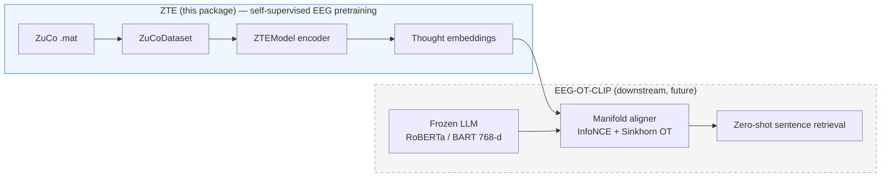
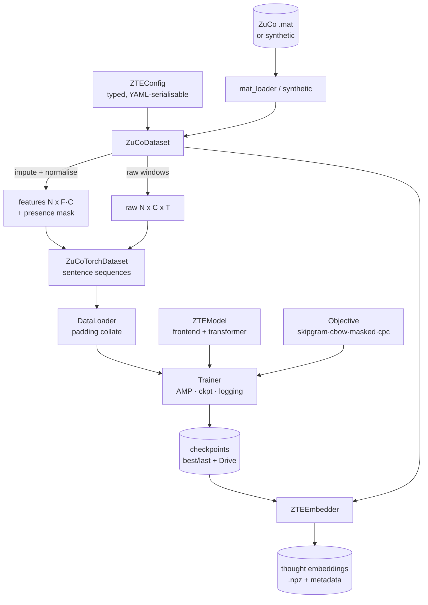
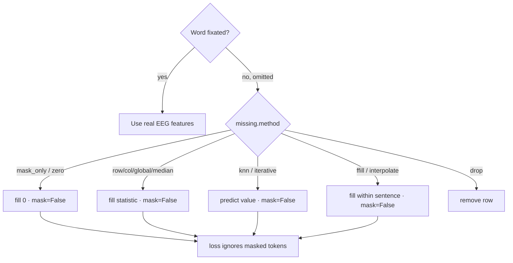
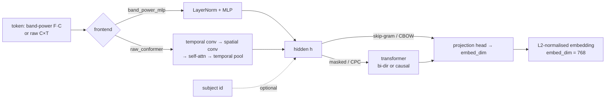

# ZTE — ZuCo Thought Embedding

> Pretraining word-level **thought embeddings** from EEG the way word embeddings are pretrained from text.
> Part of the **Cross-Modal Transfer Learning: Aligning EEG Signals to Language** project.

ZTE is two things in one `uv`-managed package:

1. A **highly tunable ZuCo dataset toolkit** — load, process, impute, normalise, visualise, analyse, select features, split (leakage-aware, incl. LOSO), convert to `torch`, cache, and round-trip to/from Google Drive.
2. A **state-of-the-art self-supervised EEG embedding pipeline** — train a `ZTEModel` with four interchangeable objectives (skip-gram, CBOW, masked/data2vec, CPC), with full logging, checkpointing, progress bars, and CPU/CUDA/MPS portability.

The learned embedding is *not yet* the device-, subject-, and task-agnostic brain representation that is the project's north star. It is the **first step**: a principled, reusable EEG token representation, analogous to what `word2vec` was for language modelling.

---

## Why this exists (the bigger picture)

The parent project reframes EEG->language decoding as **cross-modal manifold alignment** (`EEG-OT-CLIP`): an EEG encoder is aligned to a frozen LLM's 768-d semantic space using symmetric InfoNCE + Optimal Transport, evaluated by noise-anchored zero-shot retrieval under leave-one-subject-out. ZTE produces the EEG-side representation that alignment consumes.



Because ZTE's default `embed_dim` is **768**, its embeddings are plug-compatible with that downstream LLM space.

---

## What's in the box



---

## Install

```sh
# Clone, then from the package root:
uv sync                      # core install (the `dev` group syncs by default)
uv sync --group all          # + Google Drive (gdown), TensorBoard, seaborn
uv sync --no-default-groups  # core only, without the `dev` group
```

> **Python**: requires **3.12+** (`requires-python = '>=3.12'`, ruff `target-version = py312`). The code uses 3.12 features such as PEP 695 `type` aliases together with modern (`list[T]`, `X | None`, `Literal[...]`) typing throughout.
> **PyTorch / accelerators**: install the right build for your hardware. CPU and **Apple-silicon (MPS)** use the default wheel; for **Nvidia CUDA** install the matching CUDA wheel from the official index. ZTE auto-detects the device at runtime (see below).

---

## 60-second quickstart (no real data needed)

```sh
# 1) Synthesise a schema-faithful ZuCo tree + build a processed bundle (+figures).
uv run zte-prepare --synthetic --representation both --figures res/figures --out res/bundle

# 2) Pretrain a thought embedding (skip-gram) on CPU/GPU (auto-detected).
uv run zte-train --bundle res/bundle --objective skipgram --epochs 20 --run-name demo

# 3) Extract word-level embeddings from the best checkpoint.
uv run zte-extract --ckpt res/checkpoints/best.pt --bundle res/bundle --level word --out res/embeddings/embeddings.npz
```

Equivalent Python:

```python
from zte import ZuCoDataset, DatasetConfig, ZTEConfig, run_training, ZTEEmbedder
from zte.data.synthetic import generate_synthetic_zuco

generate_synthetic_zuco('res/data/synthetic_zuco')             # or point at real .mat files
ds = ZuCoDataset(DatasetConfig(root='res/data/synthetic_zuco', representation='band_power')).build()

cfg = ZTEConfig()
cfg.objective.name = 'skipgram'        # 'cbow' | 'masked' | 'cpc'
artifacts = run_training(cfg, ds)      # logs, progress bars, checkpoints

embedder = ZTEEmbedder.from_checkpoint('res/checkpoints/best.pt', ds)
embeddings, meta = embedder.embed(ds, level='word')            # (M, 768), aligned metadata

# Embed brand-new EEG signals held in memory (no dataset needed):
new_emb = embedder.embed_signals(band_power=my_array)          # (N, F*C) -> (N, 768)
```

Embedding new EEG with a trained checkpoint -- both from new `.mat` files and from
in-memory arrays -- is shown end-to-end in `examples/embed_new_signals.py`.

---

## The dataset class, end to end

```python
ds = ZuCoDataset(DatasetConfig(
    root='res/data/zuco_extracted',
    tasks=('SR', 'NR'),
    representation='both',                 # band_power | raw | both
    band_power_measures=('TRT',),          # which eye-tracking-locked features
    normalize='zscore_channel',
    missing=MissingConfig(method='knn'),   # see table below
    raw_window=128,
)).build()                                 # caches a bundle; reloads instantly next time

ds.analyze()                               # dict: counts, omission, missingness
ds.select_features(target='log_freq', method='mutual_info', k=64)
splits = ds.split('by_subject_loso', holdout_subject='ZPH')
torch_ds = ds.to_torch(split=splits['train'])
ds.save('res/bundle')                      # round-trips arrays + tables + normaliser
ds.save_to_drive('/content/drive/MyDrive/ZTE/bundle')   # mounted Drive, or gdown/PyDrive
```

### Representations

| Representation | Per-token shape    | Frontend         | When to use                                |
| -------------- | ------------------ | ---------------- | ------------------------------------------ |
| `band_power`   | `F·C` (e.g. 8×105) | `band_power_mlp` | Compact, fast, proven; great default       |
| `raw`          | `C×T` (105×window) | `raw_conformer`  | Richer temporal detail; heavier            |
| `both`         | both available     | either           | Keep options open; switch via model config |

### Missing-value strategies (`MissingConfig.method`)

Omitted (skipped) words carry **no** EEG. Every strategy returns a **presence mask** so omitted-word zero-vectors never leak into training losses.

| Method                                | What it does                                                      |
| ------------------------------------- | ----------------------------------------------------------------- |
| `mask_only`                           | Fill with 0, rely entirely on the presence mask (default, safest) |
| `zero`                                | Fill with 0                                                       |
| `row_mean`                            | Fill from each token's own present features                       |
| `col_mean` / `global_mean` / `median` | Fill from column / global statistics                              |
| `knn`                                 | `KNNImputer` (predict from similar tokens)                        |
| `iterative`                           | Model-based round-robin regression imputation                     |
| `ffill` / `interpolate`               | Sequence-aware fills along reading order (never cross sentences)  |
| `drop`                                | Remove omitted-word rows entirely                                 |



---

## The ZTE model



The **non-contextual** path (frontend -> projection) is the word2vec analogue: a word's embedding depends only on its own EEG. The **contextual** path adds a transformer for masked modelling (bidirectional) and CPC (causal).

### Self-supervised objectives

| Objective  | Analogue                | Mechanism                                                            | Encoder        |
| ---------- | ----------------------- | -------------------------------------------------------------------- | -------------- |
| `skipgram` | word2vec SG             | Multi-positive InfoNCE: a word's EEG identifies its neighbours' EEG  | non-contextual |
| `cbow`     | word2vec CBOW           | Predict a word's embedding from averaged neighbour embeddings        | non-contextual |
| `masked`   | BERT / data2vec / MAEEG | Mask word tokens; predict EMA-teacher latent or reconstruct features | bidirectional  |
| `cpc`      | wav2vec / BENDR         | Causally predict future word latents via InfoNCE                     | causal         |

All objectives gate on the presence mask: omitted words are never anchors, positives, or targets.

---

## Training: portable, logged, checkpointed


### Device matrix (auto-detected by `zte.device.resolve_device`)

| Backend | Selected when            | Mixed precision                    | Notes                                     |
| ------- | ------------------------ | ---------------------------------- | ----------------------------------------- |
| `cuda`  | Nvidia GPU present       | bf16 (Ampere+) / fp16 + GradScaler | `--device cuda`; `compile_model` optional |
| `mps`   | Apple-silicon (M-series) | fp32 (autocast still maturing)     | `--device mps`                            |
| `cpu`   | otherwise                | fp32                               | fine for smoke-tests & synthetic data     |

```python
cfg.train.device = 'auto'      # or 'cuda' | 'mps' | 'cpu'
cfg.train.precision = 'auto'   # or 'bf16' | 'fp16' | 'fp32'
```

### Logging & checkpoints

- **Progress bars** via `tqdm` on every long loop (loading, training, validating, embedding).
- **Structured logs** via `rich` to console + optional file; optional **TensorBoard** (`--tensorboard`).
- **Checkpoints**: `best.pt` / `last.pt` + rotating epoch checkpoints; each stores model, optimiser, scheduler, scaler, config, the fitted normaliser and the subject vocab — so inference is fully reproducible. Set `--drive-backup-dir` to mirror them to Google Drive.

---

## Remote (Google Drive)

```python
ds.save_to_drive('/content/drive/MyDrive/ZTE/bundle')   # Colab mounted path
ZuCoDataset.from_drive('https://drive.google.com/.../view')  # public link via gdown
```

Three transports, tried in order: mounted Drive path (most reliable) -> `gdown` (public download) -> PyDrive2 (authenticated upload). The raw ZuCo archives are tens of GB; prefer mounting Drive and pointing `root` at the extracted files, or stage a processed **bundle** (small) to Drive.

---

## Rigorous evaluation (built in)

The project's anti-"BLEU-trap" controls are first-class:

- `zte.training.metrics.linear_probe` — cross-validated linear probe of embedding content (predict word length / frequency / omission).
- `zte.training.metrics.retrieval_metrics` — Top-K / MRR (used downstream for EEG<->text).
- `zte.training.metrics.noise_matched` — Gaussian control matched to the data's mean/variance: a real encoder must beat embeddings learned from this noise.

---

## Project layout

```sh
zte/
├── pyproject.toml            # uv + ruff (single quotes) + deps
├── src/zte/
│   ├── config.py             # typed, YAML-serialisable configs
│   ├── device.py             # CPU/CUDA/MPS + autocast resolution
│   ├── logging_utils.py      # rich logging + tqdm progress
│   ├── data/                 # schema, mat_loader, synthetic, missing, transforms,
│   │                         #   features, dataset, torch_dataset, remote, viz
│   ├── models/               # frontends, embedding (ZTEModel), objectives, heads
│   ├── training/             # trainer, checkpoint, scheduler, metrics, pipeline
│   ├── inference/            # embed (ZTEEmbedder)
│   └── cli/                  # zte-prepare · zte-train · zte-extract
├── tests/                    # synthetic schema, dataset, missing, models, e2e
├── docs/                     # architecture, dataset, training, results (mermaid + figures)
└── res/                      # all generated resources (gitignored)
    ├── data/                 #   raw/extracted + synthetic ZuCo .mat trees
    ├── cache/                #   processed feature cache
    ├── bundle/               #   saved ZuCoDataset bundles
    ├── checkpoints/          #   best/last + rotating checkpoints, config, curves
    ├── embeddings/           #   exported thought embeddings (.npz)
    └── figures/              #   overview/analysis figures
```

> **Resources live under `res/`.** Every generated artefact — extracted/synthetic
> data, the feature cache, dataset bundles, checkpoints, embeddings and figures —
> defaults to a subfolder of `res/` (which is gitignored). Override any of these
> via the CLI flags (`--out`, `--cache-dir`, `--ckpt-dir`, …) or the matching
> `DatasetConfig`/`TrainConfig` fields.

---

## Roadmap — toward a device/subject/task-agnostic brain representation

ZTE v1 is intentionally subject/task-aware. The path to invariance (documented in `docs/architecture.md`):

1. **Subject-invariance** — adversarial subject head / domain confusion; SPD-tangent-space features.
2. **Task/device-invariance** — multi-corpus pretraining; channel-set adapters for differing montages.
3. **Cross-modal alignment** — feed ZTE embeddings into `EEG-OT-CLIP` (InfoNCE + Sinkhorn OT + Gromov-Wasserstein) against a frozen LLM, evaluated by noise-anchored LOSO retrieval.

---

## References

ZuCo: Hollenstein et al. (2018, *Sci. Data*; 2020, *LREC*). Self-supervised EEG: BENDR (Kostas et al. 2021), MAEEG (2021), data2vec (Baevski et al. 2022), wav2vec 2.0 (Baevski et al. 2020), EEG2Rep (2024). Word embeddings: word2vec (Mikolov et al. 2013). See `docs/` for the full bibliography and the parent project's mathematical framework.
