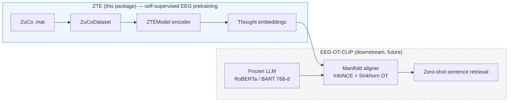
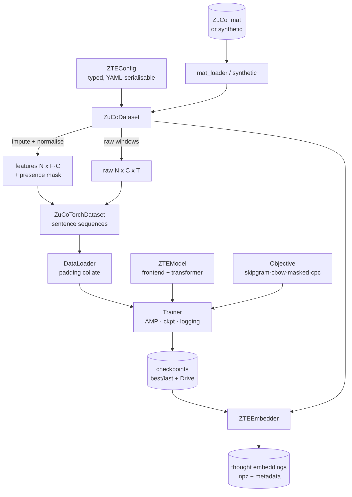
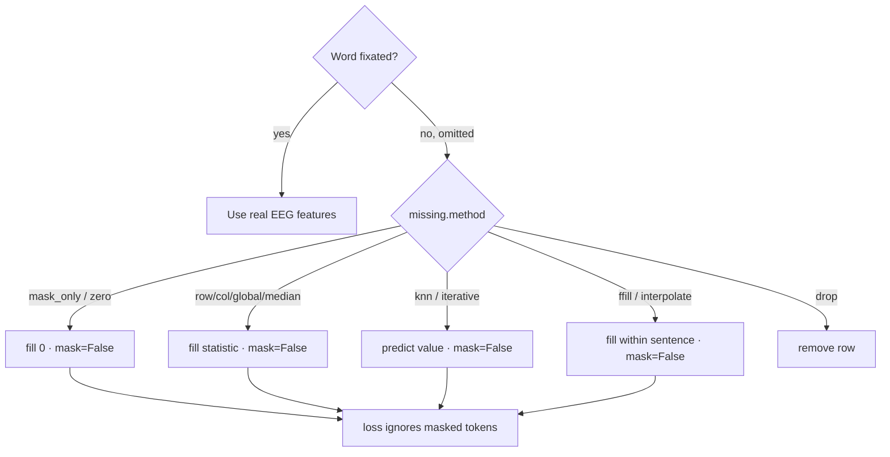
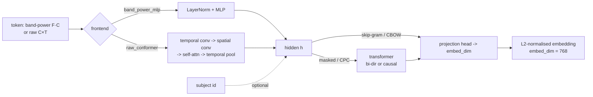
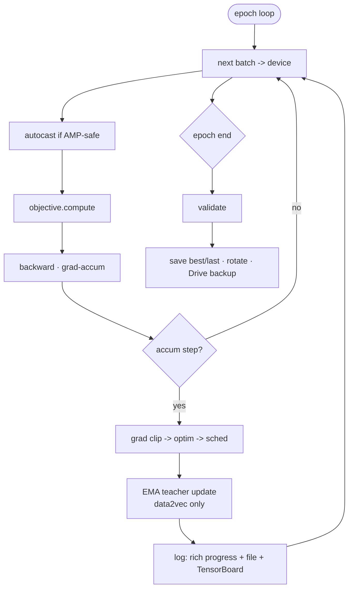

# ZTE — ZuCo Thought Embedding

> Pretraining word-level **thought embeddings** from EEG the way word embeddings are pretrained from text.
> Part of the **Cross-Modal Transfer Learning: Aligning EEG Signals to Language** project.

ZTE is a `uv`-managed package with one front door (`zte-run`) and four pillars:

1. A **highly tunable ZuCo dataset toolkit** — load (local dir / `.zip` / Google Drive), unzip, process, impute, normalise, visualise, analyse, select features, split (leakage-aware, incl. LOSO), convert to `torch`, cache, and round-trip to/from Drive. Real corpus word-frequencies and real sentence categories (SR sentiment, TSR relations) are joined in automatically, and **eye-tracking behaviour is an explicit include/exclude knob** (`include_eye_tracking`, default on) so you can build reading-evoked *or* EEG-only "imagined-thought" representations.
2. A **state-of-the-art self-supervised EEG embedding pipeline** — a `ZTEModel` with four interchangeable objectives (skip-gram, CBOW, masked/data2vec, CPC) and a **pluggable positional encoding** (RoPE by default, plus sinusoidal / learned / ALiBi / none), full logging, checkpointing, progress bars and CPU/CUDA/MPS portability.
3. A **rigorous, stratified evaluation** — transfer probes vs raw features and a noise control, cross-subject content retrieval, geometry/collapse checks, **per-subject / per-task / per-category breakdowns**, **scalp-region importance** (which brain areas encode thought vs reading), and **word2vec-style vector arithmetic** on thoughts (`emb(t, A) − centroid(A) + centroid(B) ≈ emb(t, B)`).
4. **Interactive, reproducible reporting** — a self-contained interactive HTML embedding explorer, a maximally-used **TensorBoard** (embedding projector, HParams, scalars, histograms, figures, text), fixed-seed **benchmarks**, and a per-run catalogue.

The learned embedding is *not yet* the device-, subject-, and task-agnostic brain representation that is the project's north star. It is the **first step**: a principled, reusable EEG token representation, analogous to what `word2vec` was for language modelling.

---

## Why this exists (the bigger picture)

The parent project reframes EEG->language decoding as **cross-modal manifold alignment** (`EEG-OT-CLIP`): an EEG encoder is aligned to a frozen LLM's 768-d semantic space using symmetric InfoNCE + Optimal Transport, evaluated by noise-anchored zero-shot retrieval under leave-one-subject-out. ZTE produces the EEG-side representation that alignment consumes.



Because ZTE's default `embed_dim` is **768**, its embeddings are plug-compatible with that downstream LLM space.

---

## What's in the box



---

## Install

```sh
# Clone, then from the package root:
uv sync                      # core install (the `dev` group syncs by default)
uv sync --group all          # + Google Drive (gdown), TensorBoard, seaborn
uv sync --no-default-groups  # core only, without the `dev` group
```

> **Python**: requires **3.14+** (`requires-python = '>=3.14'`, ruff `target-version = py314`). The code uses PEP 695 `type` aliases and PEP 758 parenthesis-free `except A, B:` together with modern (`list[T]`, `X | None`, `Literal[...]`) typing throughout. 3.14 is a hard floor, not a preference: the `except` form is a `SyntaxError` on older interpreters.
> **PyTorch / accelerators**: install the right build for your hardware. CPU and **Apple-silicon (MPS)** use the default wheel; for **Nvidia CUDA** install the matching CUDA wheel from the official index. ZTE auto-detects the device at runtime (see below).

---

## Quickstart: one command, end to end

`zte-run` takes an **experiment config** and a **data source**, then runs the whole pipeline — resolve/unzip -> prepare + cache -> train -> evaluate -> explore — and files every artifact under `res/experiments/<run_name>/` so each experiment is self-contained and reproducible.

```sh
# No data needed: full pipeline on a synthetic ZuCo tree (great smoke test).
uv run zte-run --config experiments/exp1_skipgram_rope_et.yaml --synthetic --epochs 5

# Real data from a local folder (extracted .mat files, or a folder of task .zip archives).
uv run zte-run --config experiments/exp1_skipgram_rope_et.yaml --root res/data/zuco_extracted

# Real data straight from Google Drive (folder id or shareable URL; needs the `drive` group).
uv run zte-run --config experiments/exp2_masked_rope_eegonly.yaml --drive <folder-id-or-url>

# Any subset, any override:
uv run zte-run --config experiments/exp1_skipgram_rope_et.yaml \
    --root res/data/zuco_extracted --subjects ZAB,ZDM,ZJS --tasks SR,NR --epochs 20 \
    --name my_first_run
```

Each run writes:

```text
res/experiments/<run_name>/
  config.yaml     bundle/     checkpoints/    figures/
  evaluation/     exploration/    tb/     manifest.json    README.md
res/experiments/INDEX.md          # a growing catalogue of every run + headline metrics
```

The **data source** (`--root` / `--drive` / `--synthetic`) is normalised by `zte.data.io.sources.resolve_source`: an already-extracted directory is used as-is, a `.zip` (or a folder of task zips) is unzipped once into `--extract-dir`, and a Drive id/URL is downloaded to `res/data/_downloads` then unzipped into `--extract-dir`.  Every CLI that loads raw ZuCo data accepts the same flags (`--root`, `--drive`, `--extract-dir`), so "load from Drive or locally, unzip, prepare, cache, train, evaluate" is a single command either way.

### The 5 flagship experiments

| Config                      | Objective           | Positional | Eye-tracking | Why run it                                              |
| --------------------------- | ------------------- | ---------- | ------------ | ------------------------------------------------------- |
| `exp1_skipgram_rope_et`     | skip-gram           | RoPE       | included     | **Start here** — best general reading-evoked embedding  |
| `exp2_masked_rope_eegonly`  | masked (data2vec)   | RoPE       | **excluded** | Device-agnostic / imagined-thought path (EEG only)      |
| `exp3_cpc_rope_et`          | CPC (wav2vec/BENDR) | RoPE       | included     | Does reading *order* carry transferable structure?      |
| `exp4_skipgram_loso`        | skip-gram           | RoPE       | included     | Subject-invariance: leave-one-subject-out validation    |
| `exp5_raw_conformer_masked` | masked              | RoPE       | excluded     | Raw temporal path (EEG-Conformer) instead of band power |

See [`experiments/README.md`](experiments/README.md) for the full rationale.

### Prefer the individual steps? They still exist

```sh
uv run zte-prepare  --root res/data/zuco_extracted --representation band_power --out res/bundle
# Or download + prepare straight from the public ZuCo Drive folder (needs `uv sync --group drive`):
uv run zte-prepare --drive 'https://drive.google.com/drive/folders/13EYW1h6dHD5E4YoEWNsKe6ZBHmMU_kFQ' \
    --representation band_power --out res/bundle
uv run zte-train    --bundle res/bundle --objective skipgram --tensorboard --run-name demo
uv run zte-evaluate --ckpt res/checkpoints/best.pt --bundle res/bundle --out res/evaluation --tensorboard
uv run zte-explore  --bundle res/bundle --out res/exploration   # brain regions + eye-tracking
uv run zte-benchmark --root res/data/zuco_extracted --objectives skipgram,masked --pos-encodings rope,learned
# `--drive` works on every step above instead of `--root` / `--bundle`.
```

Equivalent Python:

```python
from zte import ZuCoDataset, DatasetConfig, ZTEConfig, run_training, ZTEEmbedder
from zte.data.synthetic import generate_synthetic_zuco

generate_synthetic_zuco('res/data/synthetic_zuco')             # or point at real .mat files
# EEG-only (include_eye_tracking=False) so brand-new EEG can be embedded later.
ds = ZuCoDataset(DatasetConfig(root='res/data/synthetic_zuco', representation='band_power',
                               include_eye_tracking=False)).build()

cfg = ZTEConfig()
cfg.objective.name = 'skipgram'        # 'cbow' | 'masked' | 'cpc'
cfg.model.pos_encoding = 'rope'        # 'sinusoidal' | 'learned' | 'alibi' | 'none'
artifacts = run_training(cfg, ds)      # logs, progress bars, checkpoints

embedder = ZTEEmbedder.from_checkpoint('res/checkpoints/best.pt', ds)
embeddings, meta = embedder.embed(ds, level='word')            # (M, 768), aligned metadata

# Embed brand-new EEG signals held in memory (no dataset needed).
# The vector width must match the checkpoint's input: F*C for an EEG-only model,
# or F*C + gaze scalars if it was trained with include_eye_tracking=True.
new_emb = embedder.embed_signals(band_power=my_array)          # (N, in_dim) -> (N, 768)
```

Embedding new EEG with a trained checkpoint -- both from new `.mat` files and from in-memory arrays -- is shown end-to-end in `examples/embed_new_signals.py`.

---

## Headline capabilities

### Eye-tracking: include or exclude (default include)

ZuCo is a *reading* corpus, so eye-tracking behaviour (fixation durations, `nFixations`, pupil size) is richly informative — for reading. But an imagined-thought BCI has no gaze. `include_eye_tracking` makes this a first-class switch:

```python
DatasetConfig(include_eye_tracking=True)   # default: gaze scalars appended to each token
DatasetConfig(include_eye_tracking=False)  # EEG-only: the imagined-thought / device-agnostic path
```

The EEG band-power is always kept; the toggle only governs the extra gaze dimensions.  `zte-explore` quantifies exactly how much eye-tracking helps a *reading* target vs a *cognitive* target, so the choice is evidence-based, not a guess.

### Brain-region exploration (`zte-explore`)

Which parts of the cortex encode thought vs reading? `zte-explore` groups the 105 channels into anterior->posterior scalp regions and scores each region's share of the decodable information for reading targets (word length, frequency) and cognitive targets (task, subject). Supply an exact montage with `RegionMap.from_csv(...)`; the default map is documented and approximate.

```sh
uv run zte-explore --root res/data/zuco_extracted --out res/exploration
```

### Thought arithmetic (`king − man + woman` for EEG)

If ZTE is a real thought code, *who* produced a thought should be a translation in the space. For a stimulus token `t`, `emb(t, subject A) − centroid(A) + centroid(B)` should retrieve `emb(t, subject B)`. The evaluation reports this **subject-transfer** (and task-transfer) analogy accuracy vs chance, with a raw-feature control — a direct, falsifiable test of subject-agnosticism.

### State-of-the-art positional encoding

`model.pos_encoding` selects the sequence encoding for the context transformer: `rope` (rotary, default — relative, length-generalising, SOTA), `sinusoidal`, `learned`, `alibi`, or `none` (ablation). RoPE and ALiBi act inside attention; the encoder is a pre-norm, GELU Transformer honouring padding and causal (CPC) masks. The `sinusoidal` option is the classic fixed encoding, for position $p$ and dimension index $i$ (with model width $d$):

$$
PE_{p,2i}=\sin\!\big(p/10000^{2i/d}\big), \qquad PE_{p,2i+1}=\cos\!\big(p/10000^{2i/d}\big)
$$

### Stratified evaluation + interactive reporting

`zte-evaluate` (and `zte-run`) produce per-subject / per-task / per-sentence-category breakdowns, a `report.md`, a `metrics.json`, figures, a **self-contained interactive HTML explorer** (rotate the 3-D embedding cloud, hover a point for its word, recolour by subject/task/category), and a **TensorBoard** log that uses the embedding projector, HParams, scalars, histograms, images and text. Add `--tensorboard`:

```sh
uv run zte-evaluate --ckpt <best.pt> --bundle res/bundle --out res/evaluation --tensorboard
tensorboard --logdir res/evaluation/tb        # then open the PROJECTOR tab
```

### Reproducible benchmarks (`zte-benchmark`)

Fixed-seed sweep over **objective × positional-encoding × eye-tracking × seed**, aggregated into a sortable `benchmark.csv` / `benchmark.md`; every cell writes its own `config.yaml` so any row reproduces exactly.

## The dataset class, end to end

```python
ds = ZuCoDataset(DatasetConfig(
    root='res/data/zuco_extracted',
    tasks=('SR', 'NR'),
    representation='both',                 # band_power | raw | both
    band_power_measures=('TRT',),          # which eye-tracking-locked features
    normalize='zscore_channel',
    missing=MissingConfig(method='knn'),   # see table below
    raw_window=128,
)).build()                                 # caches a bundle; reloads instantly next time

ds.analyze()                               # dict: counts, omission, missingness
ds.select_features(target='log_freq', method='mutual_info', k=64)
splits = ds.split('by_subject_loso', holdout_subject='ZPH')
torch_ds = ds.to_torch(split=splits['train'])
ds.save('res/bundle')                      # round-trips arrays + tables + normaliser
ds.save_to_drive('/content/drive/MyDrive/ZTE/bundle')   # mounted Drive, or gdown/PyDrive
```

### Representations

| Representation | Per-token shape    | Frontend         | When to use                                |
| -------------- | ------------------ | ---------------- | ------------------------------------------ |
| `band_power`   | `F·C` (e.g. 8×105) | `band_power_mlp` | Compact, fast, proven; great default       |
| `raw`          | `C×T` (105×window) | `raw_conformer`  | Richer temporal detail; heavier            |
| `both`         | both available     | either           | Keep options open; switch via model config |

### Missing-value strategies (`MissingConfig.method`)

Omitted (skipped) words carry **no** EEG. Every strategy returns a **presence mask** so omitted-word zero-vectors never leak into training losses.

| Method                                | What it does                                                      |
| ------------------------------------- | ----------------------------------------------------------------- |
| `mask_only`                           | Fill with 0, rely entirely on the presence mask (default, safest) |
| `zero`                                | Fill with 0                                                       |
| `row_mean`                            | Fill from each token's own present features                       |
| `col_mean` / `global_mean` / `median` | Fill from column / global statistics                              |
| `knn`                                 | `KNNImputer` (predict from similar tokens)                        |
| `iterative`                           | Model-based round-robin regression imputation                     |
| `ffill` / `interpolate`               | Sequence-aware fills along reading order (never cross sentences)  |
| `drop`                                | Remove omitted-word rows entirely                                 |



---

## The ZTE model



The **non-contextual** path (frontend -> projection) is the word2vec analogue: a word's embedding depends only on its own EEG. The **contextual** path adds a transformer for masked modelling (bidirectional) and CPC (causal).

### Self-supervised objectives

| Objective  | Analogue                | Mechanism                                                            | Encoder        |
| ---------- | ----------------------- | -------------------------------------------------------------------- | -------------- |
| `skipgram` | word2vec SG             | Multi-positive InfoNCE: a word's EEG identifies its neighbours' EEG  | non-contextual |
| `cbow`     | word2vec CBOW           | Predict a word's embedding from averaged neighbour embeddings        | non-contextual |
| `masked`   | BERT / data2vec / MAEEG | Mask word tokens; predict EMA-teacher latent or reconstruct features | bidirectional  |
| `cpc`      | wav2vec / BENDR         | Causally predict future word latents via InfoNCE                     | causal         |

Writing the L2-normalised embeddings as $\hat z_i = z_i/\lVert z_i\rVert$ with cosine similarity $s_{ij}=\hat z_i^\top\hat z_j$ and temperature $\tau$, the multi-positive skip-gram InfoNCE loss over anchors $A$, positives $P(i)$ and candidates $\mathcal{C}(i)$ is

$$
\mathcal{L}_{\text{SG}} = -\frac{1}{\lvert A \rvert}\sum_{i \in A} \log \frac{\sum_{p \in P(i)} \exp(s_{ip}/\tau)}{\sum_{k \in \mathcal{C}(i)} \exp(s_{ik}/\tau)}
$$

All objectives gate on the presence mask: omitted words are never anchors, positives, or targets.

---

## Training: portable, logged, checkpointed



### Device matrix (auto-detected by `zte.device.resolve_device`)

| Backend | Selected when            | Mixed precision                    | Notes                                     |
| ------- | ------------------------ | ---------------------------------- | ----------------------------------------- |
| `cuda`  | Nvidia GPU present       | bf16 (Ampere+) / fp16 + GradScaler | `--device cuda`; `compile_model` optional |
| `mps`   | Apple-silicon (M-series) | fp32 (autocast still maturing)     | `--device mps`                            |
| `cpu`   | otherwise                | fp32                               | fine for smoke-tests & synthetic data     |

```python
cfg.train.device = 'auto'      # or 'cuda' | 'mps' | 'cpu'
cfg.train.precision = 'auto'   # or 'bf16' | 'fp16' | 'fp32'
```

### Logging & checkpoints

- **Progress bars** via `tqdm` on every long loop (loading, training, validating, embedding).
- **Structured logs** via `rich` to console + optional file; optional **TensorBoard** (`--tensorboard`).
- **Checkpoints**: `best.pt` / `last.pt` + rotating epoch checkpoints; each stores model, optimiser, scheduler, scaler, config, the fitted normaliser and the subject vocab — so inference is fully reproducible. Set `--drive-backup-dir` to mirror them to Google Drive.

---

## Remote (Google Drive)

### Downloading raw ZuCo (any CLI)

Install Drive support once (`uv sync --group drive`), then pass `--drive` to any command that accepts a data source — `zte-prepare`, `zte-train`, `zte-extract`, `zte-evaluate`, `zte-explore`, `zte-benchmark`, or `zte-run`:

```sh
uv run zte-prepare \
    --drive 'https://drive.google.com/drive/folders/13EYW1h6dHD5E4YoEWNsKe6ZBHmMU_kFQ' \
    --representation band_power --out res/bundle
```

| Flag            | Default                   | Meaning                                                                   |
| --------------- | ------------------------- | ------------------------------------------------------------------------- |
| `--drive`       | —                         | Google Drive folder id or shareable URL                                   |
| `--root`        | —                         | Local extracted `.mat` dir, a `.zip`, or a folder of task `.zip` archives |
| `--extract-dir` | `res/data/zuco_extracted` | Where task archives are unzipped (idempotent)                             |

Zips are downloaded to `res/data/_downloads` first; extraction is skipped for archives already marked done. A folder id alone (e.g. `1Rd3vZq404sykxhCfkIJERz6qT5csWARL`) works the same as the full URL.

**Interrupt & resume:** Downloads are safe to stop (Ctrl+C). Each zip is fetched separately with per-file byte progress (`tqdm`). Finished files are recorded in `.zte_drive_manifest.json`; re-run the same command to continue. For download-only:

```sh
uv run zte-download --drive 13EYW1h6dHD5E4YoEWNsKe6ZBHmMU_kFQ --out res/data/_downloads
```

### Bundles & uploads (Python API)

```python
ds.save_to_drive('/content/drive/MyDrive/ZTE/bundle')   # Colab mounted path
ZuCoDataset.from_drive('https://drive.google.com/.../view')  # public link via gdown
```

Three transports, tried in order: mounted Drive path (most reliable) -> `gdown` (public download) -> PyDrive2 (authenticated upload). The raw ZuCo archives are tens of GB; prefer `--drive` for a one-shot download, mounting Drive and pointing `--root` at extracted files, or staging a processed **bundle** (small) to Drive.

---

## Anti-collapse & subject-invariance levers

ZTE v1 is well-instrumented but, on real data so far, dimensionally collapsed and subject-dominated. These levers address that head-on — all implemented and tested (see **[`CHANGELOG.md`](CHANGELOG.md)**). The load-bearing changes:

- **Anti-collapse (VICReg).** `objective.variance_weight` / `objective.covariance_weight` add a variance-hinge + covariance penalty to every objective — the single biggest fix for the ~15-of-768 collapse. The variance hinge pushes every one of the $d$ embedding dimensions to keep a standard deviation of at least the target $\gamma$:

$$
\mathcal{L}_{\text{var}} = \frac{1}{d}\sum_{j=1}^{d} \max\!\big(0,\ \gamma - \sqrt{\mathrm{Var}(z_{:,j}) + \epsilon}\big)
$$

- **Learn "what", not "who".** `objective.cross_subject_positives` (same stimulus, different subject, via a stimulus-grouped batch sampler), `objective.subject_adversary_weight` (gradient-reversal subject adversary), and `dataset.normalize='zscore_subject'` (per-subject whitening) attack subject dominance directly.
- **Masked objective repaired.** The exported 768-d head is now trained; the data2vec teacher is normalised across tokens with a variance floor and its EMA decay is ramped — no more exp2 cone.
- **Honest evaluation.** `train.test_fraction` defaults to `0.1` (held-out), a new `by_stimulus` split keeps a sentence's text on one side, and the normaliser is fit on train only. Verdicts use bootstrap CIs + effect-size floors; retrieval chance is query-weighted; probes are shuffled and scaled; the `task_transfer` id bug is fixed; a real electrode montage can be supplied via `dataset.montage_csv`.

The new **`exp6_skipgram_eegonly_invariant`** preset is the fairest test: EEG-only, `by_stimulus` held-out, and every subject-invariance lever on.

### Interactive Thought-Space Explorer

```sh
# Build a self-contained, offline interactive HTML explorer (Plotly).
uv run zte-visualize --run res/experiments/exp1_skipgram_rope_et --out res/explorer.html
uv run zte-visualize --synthetic --out res/explorer.html   # no data needed
```

Live, on-page controls let you see: one subject / many words; **many subjects / one word** (with the cross-subject cosine stat that shows the word does *not* cluster across people); **thought arithmetic** `emb(t,A) − centroid(A) + centroid(B) ≈ emb(t,B)` drawn as an arrow with its nearest-neighbour hit; and an **eye-tracking with/without** toggle — all switchable in real time.

### Neuron Atlas — which dimensions fire, and what they encode

```sh
uv run zte-visualize --atlas --run res/experiments/exp1_skipgram_rope_et --out res/atlas.html
```

Every evaluation also writes `evaluation/interactive/neuron_atlas.html` (and `neurons.json`). It ranks all 768 dimensions by how much they *fire* (variance share), colours each by what it **encodes** (amber for *who* = subject, cool hues for *what* = word length / frequency / task / category, grey for the negligible dead tail past the active-threshold line), and — on click — shows a neuron's selectivity, activation histogram, top-firing words, and scalp band × region attribution. The header reports the **who-vs-what variance budget**: the share of the space spent on identity versus content. This is the "encodes who, not what" story made legible at neuron resolution.

### Reproducible experiment suite

**[`docs/EXPERIMENTS.md`](docs/EXPERIMENTS.md)** lays out a bias-controlled study set (eye-tracking confound, a LOSO subject-invariance A/B, an anti-collapse VICReg ablation, an objective sweep) that uses all 12 subjects, leakage-aware `by_stimulus` / LOSO splits, train-only normalisation, and multiple seeds so differences carry bootstrap CIs — with exact commands and a "how to read every output" guide.
Run it with `bash scripts/run_suite.sh` (or `SMOKE=1 bash scripts/run_suite.sh` for a synthetic dry run).

## Rigorous evaluation (built in)

A full representation-evaluation suite (`zte.evaluation`, CLI `zte-evaluate`) shows through figures, tables and numbers that the encoder produces a re-purposable space — transfer probes (vs raw features and a noise control), cross-subject content retrieval, and geometry/collapse checks. See **`docs/EVALUATION.md`** for methodology and results.

```sh
uv run zte-evaluate --ckpt res/checkpoints/best.pt --bundle res/bundle --out res/evaluation
uv run python examples/evaluate_zte.py    # self-contained synthetic demo
```

The project's anti-"BLEU-trap" controls are first-class:

- `zte.evaluation.representation_comparison` — linear + kNN probes of ZTE vs raw features vs noise, per attribute.
- `zte.evaluation.content_retrieval` — cross-subject same-stimulus Top-K / MRR vs chance.
- `zte.evaluation.embedding_health` — effective rank, uniformity, alignment, anisotropy, dead dims (collapse check).
- `zte.evaluation.breakdown` — the same metrics stratified by subject, task and sentence category.
- `zte.evaluation.analogy` — subject/task vector-arithmetic transfer (the `king − man + woman` test for thoughts) vs a raw-feature control.
- `zte.data.montage.regions.region_importance` — which scalp regions carry which information (reading vs cognitive).
- `zte.evaluation.interactive` / `zte.evaluation.tensorboard` — self-contained interactive HTML + a maximally-used TensorBoard (projector, HParams, histograms, figures).
- `zte.inference.retrieval.NearestNeighborIndex` — temporary nearest-neighbour decoder/probe over a labelled embedding bank.
- `zte.training.metrics.noise_matched` — Gaussian control matched to the data's mean/variance: a real encoder must beat it.

---

## Project layout

```sh
zte/
├── pyproject.toml            # uv + ruff (single quotes) + deps
├── experiments/              # the 5 flagship experiment configs (+ README)
├── src/zte/
│   ├── config/               # typed, YAML-serialisable configs (dataset · model · objective · train · types)
│   ├── device.py             # CPU/CUDA/MPS + autocast + seeding
│   ├── logging_utils.py      # rich logging + tqdm progress
│   ├── data/                 # schema, dataset, torch_dataset, synthetic, viz  (+ subpackages)
│   │   ├── io/               #   mat_loader, sources, remote, drive_download
│   │   ├── features/         #   transforms, features, missing
│   │   ├── targets/          #   meaning, glove, text, behaviour, categories
│   │   └── montage/          #   montage, regions
│   ├── models/               # embedding (ZTEModel), transformer (RoPE/ALiBi), heads, spatial
│   │   ├── frontends/        #   band_power, raw_conformer (+ build_frontend)
│   │   └── objectives/       #   skipgram, cbow, masked, cpc, clip (+ base, losses)
│   ├── training/             # trainer (+TensorBoard), checkpoint, scheduler, metrics, pipeline
│   ├── inference/            # embed (ZTEEmbedder), retrieval
│   ├── evaluation/           # metrics, breakdown, analogy, neurons, plots, report, tensorboard
│   │   ├── audit/            #   confound, honesty, scoreboard (is the signal real?)
│   │   └── interactive/      #   explorer · classic · atlas · scoreboard · compare (+ web/ html·css·js)
│   └── cli/                  # zte-run · prepare · train · extract · evaluate · … (+ support/ helpers)
├── tests/                    # synthetic schema, dataset, missing, models, evaluation, e2e
├── docs/                     # architecture, dataset, training, results, evaluation (mermaid + figures)
└── res/                      # all generated resources (gitignored)
    ├── data/                 #   raw/extracted (+ _downloads) + synthetic ZuCo .mat trees
    └── experiments/          #   one self-contained folder per run + INDEX.md catalogue
        └── <run_name>/       #     config · bundle · checkpoints · evaluation · exploration · tb · manifest
```

> **Resources live under `res/`.** Every generated artefact — extracted/synthetic data, the feature cache, dataset bundles, checkpoints, embeddings and figures — defaults to a subfolder of `res/` (which is gitignored). Override any of these via the CLI flags (`--out`, `--cache-dir`, `--ckpt-dir`, …) or the matching `DatasetConfig`/`TrainConfig` fields.

---

## Roadmap — toward a device/subject/task-agnostic brain representation

ZTE v1 is intentionally subject/task-aware. The path to invariance (documented in `docs/ARCHITECTURE.md`):

1. **Subject-invariance** — adversarial subject head / domain confusion; SPD-tangent-space features.
2. **Task/device-invariance** — multi-corpus pretraining; channel-set adapters for differing montages.
3. **Cross-modal alignment** — feed ZTE embeddings into `EEG-OT-CLIP` (InfoNCE + Sinkhorn OT + Gromov-Wasserstein) against a frozen LLM, evaluated by noise-anchored LOSO retrieval.

---

## References

ZuCo: Hollenstein et al. (2018, *Sci. Data*; 2020, *LREC*). Self-supervised EEG: BENDR (Kostas et al. 2021), MAEEG (2021), data2vec (Baevski et al. 2022), wav2vec 2.0 (Baevski et al. 2020), EEG2Rep (2024). Word embeddings: word2vec (Mikolov et al. 2013). See `docs/` for the full bibliography and the parent project's mathematical framework.
