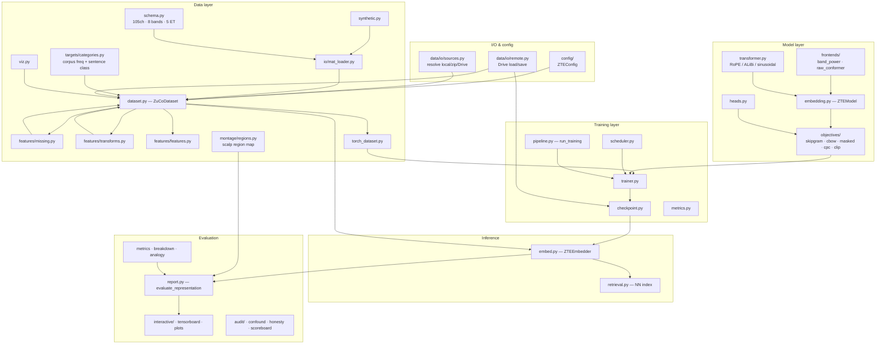
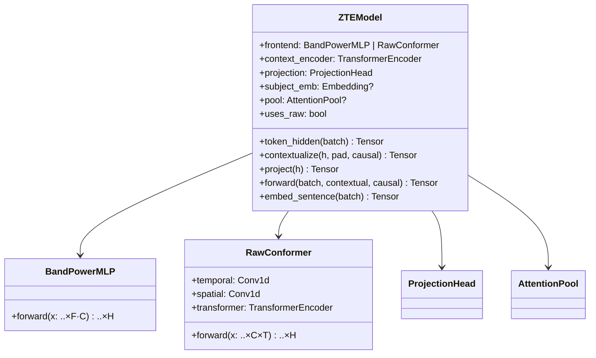
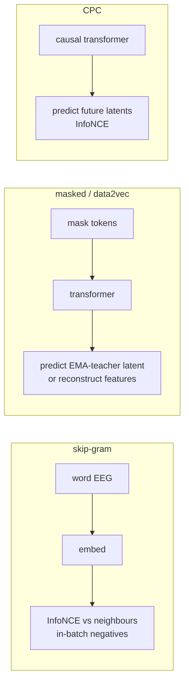
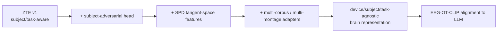

# ZTE Architecture

How the pieces fit together, why the design choices were made, and how ZTE feeds the parent **Cross-Modal Transfer Learning** project.

> New here? Read the [top-level README] first for the one-command quickstart, then use this document to understand *why* the pipeline is shaped the way it is.
> Sibling guides: [DATASET] · [TRAINING] · [EVALUATION] · [RESULTS].

## 1. Component overview

Everything is driven by one typed config (`ZTEConfig`) and flows left-to-right: data -> model -> training -> inference -> evaluation.

## 2. The data model

ZuCo's verified structure is encoded once in `schema.py`:

| Fact                             | Value                                                  |
| -------------------------------- | ------------------------------------------------------ |
| Channels (post-artefact-removal) | 105 (from a 128-channel EGI system)                    |
| Sampling rate                    | 500 Hz                                                 |
| Frequency bands                  | `t1 t2 a1 a2 b1 b2 g1 g2` (theta->gamma)               |
| Eye-tracking measures            | `FFD SFD GD GPT TRT` (+ `nFixations`, `meanPupilSize`) |
| Word EEG fields                  | `<measure>_<band>` (e.g. `TRT_t1`), each a 105-vector  |
| Sentence EEG fields              | `mean_<band>`, `rawData`                               |
| Omission                         | skipped words -> **empty arrays**                      |

A `ZuCoDataset` flattens files into a **word table** + a **sentence table** + an aligned band-power tensor `(N, F, C)` and/or raw tensor `(N, C, T)`, plus a **presence mask** `(N,)`. Everything is row-aligned, so a single boolean filter (length cap, `drop`, or a split) stays consistent across every store. Real corpus word-frequencies and sentence categories (SR sentiment, TSR relations) are joined in automatically by `categories.py`.

See [DATASET.md] for every knob and the analysis helpers.

### Data source resolution

`data/io/sources.py` normalises every supported input into a local directory of `.mat` files: an already-extracted tree, a `.zip` (or folder of task archives), or a Google Drive folder id/URL (downloaded via `data/io/remote.py` + `gdown` into `res/data/_downloads`, then unzipped into `--extract-dir`). Every CLI that loads raw ZuCo data shares the same flags through `cli/support/sources.py` (`--root`, `--drive`, `--extract-dir`).

## 3. The ZTE model

**Design rationale.** Skip-gram/CBOW use the *non-contextual* path so a word's embedding depends only on its own EEG — the literal word2vec analogue. Masked and CPC use the transformer because their premise is contextual prediction. The raw frontend follows the project's EEG-Conformer recipe (temporal conv as a learnable band-pass -> spatial mixing -> self-attention -> pooling).

### Positional encoding is pluggable

The context transformer (`transformer.py`) honours `model.pos_encoding`:

| Scheme       | Where it acts    | Why you'd pick it                                |
| ------------ | ---------------- | ------------------------------------------------ |
| `rope`       | inside attention | relative, length-generalising SOTA (**default**) |
| `alibi`      | inside attention | linear distance bias; cheap length extrapolation |
| `sinusoidal` | added to inputs  | classic fixed Transformer encoding               |
| `learned`    | added to inputs  | absolute learned table (`max_positions`)         |
| `none`       | —                | ablation: no positional information              |

All four schemes modify the same scaled dot-product attention that the context transformer computes over its $L$ tokens, where $Q,K,V$ are the per-head query/key/value projections and $d_h$ is the per-head dimension:

$$
\mathrm{Attn}(Q,K,V) = \mathrm{softmax}\!\Big(\frac{QK^\top}{\sqrt{d_h}}\Big)V
$$

They differ in *where* they inject position (token position $p$, or indices $m,n$):

- **`sinusoidal`** adds a fixed absolute code to the inputs before attention, indexing dimension $i$ of the model dim $d$:

$$
PE_{p,2i} = \sin\!\Big(\frac{p}{10000^{2i/d}}\Big), \qquad PE_{p,2i+1} = \cos\!\Big(\frac{p}{10000^{2i/d}}\Big)
$$

- **`rope`** rotates $Q$ and $K$ *inside* attention. With per-pair frequencies $\theta_i = 10000^{-2i/d_h}$, a token at position $p$ is rotated by a block-diagonal rotation $R(p)$ that turns coordinate pair $i$ through angle $p\theta_i$, so the attention score $\langle R(m)q,\ R(n)k\rangle$ depends only on the relative offset $m-n$ — the source of its length generalisation.

- **`alibi`** leaves the projections untouched and subtracts a linear per-head distance bias with slope $m_h$:

$$
\text{score}_{ij} = \frac{q_i^\top k_j}{\sqrt{d_h}} - m_h\,\lvert i - j \rvert
$$

Each run records its scheme in the checkpoint config, so inference rebuilds the matching encoder automatically.

## 4. Objectives

The symmetric InfoNCE used here is the same family the parent project applies for EEG↔text alignment:

$$
\mathcal{L}_{\text{InfoNCE}} = -\frac{1}{B}\sum_i \log \frac{\exp(\text{sim}(e_i, t_i)/\tau)}{\sum_j \exp(\text{sim}(e_i, t_j)/\tau)}
$$

In ZTE, `t` is a *neighbouring word's EEG* (skip-gram) or a *future word latent* (CPC) rather than text — pretraining the geometry that alignment later reuses.  The objective is selected with `objective.name`; see [TRAINING.md] for the full hyper-parameter table.

## 5. Anti-leakage: the presence mask

Word-level ZuCo modelling's biggest hazard is treating omitted-word zero/NaN vectors as signal. ZTE addresses it at three layers:

1. **Loading** — empty arrays become `NaN`; a presence probe marks the word absent.
2. **Imputation** — every strategy returns a presence mask; the normaliser is fit on **present tokens only**.
3. **Objectives** — `_usable_mask = pad & presence` gates all anchors, positives and targets, so omitted words are never a training signal.

## 6. Cross-subject roadmap (toward invariance)

`ModelConfig.subject_conditioning` already exposes the subject-embedding knob for ablations; the adversarial and SPD steps slot into the same encoder interface.  `zte-benchmark` sorts runs by **subject-transfer lift**, so progress toward invariance is measurable, not asserted.

## 7. Where ZTE stops and EEG-OT-CLIP begins

ZTE outputs `(M, 768)` embeddings + aligned metadata. The downstream aligner adds a frozen LLM text encoder and the composite loss

$$
\mathcal{L} = \lambda_1\mathcal{L}_{\text{InfoNCE}} + \lambda_2\mathcal{L}_{\text{OT}}
$$

(Sinkhorn-regularised Wasserstein, optionally Gromov-Wasserstein for distinct metric spaces), evaluated by **noise-anchored zero-shot retrieval** under LOSO.  ZTE ships the building blocks for that evaluation in `training/metrics.py` and `evaluation/`. Because the default `embed_dim` is **768**, ZTE embeddings are plug-compatible with that downstream space.

[top-level README]: ../README.md
[EVALUATION]: ./EVALUATION.md
[RESULTS]: ./RESULTS.md
[TRAINING]: ./TRAINING.md

## What the rebuild added

| Module                             | Owns                                                                                    |
| ---------------------------------- | --------------------------------------------------------------------------------------- |
| `models/decoder/quantiser.py`      | `SemanticRateLadder` — the text-anchored residual quantiser and its measured bit report |
| `models/decoder/evidence.py`       | `MonotonicPointer`, `WordEvidence` — the word-synchronous path                          |
| `models/decoder/gap.py`            | `GapCorrector`, moved out of `bridge.py` now that the bridge has company                |
| `models/objectives/lexical.py`     | `LexicalAligner` — the token-level loss, shared by the encoder and read by the decoder  |
| `data/targets/lexical.py`          | The frozen per-word-type embedding target                                               |
| `evaluation/analysis/`             | `collect` · `aggregate` · `figures` · `dashboard` — the study-level analysis            |
| `cli/analyze.py`                   | `zte-analyze`                                                                           |
| `evaluation/interactive/studio.py` | The decode studio: per-step trace, scalp cube and the page it writes                    |
| `cli/studio.py`                    | `zte-studio`                                                                            |
| `models/encoder/residual.py`       | `PredictiveResidual` — de-trends a token against what its left context predicted        |
| `models/encoder/consensus.py`      | `ConsensusBank`, `ConsensusDistiller` — the cross-reader prototype teacher              |
| `models/encoder/gallery.py`        | `GalleryContrast` — the full-gallery, length-matched InfoNCE denominator                |
| `models/encoder/nuisance.py`       | `LengthProjector` — train-fitted removal of the sentence-length subspace                |
| `utils/session.py`                 | `DriveSession`, `discover_runs`, `find_checkpoint` — the dated Drive layout             |
| `cli/colab.py`                     | `zte-colab` — every notebook capability as one JSON object on stdout                    |

The lexical projection is the seam between the two halves: the **encoder** trains it contrastively
(`objective.lexical_weight`), the checkpoint carries it under `lexical.head.*`, and the **decoder** restores it
frozen and reads per-word vectors through it. A decoder built over an encoder that never trained one degrades to
the pooled decoder and says so at startup.

`models/encoder/` is the mirror of `models/decoder/`: mechanisms that layer onto `ZTEModel` rather than replacing it.
Three of the four are training-time only and leave the exported embedding's *shape* and inference path untouched --
the residual coder runs inside `ZTEModel.token_hidden` and so travels in the checkpoint, the consensus bank lives on
the objective and is never consulted at inference, and the gallery denominator exists only inside the loss. The
fourth, `LengthProjector`, is evaluation post-processing and sits beside `whiten` and `all_but_top` in
`evaluation/report.py`, carrying the same `postprocess_fit` provenance discipline.

`cli/colab.py` is the seam in the other direction. Colab opens a notebook with an interpreter older than the
`>=3.14` this package requires, so the kernel cannot import `zte` at all. Rather than keep a second, untested copy
of the search order and the verdict arithmetic inside notebook cells, every capability the notebook needs is a
`zte-colab` subcommand printing one JSON object on stdout with its logs on stderr, and the kernel only renders it.
The shared pieces it reaches through are ordinary library functions with their own tests --- `utils/session.py` for
the Drive layout, `utils/mirror.py` for what a backup deliberately leaves behind, `utils/env.py` for the environment
a run wants, `device.device_plan` for what the machine will actually do, `analysis/dashboard.panel_builders` for the
chart list the page and the notebook share, and `interactive/generation.generation_payload` for the five-clause
generation gate. See [`RUNNING.md`](RUNNING.md).
