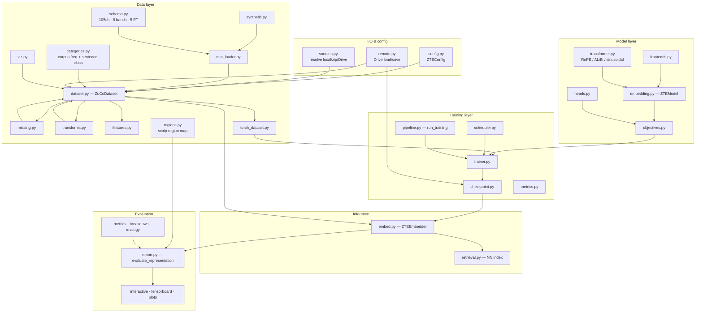
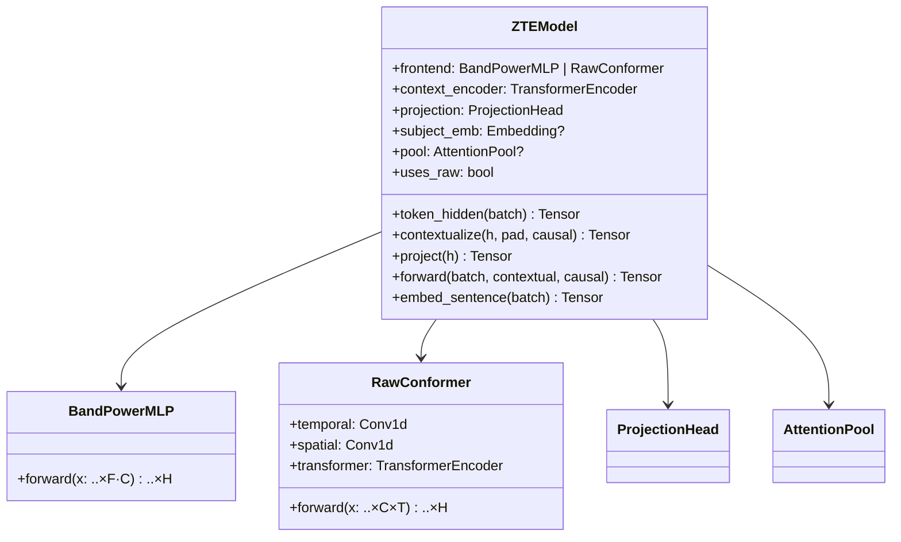
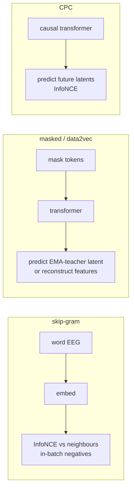
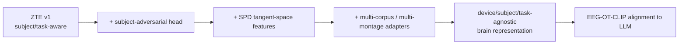

# ZTE Architecture

How the pieces fit together, why the design choices were made, and how ZTE feeds
the parent **Cross-Modal Transfer Learning** project.

> New here? Read the [top-level README](../README.md) first for the one-command
> quickstart, then use this document to understand *why* the pipeline is shaped the
> way it is. Sibling guides: [DATASET](DATASET.md) · [TRAINING](TRAINING.md) ·
> [EVALUATION](EVALUATION.md) · [RESULTS](RESULTS.md).

## 1. Component overview

Everything is driven by one typed config (`ZTEConfig`) and flows left-to-right:
data → model → training → inference → evaluation.

## 2. The data model

ZuCo's verified structure is encoded once in `schema.py`:

| Fact                             | Value                                                  |
| -------------------------------- | ------------------------------------------------------ |
| Channels (post-artefact-removal) | 105 (from a 128-channel EGI system)                    |
| Sampling rate                    | 500 Hz                                                 |
| Frequency bands                  | `t1 t2 a1 a2 b1 b2 g1 g2` (theta→gamma)                |
| Eye-tracking measures            | `FFD SFD GD GPT TRT` (+ `nFixations`, `meanPupilSize`) |
| Word EEG fields                  | `<measure>_<band>` (e.g. `TRT_t1`), each a 105-vector  |
| Sentence EEG fields              | `mean_<band>`, `rawData`                               |
| Omission                         | skipped words → **empty arrays**                       |

A `ZuCoDataset` flattens files into a **word table** + a **sentence table** + an
aligned band-power tensor `(N, F, C)` and/or raw tensor `(N, C, T)`, plus a
**presence mask** `(N,)`. Everything is row-aligned, so a single boolean filter
(length cap, `drop`, or a split) stays consistent across every store. Real corpus
word-frequencies and sentence categories (SR sentiment, TSR relations) are joined
in automatically by `categories.py`.

See [DATASET.md](DATASET.md) for every knob and the analysis helpers.

## 3. The ZTE model

**Design rationale.** Skip-gram/CBOW use the *non-contextual* path so a word's
embedding depends only on its own EEG — the literal word2vec analogue. Masked and
CPC use the transformer because their premise is contextual prediction. The raw
frontend follows the project's EEG-Conformer recipe (temporal conv as a learnable
band-pass → spatial mixing → self-attention → pooling).

### Positional encoding is pluggable

The context transformer (`transformer.py`) honours `model.pos_encoding`:

| Scheme       | Where it acts    | Why you'd pick it                                |
| ------------ | ---------------- | ------------------------------------------------ |
| `rope`       | inside attention | relative, length-generalising SOTA (**default**) |
| `alibi`      | inside attention | linear distance bias; cheap length extrapolation |
| `sinusoidal` | added to inputs  | classic fixed Transformer encoding               |
| `learned`    | added to inputs  | absolute learned table (`max_positions`)         |
| `none`       | —                | ablation: no positional information              |

Each run records its scheme in the checkpoint config, so inference rebuilds the
matching encoder automatically.

## 4. Objectives

The symmetric InfoNCE used here is the same family the parent project applies for
EEG↔text alignment:

$$\mathcal{L}_{\text{InfoNCE}} = -\frac{1}{B}\sum_i \log \frac{\exp(\text{sim}(e_i, t_i)/\tau)}{\sum_j \exp(\text{sim}(e_i, t_j)/\tau)}$$

In ZTE, `t` is a *neighbouring word's EEG* (skip-gram) or a *future word latent*
(CPC) rather than text — pretraining the geometry that alignment later reuses.
The objective is selected with `objective.name`; see [TRAINING.md](TRAINING.md)
for the full hyper-parameter table.

## 5. Anti-leakage: the presence mask

Word-level ZuCo modelling's biggest hazard is treating omitted-word zero/NaN
vectors as signal. ZTE addresses it at three layers:

1. **Loading** — empty arrays become `NaN`; a presence probe marks the word absent.
2. **Imputation** — every strategy returns a presence mask; the normaliser is fit
   on **present tokens only**.
3. **Objectives** — `_usable_mask = pad & presence` gates all anchors, positives
   and targets, so omitted words are never a training signal.

## 6. Cross-subject roadmap (toward invariance)

`ModelConfig.subject_conditioning` already exposes the subject-embedding knob for
ablations; the adversarial and SPD steps slot into the same encoder interface.
`zte-benchmark` sorts runs by **subject-transfer lift**, so progress toward
invariance is measurable, not asserted.

## 7. Where ZTE stops and EEG-OT-CLIP begins

ZTE outputs `(M, 768)` embeddings + aligned metadata. The downstream aligner adds
a frozen LLM text encoder and the composite loss
$\mathcal{L} = \lambda_1\mathcal{L}_{\text{InfoNCE}} + \lambda_2\mathcal{L}_{\text{OT}}$
(Sinkhorn-regularised Wasserstein, optionally Gromov-Wasserstein for distinct
metric spaces), evaluated by **noise-anchored zero-shot retrieval** under LOSO.
ZTE ships the building blocks for that evaluation in `training/metrics.py` and
`evaluation/`. Because the default `embed_dim` is **768**, ZTE embeddings are
plug-compatible with that downstream space.
