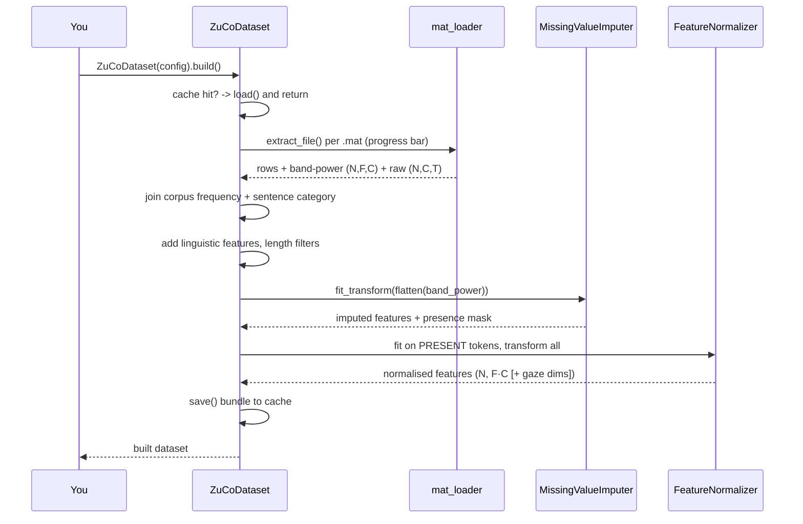
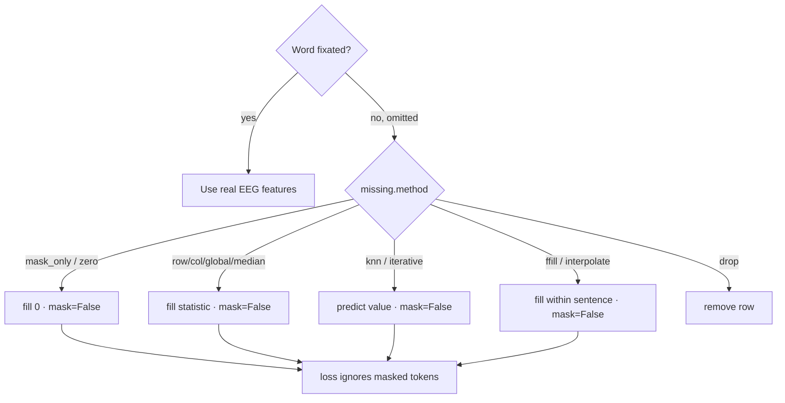

# The ZuCoDataset guide

`ZuCoDataset` is the tunable front door to ZuCo. This guide covers its lifecycle, every configuration knob, the CLI wrapper (`zte-prepare`), and the analysis/visualisation helpers.

> Related: [ARCHITECTURE.md] (how data flows through the system), [TRAINING.md] (consuming a bundle), [EVALUATION.md].

## How to run it

### CLI — build and cache a bundle (`zte-prepare`)

```sh
# Real data: point --root at a directory of extracted .mat files.
uv run zte-prepare --root res/data/zuco_extracted --representation band_power --out res/bundle

# Or download + extract straight from Google Drive (needs `uv sync --group drive`).
uv run zte-prepare \
    --drive 'https://drive.google.com/drive/folders/13EYW1h6dHD5E4YoEWNsKe6ZBHmMU_kFQ' \
    --representation band_power --out res/bundle

# No data: synthesise a schema-faithful tree, then build (great smoke test).
uv run zte-prepare --synthetic --synthetic-sentences 12 --out res/bundle --figures res/figures

# Choose the missing-value strategy, normalisation and raw window.
uv run zte-prepare --root res/data/zuco_extracted \
    --representation both --missing-method knn --normalize zscore_channel --raw-window 128 \
    --tasks SR,NR --subjects ZAB,ZDM,ZJS --out res/bundle
```

`zte-prepare` flags (all optional except a source):

| Flag                                                                 | Default                                          | Meaning                                                   |
| -------------------------------------------------------------------- | ------------------------------------------------ | --------------------------------------------------------- |
| `--root` / `--drive` / `--synthetic`                                 | — (one required)                                 | Local `.mat` dir / zip(s), Drive folder, or synthesise    |
| `--extract-dir`                                                      | `res/data/zuco_extracted`                        | Where Drive/zips are unzipped (idempotent)                |
| `--representation`                                                   | `band_power`                                     | `band_power` \| `raw` \| `both`                           |
| `--missing-method`                                                   | `mask_only`                                      | Any strategy from the table below                         |
| `--normalize`                                                        | `zscore_channel`                                 | `zscore_channel` \| `zscore_global` \| `minmax` \| `none` |
| `--raw-window`                                                       | `128`                                            | Samples raw EEG is padded/truncated to                    |
| `--tasks`                                                            | `SR,NR`                                          | Comma-separated tasks (`SR`,`NR`,`TSR`)                   |
| `--subjects`                                                         | all                                              | Comma-separated subject filter                            |
| `--cache-dir`                                                        | `res/cache`                                      | Feature-cache location                                    |
| `--out`                                                              | `res/bundle`                                     | Where the reusable bundle is saved                        |
| `--figures`                                                          | off                                              | If set, render the overview figures here                  |
| `--synthetic-out` / `--synthetic-subjects` / `--synthetic-sentences` | `res/data/synthetic_zuco` / `ZAB,ZDM,ZJN` / `12` | Synthetic generator options                               |

### Python API

```python
from zte.config import DatasetConfig, MissingConfig
from zte.data.dataset import ZuCoDataset

ds = ZuCoDataset(
    DatasetConfig(
        root='res/data/zuco_extracted',
        tasks=('SR', 'NR'),
        representation='both',  # band_power | raw | both
        band_power_measures=('TRT',),  # which eye-tracking-locked features
        include_eye_tracking=True,  # gaze scalars appended? (see below)
        normalize='zscore_channel',
        missing=MissingConfig(method='knn'),  # see table below
        raw_window=128,
    )
).build()  # caches a bundle; reloads instantly next time

ds.analyze()  # dict: counts, omission, missingness
ds.select_features(target='log_freq', method='mutual_info', k=64)
splits = ds.split('by_subject_loso', holdout_subject='ZPH')
torch_ds = ds.to_torch(split=splits['train'])
ds.save('res/bundle')  # round-trips arrays + tables + normaliser
```

## Lifecycle



## Configuration reference (`DatasetConfig`)

Defaults come straight from `src/zte/config/`.

| Field                        | Default                                     | Meaning                                                   |
| ---------------------------- | ------------------------------------------- | --------------------------------------------------------- |
| `root`                       | `res/data/zuco_extracted`                   | Directory of `.mat` files (searched recursively)          |
| `tasks`                      | `('SR','NR')`                               | Reading tasks to include (`SR`,`NR`,`TSR`)                |
| `subjects`                   | `None`                                      | Subject filter (`None` = all discovered)                  |
| `granularity`                | `word`                                      | Token granularity (`word`; `sentence` reserved)           |
| `representation`             | `band_power`                                | `band_power` \| `raw` \| `both`                           |
| `band_power_measures`        | `('TRT',)`                                  | Eye-tracking-locked measures for band power               |
| `include_eye_tracking`       | `True`                                      | Append gaze-behaviour scalars to each token (see below)   |
| `eye_tracking_measures`      | `FFD,SFD,GD,GPT,TRT,n_fixations,mean_pupil` | Which gaze scalars are appended                           |
| `bands`                      | all 8                                       | Frequency bands for band power                            |
| `raw_field`                  | `rawEEG`                                    | Word raw-EEG field (`rawData` for sentence)               |
| `raw_window`                 | `128`                                       | Samples raw EEG is padded/truncated to                    |
| `normalize`                  | `zscore_channel`                            | `zscore_channel` \| `zscore_global` \| `minmax` \| `none` |
| `bandpass`                   | `None`                                      | Optional `(low, high)` Hz Butterworth filter for raw      |
| `missing`                    | `MissingConfig()`                           | Missing-value strategy (see table)                        |
| `include_omitted`            | `True`                                      | Keep omitted words as masked tokens (else drop them)      |
| `min_words` / `max_words`    | `1` / `None`                                | Sentence-length filter                                    |
| `cache_dir` / `cache_format` | `res/cache` / `npz`                         | Processed cache location/format                           |

### Eye-tracking: include or exclude

ZuCo is a *reading* corpus, so eye-tracking behaviour (fixation durations, `nFixations`, pupil size) is richly informative — **for reading**. But an imagined-thought BCI has no gaze. `include_eye_tracking` makes this a first-class switch:

```python
DatasetConfig(include_eye_tracking=True)  # default: gaze scalars appended to each token
DatasetConfig(include_eye_tracking=False)  # EEG-only: the imagined-thought / device-agnostic path
```

The EEG band-power is always kept; the toggle only governs the extra gaze dimensions. `zte-explore` quantifies exactly how much eye-tracking helps a *reading* target vs a *cognitive* target, so the choice is evidence-based (see [EVALUATION.md]).

## Representations

| Representation | Per-token shape    | Frontend         | When to use                                |
| -------------- | ------------------ | ---------------- | ------------------------------------------ |
| `band_power`   | `F·C` (e.g. 8×105) | `band_power_mlp` | Compact, fast, proven; great default       |
| `raw`          | `C×T` (105×window) | `raw_conformer`  | Richer temporal detail; heavier            |
| `both`         | both available     | either           | Keep options open; switch via model config |

Per set of words the band-power tensor is $X \in \mathbb{R}^{n_{\text{words}} \times n_{bp} \times C}$, where $n_{bp} = n_{\text{measures}} \times n_{\text{bands}}$ band-power features are laid over $C = 105$ channels. Each token flattens the $(n_{bp} \times C)$ grid into a band-major, channel-minor vector, optionally with appended eye-tracking scalars:

$$
X \in \mathbb{R}^{n_{\text{words}} \times n_{bp} \times C}, \qquad x_{\text{token}} \in \mathbb{R}^{n_{bp}\cdot C}\ (\text{e.g. } 8 \times 105 = 840)
$$

The `raw` representation instead keeps $C \times T$ samples per token, with $C = 105$ and $T =$ `raw_window`.

## Normalisation (`normalize`)

`FeatureNormalizer` fits its statistics on the **present** training tokens (never on masked omitted words), then transforms every split with those fixed statistics. The variants:

- `zscore_channel` — per-channel (per-feature) z-score using that channel's train mean $\mu_c$ and std $\sigma_c$: $\tilde x_c = \dfrac{x_c - \mu_c}{\sigma_c}$.
- `zscore_global` — a single global $\mu,\sigma$ over all features: $\tilde x = \dfrac{x - \mu}{\sigma}$.
- `minmax` — rescale to $[0,1]$: $\tilde x = \dfrac{x - \min x}{\max x - \min x}$.
- `none` — leave features unscaled.

$$
\tilde x_c = \frac{x_c - \mu_c}{\sigma_c}, \qquad \tilde x = \frac{x - \min x}{\max x - \min x}
$$

## Missing-value strategies (`MissingConfig.method`)

Omitted (skipped) words carry **no** EEG. Every strategy returns a **presence mask** so omitted-word zero-vectors never leak into training losses.

| Method                                | What it does                                                      |
| ------------------------------------- | ----------------------------------------------------------------- |
| `mask_only`                           | Fill with 0, rely entirely on the presence mask (default, safest) |
| `zero`                                | Fill with 0                                                       |
| `row_mean`                            | Fill from each token's own present features                       |
| `col_mean` / `global_mean` / `median` | Fill from column / global statistics                              |
| `knn`                                 | `KNNImputer` (predict from similar tokens)                        |
| `iterative`                           | Model-based round-robin regression imputation                     |
| `ffill` / `interpolate`               | Sequence-aware fills along reading order (never cross sentences)  |
| `drop`                                | Remove omitted-word rows entirely                                 |

The statistical fills average over the observed entries only. For `col_mean` / `global_mean`, the missing entry $x_{ij}$ is filled from the observed set $\Omega_j$ of column $j$ (a single global column for `global_mean`); `row_mean` averages a token's own present features instead:

$$
\hat x_{ij} = \frac{1}{\lvert \Omega_j \rvert}\sum_{i' \in \Omega_j} x_{i'j}
$$



## Analysis & visualisation

```python
from zte.data.viz import save_overview

summary = ds.analyze()  # counts, omission, missingness (JSON-safe)
save_overview(ds, 'res/figures')  # missingness, ET dists, correlations, omission, availability
```

| Figure                      | Function                  | What it shows         |
| --------------------------- | ------------------------- | --------------------- |
| Missingness by measure/task | `plot_missingness`        | missing-rate analysis |
| ET duration histograms      | `plot_et_distributions`   | word-level durations  |
| ET correlation matrix       | `plot_correlations`       | measure correlations  |
| Omission & TRT vs length    | `plot_omission_by_length` | length effects        |
| EEG availability heatmap    | `plot_eeg_availability`   | availability heatmap  |

Sample outputs (from the synthetic smoke run) are shown in [RESULTS.md].

## Feature selection

```python
res = ds.select_features(target='log_freq', method='mutual_info', k=64)
res.indices  # selected flattened (channel×band) indices
res.scores  # importance per input feature
res.names  # e.g. 'TRT_t1::ch042'
```

Methods: `variance`, `f_score`, `mutual_info`, `rf_importance`. Scoring is restricted to present tokens (`present_only=True`) so omitted words never drive the ranking.

## Splits

Choose with `train.split` (see [TRAINING.md]) or `ds.split(...)`.

| Strategy          | Holds out       | Use                                          |
| ----------------- | --------------- | -------------------------------------------- |
| `random`          | random words    | quick sanity checks                          |
| `by_sentence`     | whole sentences | default; no within-sentence leakage          |
| `by_subject_loso` | one subject     | cross-subject generalisation (the real test) |
| `by_task`         | one task        | cross-task transfer                          |

## Persistence & remote

### Downloading raw ZuCo

Every CLI that loads `.mat` files (`zte-prepare`, `zte-train`, `zte-extract`, `zte-evaluate`, `zte-explore`, `zte-benchmark`, `zte-run`) accepts the same data source flags. Install Drive support once, then pass `--drive`:

```sh
uv sync --group drive
uv run zte-prepare --drive 13EYW1h6dHD5E4YoEWNsKe6ZBHmMU_kFQ --out res/bundle
```

`--drive` downloads the folder to `res/data/_downloads`, unzips task archives into `--extract-dir` (default `res/data/zuco_extracted`), then proceeds. Re-runs skip archives already extracted. `--root` still works for a local extracted dir, a single `.zip`, or a folder of task `.zip` files.

**Resumable downloads:** Drive downloads are interrupt-safe (Ctrl+C). Each archive is fetched individually with byte-level progress; completed files are tracked in `res/data/_downloads/.zte_drive_manifest.json`. Re-run the same `--drive` command (or `zte-download`) to resume.

### Bundles

```python
ds.save('res/bundle')  # arrays.npz + words.pkl + sentences.pkl + meta.json
ds2 = ZuCoDataset.load('res/bundle')  # exact round-trip incl. normaliser state
ds.save_to_drive('/content/drive/MyDrive/ZTE/bundle')
ZuCoDataset.from_drive('<file id | url | mounted path>')
```

A saved bundle is the unit of reuse: build once with `zte-prepare`, then train, evaluate and explore from it repeatedly without re-reading the `.mat` files.

### The layered cache — prepare once, across machines and sessions

`--cache-dir` is a fast local cache; `--cache-remote` (or `$ZTE_CACHE_REMOTE`, which every `zte-*` command honours) is a persistent one, typically a mounted Drive folder. Lookups read local first, then the persistent store, staging a hit down once; a freshly built bundle is published upward immediately, so an interrupted run never costs a rebuild.

```sh
export ZTE_CACHE_REMOTE="/content/drive/MyDrive/Sharables/ZTE/prepared"

uv run zte-prepare --root "<ZuCo>" --configs                 # build every dataset the experiments need, once
uv run zte-prepare --root "<ZuCo>" --configs --check         # report what exists; build nothing
```

`--configs` groups every config by its content-addressed cache key, so the many experiments sharing a dataset (all the raw arms, every LOSO fold, every seed) cost one build between them. The `status` column reads:

| status | meaning |
| --- | --- |
| `cached` | already on this machine |
| `on-drive` | in the persistent store; pulled down on demand by the first run that needs it |
| `MISSING` | about to be built (or, under `--check`, still outstanding) |

**A prepared project never touches the raw data.** Cache keys exclude the data root, so every command keys its config and queries the store *before* resolving the `.mat` tree, and only resolves it for what is genuinely absent. This matters because "resolving" a Drive folder of ZuCo task archives means unpacking tens of gigabytes: on a warm store `zte-run`, `zte-train`, `zte-explore`, `zte-benchmark` and `zte-prepare` all skip it entirely and log `Processed bundle already persistent; skipping raw-data extraction.`

**Single-file artifacts layer too.** The frozen encoder passes — the contextual BERT meaning matrix (`res/cache/meaning/`) and the E5/BGE sentence embeddings (`res/cache/text/`) — are content-addressed and mirrored to `<remote>/_artifacts/`, so they are built once ever rather than once per runtime.

That is what makes it safe to run at the top of every Colab session: the local cache dies with the runtime, but Drive does not, and re-running costs nothing. Do not gate it behind a local "already done" sentinel — a sentinel on the ephemeral disk never survives to fire, and one that does survive goes stale the moment a new experiment config needs a dataset it has not seen.

[ARCHITECTURE.md]: ./ARCHITECTURE.md
[EVALUATION.md]: ./EVALUATION.md
[RESULTS.md]: ./RESULTS.md
[TRAINING.md]: ./TRAINING.md
