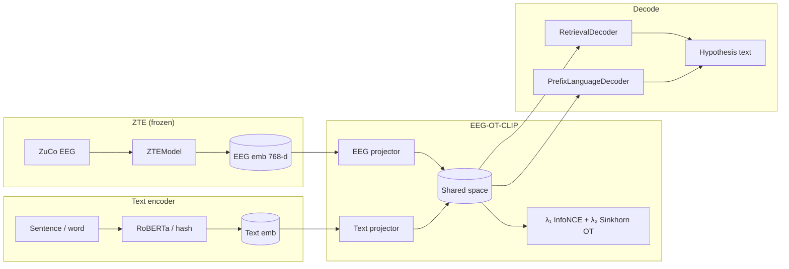

# EEG → language decoding

ZTE pretrains subject-aware thought embeddings. This document describes the
**downstream** stage that turns those embeddings into language: EEG-OT-CLIP
alignment, retrieval / generative decode, CLI, and the noise-anchored LOSO
evaluation protocol.

## Motivation

Reading EEG is not a sequence-to-sequence transcription problem in the usual
sense. The parent project reframes it as **cross-modal manifold alignment**:
map a frozen EEG encoder into a frozen LLM's semantic space, then retrieve (or
generate) language by nearest neighbour / prefix conditioning. ZTE supplies the
EEG-side representation; `zte.decode` implements the aligner and decoders.

## Architecture



Package layout under `src/zte/decode/`:

| Module | Role |
|--------|------|
| `config.py` | `DecoderConfig`, `AlignConfig`, `TextEncoderConfig`, `GenerativeConfig` |
| `text_encoder.py` | Hash / HuggingFace text encoders + disk cache |
| `alignment.py` | `EEGProjector`, `OTCLIPAligner` |
| `losses.py` | `info_nce_loss`, `sinkhorn_ot_loss` |
| `pairing.py` | Sentence / word EEG↔text pair builders |
| `train.py` / `train_align.py` | Alignment training loops |
| `train_decode.py` | Retrieval bank fit / prefix-LM training |
| `decoders.py` | `RetrievalDecoder`, `PrefixLanguageDecoder`, `LanguageDecoder` |
| `metrics.py` / `evaluate.py` | BLEU, WER, noise-anchored retrieval, reports |

## Alignment loss

\[
\mathcal{L} = \lambda_1 \mathcal{L}_{\mathrm{InfoNCE}} + \lambda_2 \mathcal{L}_{\mathrm{OT}}
\]

- **InfoNCE** — symmetric batch contrastive loss between projected EEG and text
  (temperature \(\tau\), default `0.07`).
- **Sinkhorn OT** — entropic optimal transport on cosine cost
  \(C_{ij} = 1 - \cos(z_i^{\mathrm{eeg}}, z_j^{\mathrm{text}})\), regularised by
  \(\varepsilon\) (default `0.05`).

The ZTE encoder is **frozen** by default (`freeze_eeg_encoder: true`); only the
MLP projectors are trained (AdamW + warmup cosine via
`zte.training.scheduler.build_scheduler`).

## Retrieval vs generative decode

| Mode | Mechanism | When to use |
|------|-----------|-------------|
| `retrieval` | Nearest neighbour in the aligned text bank | Primary zero-shot path; no LM weights needed |
| `prefix_lm` | Map EEG → soft prompt prefixes for GPT-2 / toy char-GRU | Open-ended generation experiments |
| `both` | Fit retrieval bank + train prefix mapper | Ablations / combined reporting |

Tests and CI use `backend='hash'` (text) and `backend='toy'` (LM) so nothing
downloads from HuggingFace.

## CLI

```bash
# One-command synthetic smoke
zte-decode-run --synthetic --epochs 3 --align-epochs 5 --backend hash --out res/decode/demo

# Align a trained ZTE checkpoint
zte-align --ckpt res/checkpoints/best.pt --bundle res/bundle \
  --config experiments/decode/align_otclip_loso.yaml --out res/decode/alignment

# Decode
zte-decode --align-ckpt res/decode/alignment/<run>/best.pt \
  --ckpt res/checkpoints/best.pt --bundle res/bundle \
  --mode retrieval --out res/decode/predictions

# Full evaluation report
zte-decode-eval --align-ckpt ... --ckpt ... --bundle ... --out res/decode/eval
```

Optional dependency group (real transformers backends):

```bash
uv sync --group decode
```

Hash / toy backends work without that group.

## Evaluation protocol

Honest claims require **noise-anchored zero-shot retrieval under LOSO**:

1. **Split** — `by_subject_loso` with a held-out subject (e.g. `ZPH`). Alignment
   never sees that subject's EEG.
2. **Retrieval** — project val EEG and text; report Top-K / MRR
   (`zte.training.metrics.retrieval_metrics`).
3. **Noise anchor** — replace EEG queries with
   `noise_matched(eeg)` (matched mean/variance, no structure) and recompute
   retrieval. A real aligner must beat this floor (`beats_noise_anchor`).
4. **Chance** — Top-1 must exceed \(1/N\) (`retrieval_above_chance`).
5. **Generative** (optional) — exact match, corpus BLEU-ish, token F1, WER, plus
   per-subject / per-task breakdowns.

`evaluate_decoding` writes:

```
out_dir/
  metrics.json
  report.md
  predictions.csv
  figures/retrieval_curve.png
  figures/per_subject_exact_match.png
```

## Connection to the ZTE encoder

1. Train (or load) a ZTE checkpoint → `ZTEEmbedder.from_checkpoint`.
2. Embed sentences (or words) with the frozen encoder.
3. Embed the same strings with `build_text_encoder` (RoBERTa or hash).
4. Train `OTCLIPAligner` projectors; save `best.pt` (aligner + text bank).
5. Decode via retrieval (or prefix-LM) and run `zte-decode-eval`.

Default `embed_dim=768` keeps ZTE plug-compatible with RoBERTa / BART spaces.
For synthetic smoke tests, smaller dims (e.g. 64) are fine with the hash encoder.

## Reproduce

```bash
# Demo script (mirrors zte-decode-run)
uv run python examples/run_decode_demo.py --epochs 3 --align-epochs 5

# Unit tests (hash/toy only, <30s)
PYTHONPATH=src python -m pytest tests/test_decode.py -q --tb=short
```

Experiment YAMLs live under [`experiments/decode/`](../experiments/decode/).
