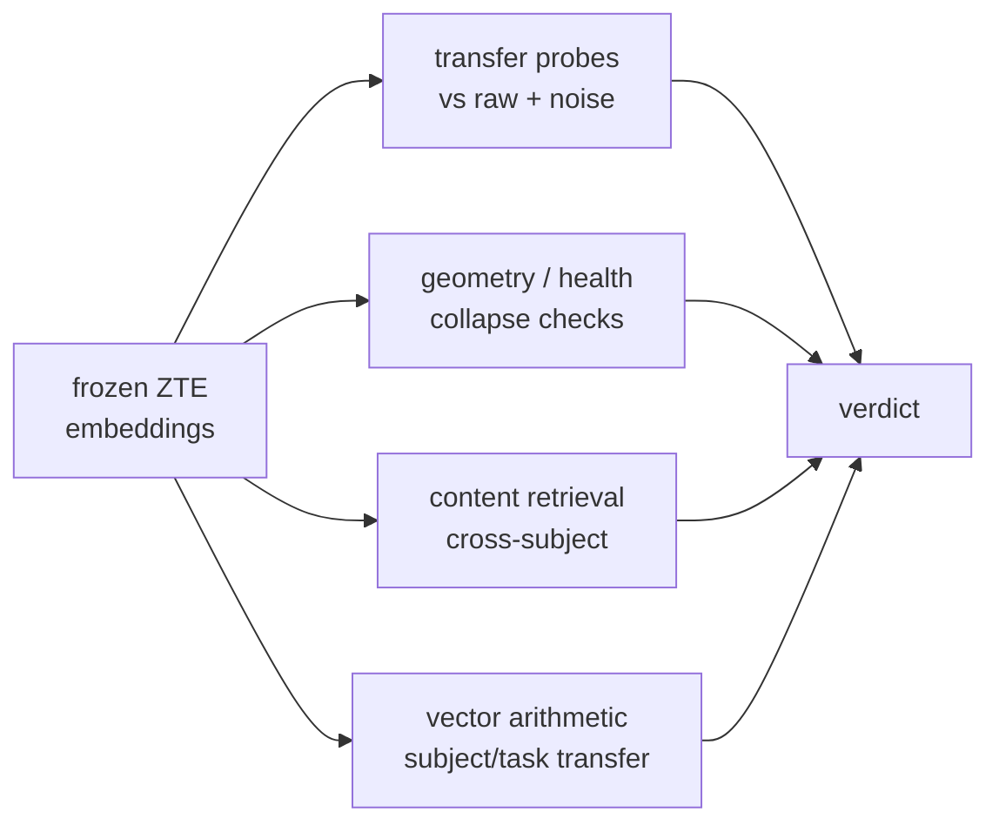

# Evaluation guide

How ZTE proves — without training a decoder — that its encoder turns EEG into a **structured, re-purposable** space rather than memorising noise. This is the project's defence against the "BLEU-trap": every headline number is checked against a raw-feature reference **and** a noise-matched control.

> Related: [ARCHITECTURE.md] · [TRAINING.md] · [RESULTS.md] (validated numbers from a real run).
> Each run writes its plots to `evaluation/figures/` (via `examples/evaluate_zte.py`); the numbers here come from the synthetic smoke run, and real ZuCo produces the same artifacts at scale.

## How to run it

### CLI — `zte-evaluate`

```sh
# Evaluate a checkpoint against a bundle; write report, figures, tables.
uv run zte-evaluate --ckpt res/checkpoints/best.pt --bundle res/bundle --out res/evaluation

# Add the full TensorBoard log (projector, hparams, scalars, histograms, images).
uv run zte-evaluate --ckpt res/checkpoints/best.pt --bundle res/bundle \
    --out res/evaluation --tensorboard
tensorboard --logdir res/evaluation/tb        # then open the PROJECTOR tab

# Evaluate straight from .mat files instead of a bundle; skip the HTML explorer.
uv run zte-evaluate --ckpt res/checkpoints/best.pt --root res/data/zuco_extracted \
    --out res/evaluation --no-interactive
# Or download + evaluate in one step (needs `uv sync --group drive`):
uv run zte-evaluate --ckpt res/checkpoints/best.pt \
    --drive 'https://drive.google.com/drive/folders/13EYW1h6dHD5E4YoEWNsKe6ZBHmMU_kFQ' \
    --out res/evaluation
```

Flags: `--ckpt` (required), one of `--bundle` / `--root` / `--drive`, `--extract-dir` (default `res/data/zuco_extracted`), `--out` (`res/evaluation`), `--device`, `--run-name`, `--tensorboard`, `--no-interactive`.  `zte-run` performs this automatically for each experiment.

### Self-contained demo (no data)

```sh
uv run python examples/evaluate_zte.py --out res/eval_demo/evaluation
```

Trains a small model on synthetic ZuCo, then runs the whole suite end-to-end.

### Python API

```python
from zte.cli.evaluate import collect_embeddings
from zte.evaluation.report import evaluate_representation
from zte.inference.embed import ZTEEmbedder

embedder = ZTEEmbedder.from_checkpoint('res/checkpoints/best.pt', ds)
word_emb, word_meta, raw_feats, sent_emb, sent_ids, sent_meta, word_bp = collect_embeddings(embedder, ds)
metrics = evaluate_representation(
    word_emb,
    word_meta,
    raw_feats,
    sent_emb,
    sent_ids,
    out_dir='res/evaluation',
    sent_meta=sent_meta,
    word_band_power=word_bp,
    config=embedder.config,
    tensorboard=True,
    interactive=True,
)
print(metrics['verdict'])
```

## What gets written

```text
res/evaluation/
├── report.md          # human-readable report with a pass/fail verdict
├── metrics.json       # every number (also returned by evaluate_representation)
├── comparison.csv     # probe table (ZTE vs raw vs noise, per target)
├── breakdown.csv      # per-subject / per-task rows
├── region_importance.csv
├── figures/           # generated plots (per run)
├── interactive/word_explorer.html   # self-contained 3-D explorer
└── tb/<run_name>/     # TensorBoard (if --tensorboard)
```

## The four families of evidence



### 1. Transfer probes (does the space *carry* attributes?)

Linear + kNN probes predict known attributes (word length, log frequency, subject, task) from **frozen** embeddings. Each is run on three representations so the result is interpretable:

- **ZTE** — the learned embedding.
- **raw band-power** — the un-learned input features (a strong reference).
- **noise (matched)** — Gaussian noise matched to the data's mean/variance (the floor a *real* encoder must beat).

R² for regression, accuracy for classification; a dashed baseline marks predict-the-mean / majority. The coefficient of determination compares residual to total variance,

$$
R^{2} = 1 - \frac{\sum_i (y_i - \hat y_i)^{2}}{\sum_i (y_i - \bar y)^{2}}
$$

so the predict-the-mean baseline sits at $R^{2}=0$. ZTE should beat the noise control and rival raw band-power in far fewer dimensions.

### 2. Geometry / health (is the space healthy, or collapsed?)

Label-free metrics from `zte.evaluation.metrics`:

| Metric                     | Good sign               | Detects                   |
| -------------------------- | ----------------------- | ------------------------- |
| Effective rank / ratio     | high (near `embed_dim`) | dimensional collapse      |
| Uniformity (Wang & Isola)  | low (spread out)        | crowding on the sphere    |
| Alignment (adjacent words) | low                     | neighbours drifting apart |
| Anisotropy                 | low                     | a degenerate "cone"       |
| Dead-dim fraction          | ~0                      | unused dimensions         |

Writing $Z \in \mathbb{R}^{n \times d}$ ($d = 768$) for the embedding matrix with rows $z_i$, unit-normalised $\hat z_i = z_i / \lVert z_i \rVert$ and cosine $s_{ij} = \hat z_i^\top \hat z_j$, the label-free metrics are:

- **Effective rank** (Roy & Vetterli) from the singular values $\sigma_k$ of the mean-centred $Z$, with $p_k = \sigma_k / \sum_j \sigma_j$ — a soft count of active dimensions:

$$
\mathrm{erank}(Z) = \exp\!\Big(-\sum_k p_k \log p_k\Big)
$$

- **Uniformity** (Wang & Isola, $t = 2$) — the log mean Gaussian potential over all distinct pairs, lower when embeddings spread over the sphere:

$$
\mathcal{U} = \log\ \mathbb{E}_{i \ne j}\ \exp\!\big(-t\,\lVert \hat z_i - \hat z_j \rVert^{2}\big)
$$

- **Alignment** (over positive pairs $P$, adjacent words, $\alpha = 2$) — low when neighbours stay close:

$$
\mathcal{A} = \mathbb{E}_{(i,j)\in P}\ \lVert \hat z_i - \hat z_j \rVert^{\alpha}
$$

- **Anisotropy** — the mean off-diagonal cosine; high values signal a degenerate "cone". On the unit sphere it is equivalent (up to a constant) to squared distance:

$$
\text{aniso} = \mathbb{E}_{i \ne j}\big[\hat z_i^\top \hat z_j\big], \qquad \lVert \hat z_i - \hat z_j \rVert^{2} = 2 - 2\,\hat z_i^\top \hat z_j
$$

The PCA projections should show smooth structure by word length and separable subjects rather than a featureless blob:

### 3. Content retrieval (do same-thoughts attract?)

Leave-one-out retrieval: does the *same stimulus read by a different subject* retrieve its counterparts better than chance (Top-K, MRR)? Over $Q$ queries, a hit is a $\text{top-}k$ neighbour sharing the query's group, and $\text{rank}_q$ is the rank of the first such neighbour:

$$
\text{Recall@}k = \frac{1}{Q}\sum_{q=1}^{Q} \mathbf{1}\!\big[\text{rank}_q \le k\big], \qquad \text{MRR} = \frac{1}{Q}\sum_{q=1}^{Q} \frac{1}{\text{rank}_q}
$$

This is the honest cross-subject test and the direct analogue of the downstream zero-shot task.

### 4. Vector arithmetic (the `king − man + woman` test for thoughts)

If ZTE is a real thought code, *who* produced a thought should be a translation in
the space. For a stimulus token `t`,
`emb(t, subject A) − centroid(A) + centroid(B)` should retrieve `emb(t, B)`. The
report gives **subject-transfer** (and task-transfer) analogy accuracy vs chance,
with a raw-feature control — a falsifiable test of subject-agnosticism.

## Stratified breakdowns

The same metrics are re-computed **per subject, per task and per sentence category** (`zte.evaluation.breakdown`), so a strong global number can't hide a subject that fails:

## Scalp-region importance & eye-tracking (`zte-explore`)

Which parts of the cortex encode *thought* vs *reading*, and how much does gaze behaviour actually help? `zte-explore` groups the 105 channels into anterior->posterior scalp regions and scores each region's share of the decodable information for reading targets (word length, frequency) and cognitive targets (task, subject). It also probes EEG-only vs eye-tracking-only vs both, quantifying the intuition behind the `include_eye_tracking` switch.

```sh
uv run zte-explore --root res/data/zuco_extracted --out res/exploration
uv run zte-explore --drive <folder-id-or-url> --out res/exploration
# Supply an exact montage instead of the approximate default map:
uv run zte-explore --bundle res/bundle --montage-csv my_montage.csv --out res/exploration
```

Flags: one of `--bundle` / `--root` / `--drive` / `--synthetic`, `--extract-dir`, `--tasks`, `--out`, `--montage-csv`, `--method mutual_info|f_score`.

## The verdict

`report.md` ends with a small set of boolean checks derived from the metrics:

- **beats the noise control** on each probe target,
- **no representation collapse** (effective-rank ratio > 0.1, dead dims < 50%),
- **cross-subject retrieval above chance** — judged on `scoreboard.held_out_retrieval` whenever the split holds a subject out,
- **subject arithmetic above chance**.

Each check is now backed by a **statistic, not a sign**. "Beats noise" requires the paired
per-fold (ZTE − noise) probe-score difference's bootstrap 95% CI lower bound to clear an
**effect-size floor** (0.01), not merely be positive by 1e-3; retrieval- and arithmetic-above-chance
require the bootstrap CI on `(Top-1 − chance)` over the per-query hit vector to exclude zero. These are
**percentile bootstrap** intervals: resample the statistic $B$ times to get $\theta^{\ast}_1,\dots,\theta^{\ast}_B$, then take the central $(1-\alpha)$ quantile pair,

$$
\text{CI}_{1-\alpha} = \big[\theta^{\ast}_{(\alpha/2)},\ \theta^{\ast}_{(1-\alpha/2)}\big].
$$

The retrieval clause names its basis. `verdict['retrieval_basis']` records what `retrieval_above_chance` and
`retrieval_ci` were computed on: `held_out_retrieval` whenever the split holds a subject out — the CI is then the
bootstrap on the held-out per-query Top-1 hits minus their cross-subject gallery chance — and the pooled
`sentence_retrieval` only when no subject is held out, in which case the label says so in plain words. A pooled
number can therefore never turn the clause green on a LOSO run. The permutation-null and phase-control demotions
apply unchanged on top of whichever basis was used.

The CIs are stored in the verdict (`beats_noise_ci`, `retrieval_ci`, `subject_arithmetic_ci`,
`effect_size_floor`). Two further honesty fixes: retrieval **chance is query-weighted** (matching how
hits are scored) — for group sizes $g$ this is

$$
\text{chance} = \frac{\sum_g g(g-1)}{\big(\sum_g g\big)(n-1)}
$$

(the old type-weighted value is kept as `chance_top1_typeweighted` and typically
understated chance by ~30×), and probes use **shuffled, scaled** cross-validation so R² magnitudes are
trustworthy (direction was always correct). Evaluation now defaults to a **held-out** split
(`train.test_fraction = 0.1`, or a `by_stimulus` split) rather than in-sample.

These are intentionally strict: on tiny synthetic data some will legitimately fail (there is little real cross-subject signal to find), which is exactly why the same commands must be run on real ZuCo to make claims. See [RESULTS.md].

## Generation and rescoring (`zte-decode`)

A decoder run adds two readouts, and the distinction between them is the whole point.

**Rescoring retrieval is the powered one.** Every gallery sentence is scored by length-normalised
$\log p(\text{text}_j \mid z_i)$ and reported as `scoreboard.decoder_rescoring_retrieval` — Top-1/5/10,
`rank_percentile`, exact binomial tail, bootstrap CI, plus a length-stratified sub-block. At 700 queries that is ~9.5
bits of forced choice. It is **retrieval** and is labelled as such wherever it appears. With `decoder.rescore_pmi` on,
the score is the PMI form — each candidate's null-prefix log-likelihood subtracted, cancelling candidate-side
familiarity bias — the block is marked `score: 'pmi'`, and `pmi_vs_raw` carries the paired per-query rank-percentile
delta with a bootstrap CI (see [DECODER.md]).

**Free-running generation is the secondary, expected-null one.** No reference length, no candidate set, greedy, EOS or
`max_new_tokens`. `generation_report` scores it with BLEU-1..4, ROUGE-1/2/L, WER and content-word F1 (pure stdlib +
numpy — no metric package is a dependency) against five brain-independent controls decoded through the identical path:
`mean_prefix` (the train-split mean vector, which absorbs any learned text prior), `null_prefix`, `phase`, `noise`, and
a length-stratified `mismatch` derangement. A true-text-embedding `oracle` bounds the achievable score.

`_verdict['generation_above_controls']` is an AND over five clauses, each reported with its numbers: the readings come
from the `test` cell of `by_subject_and_stimulus` (`report.HONEST_SPLIT`); `n_candidate_sentences is None`; the paired
per-sentence bootstrap CI lower bound is above zero against **every** requested control, with one that could not be
decoded counting as not beaten; the permutation null (hypotheses fixed, pairing permuted) gives *p* < 0.05; and the mean
KL between a reading's own prefix and another reading's clears `decoder.min_prefix_kl`. A bridge whose prompt does not
vary with the conditioning vector scores exactly 0 there, so below that last floor no delta means anything.

`teacher_forced_ppl_DIAGNOSTIC` is computed, stored and **provably unread** by the verdict: `strip_quarantined` drops
any `*_DIAGNOSTIC` / `*_RETRIEVAL` key at any depth and `_verdict` re-applies it to whatever it is handed. No
`*_RETRIEVAL` key is emitted today; the suffix is the standing contract for any forced-choice number added later.
Artifacts: `evaluation/generation.jsonl`, `generation.json`, and `evaluation/interactive/generation.html`.

## The sentence-length confound (`zte-rebaseline`)

Before believing any ZuCo retrieval number, ask how much of it is word count. On the real 700-stimulus gallery,
`H(identity) = 9.4512` bits and `H(identity | n_words) = 4.3090`, so **sentence length alone carries 5.1422 bits** —
and ZuCo's segmentation is eye-tracking-derived, so the model gets it free. A length-only oracle at ±2 words scores
Top-1 0.0214 / Top-5 0.0786 / Top-10 0.1371 / MRR 0.0672 against the best encoder's 0.0143 / 0.0457 / 0.0886 / 0.0427.

`zte-rebaseline --ckpt <best.pt> --root <data>` scores any existing checkpoint in a 3×2 grid — post-processing in
{none, train-fitted whiten+ABTT, transductive whiten+ABTT} × gallery in {full 700, `|Δn_words| ≤ length_tol`} — beside
the length-oracle floor and the bit budget, and writes `rebaseline.json` + `rebaseline.md`. It trains nothing and
gates nothing; it tells you which column of your own result is length. The transductive column reproduces the
published number and is contaminated by construction (the whitening is fitted over the held-out subject too); the
train-fitted column is the one a decoder inherits.

## The sub-word piece confound (`zte-rebaseline --piece-oracle`)

Word count is one integer per sentence. The moment an objective works at the sub-word level, the gallery also gives
away a *vector* of them — how many word-pieces the reference tokeniser spells each word in — and that channel is
larger than the identity it would be used to recover.

Measured with the real `Qwen/Qwen2.5-0.5B` tokeniser over a 700-sentence corpus matched to ZuCo's statistics
(1.463 pieces per word against ZuCo's measured 1.4), and priced against the same $H(\text{identity}) = 9.4512$ bits
the length audit above is:

| What the oracle is told, and nothing else                 | Bits |  Top-1 | hits / 700 |
| --------------------------------------------------------- | ---: | -----: | ---------: |
| `n_words` — the documented length confound                | 4.96 |  4.71% |         33 |
| the total sub-word piece count — one integer per sentence | 5.58 |  8.86% |         62 |
| `n_words` and the total piece count together              | 8.18 | 51.29% |        359 |
| the per-word piece profile                                | 9.44 | 99.57% |        697 |
| the same profile after ZuCo's 33% word omission           | 9.37 | 96.14% |        673 |

Read the second row against this programme's best measured held-out retrieval, 26 of 700 (stale pending the length-projection re-measurement): **a single brain-free
integer retrieves 62**. The ordered profile leaves 0.01 of the gallery's 9.4512 bits unresolved, and still resolves
673 of 700 once a third of the words are dropped, so eye-tracking omission does not close the channel.

### The four signatures

`piece_signatures` turns `TokenAlignment.word_pieces` — the `(n_text, max_words)` table of per-word piece counts,
built from real character offsets and keyed by `content_id` — into one hashable key per sentence, in four flavours
ordered by how much they know:

- `words` — the word count alone, which is the length oracle re-expressed as an exact match rather than a tolerance.
- `total` — the summed piece count, one integer.
- `multiset` — the per-word counts with their order destroyed.
- `profile` — the ordered per-word vector.

`multiset` is bounded on both sides by the rows in the table: its length is the word count and its sum is the total,
so it carries at least the 8.18 bits of the pair, and the profile determines it, so it carries at most 9.44.

### The construction, shared with the length oracle

`signature_oracle` scores each signature exactly the way `length_oracle` scores word count. An oracle told signature
$X$ and nothing else resolves a query to the stratum of gallery items carrying an identical key, ranks that stratum
uniformly at random, and puts everything else behind it. Writing $n$ for the gallery size and $m_i$ for the size of
query $i$'s stratum:

$$
\text{Top-}k = \frac{1}{n}\sum_{i=1}^{n} \frac{\min(k,\ m_i)}{m_i}, \qquad
\text{MRR} = \frac{1}{n}\sum_{i=1}^{n} \frac{1}{m_i}\sum_{r=1}^{m_i} \frac{1}{r}, \qquad
\mathbb{E}[\text{rank}_i] = \frac{m_i + 1}{2}
$$

These are exact expectations over the within-stratum ordering, not an average over sampled draws, so **there is no
seed and no Monte Carlo error**: the floor is a property of the gallery, and re-running it returns the same number.
The one difference from `length_oracle` is the matching rule — word count admits a tolerance (`±tol`, which is why
that oracle is reported at 0, 1, 2 and 4), where a signature is discrete and its stratum is exact equality.

The information column is the quantity the length confound is already quoted in. Identity is uniform inside a
stratum, so $H(\text{identity} \mid X)$ is the mean log stratum size:

$$
I(\text{identity};\, X) \;=\; H(\text{identity}) - H(\text{identity} \mid X) \;=\; \log_2 n - \frac{1}{n}\sum_{i=1}^{n} \log_2 m_i
$$

Under this estimator `words` reproduces the 5.14-bit length confound on the real gallery, and reading down the
column is reading how much of the sentence's 9.4512 bits each signature hands over for free.

### The rule

**A token-level Top-k below the oracle it is gated on is not evidence of decoding**, exactly as an unstratified
Top-k is not evidence of decoding for sentence length. `piece_profile_report` scores all four signatures and
returns a `clears` verdict for each, plus `beats_oracles` — `True`, `False`, or `None` when no observation was
supplied — decided by one of them.

**The gate is `total`; the ordered profile is the ceiling.** The profile resolves 99.6% of a real gallery, so a
verdict against it would read *below the floor* whatever the encoder did — a column carrying no information rather
than a check. The profile is the floor for a design that sized a word's EEG by how many pieces its reference
spells it in; this encoder uses a **fixed** sub-token count, so what it can actually reach is the total piece
count, through the padding-boundary length channel described below. `gate_signature` defaults to `'total'`, is
reported as `gate_signature` / `gate_top1` / `gate_bits`, and the profile travels beside it as `ceiling_signature`
/ `ceiling_top1`. Every signature's own verdict is in `clears`, so the choice of gate is visible rather than
assumed.

**The second channel, in the substrate rather than the level.** ZuCo's per-word window is a variable-length
fixation zero-padded to `raw_window` samples and then z-scored across the whole padded width, so its tail is an
*exactly constant* per-channel value beginning at sample $L$ — the fixation length. Measured: $L = 120$ gives a
tail constant from sample 120, $L = 305$ from sample 305. Fixation length is an eye-tracking quantity that word
length is linearly readable from, so the padding boundary hands every raw-representation encoder a per-word length
estimate for free. It is a property of every raw run on the board, and the token level adds an incentive to use it
because slot $k$ is supervised only for words with more than $k$ pieces. No structural guard distinguishes it from
decoding, because neither route carries a reference tensor — only the oracle above, a piece-count-stratified
gallery, and a padding-tail ablation do.

Two consequences are enforced in code rather than left to a reviewer:

- **`objective.token_sub_tokens` is a fixed 4 for every word**, never the number of pieces its reference spells it
  in. The piece count enters the loss's target mask and nothing the encoder computes, so a reading is encoded
  identically whatever sentence it turns out to be.
- **Every token-level headline is gated on the report.** `zte-rebaseline --ckpt <ckpt> --piece-oracle` rebuilds the
  run's own token alignment with the tokeniser that run trained against, scores the four signatures against its
  held-out full-gallery Top-1, and writes the block into `rebaseline.json` under `piece_oracle` with `tokenizer` and
  `alignment_coverage` beside the verdict — a floor measured with a different tokeniser is a different floor.

Like the length oracle, the piece oracle trains nothing and stops no run. What it gates is the sentence you are
allowed to write, and the cross-level table below, which refuses a token row that does not carry it.

## Comparing the three alignment levels (`zte.alignment.compare`)

A token-level, a word-level and a sentence-level encoder are three different objectives scored over the same
700-sentence gallery. Putting their numbers into one table is exactly where a level's free channel would otherwise
disappear, so `cross_level_table` is built out of `LevelRetrieval` rows that refuse to be constructed wrong.

A row carries the level, the **1-based rank of the correct item for every query**, the gallery those ranks were
taken against, the `postprocess_fit` label (`none` / `train split` / `transductive`), and — mandatorily at the
token level — the brain-free floor it has to clear.
Each level is scored into hit counts at each $k$ with an exact binomial tail against $\min(k / n_\text{gallery},\, 1)$,
a mean rank, an MRR, and the rank percentile with a percentile bootstrap CI (2000 resamples, seed 0):

$$
\text{rank percentile}_i = 1 - \frac{\text{rank}_i - 1}{n_\text{gallery} - 1}
$$

The contract the table enforces:

- **Rank percentile is the only metric a cross-level claim may lead with.** It is stamped into the payload as
  `headline_metric` and repeated inside every level's block, because it uses every query where Top-k uses only the
  winners — and at a gallery of 700 the expected number of chance Top-1 hits is one.
- **Top-K is a hit count out of the queries actually scored, never a bare rate**, and each one carries its exact
  binomial tail.
- **A token row without its floor is refused outright.** Construction raises, naming `token_oracle_floor`; it is not
  a warning a rendered table could be read past. A floor handed in without `worst_case_top1` in it is refused the
  same way. `beats_oracle_floor` then becomes a rendered column, and a level below its floor prints
  `NO -- below a brain-free floor`, so the failure sits in the table rather than in a footnote.
- **A row states what was fitted on what.** `postprocess_fit` is required; a row that does not know prints
  `unstated` rather than sitting silently beside one that does.
- **Ranks are validated against the row's own gallery** — non-empty, one-dimensional, and inside
  $[1, n_\text{gallery}]$ — so ranks taken against a different gallery than the row claims cannot enter it.
- **A level appears at most once, and the table renders token → word → sentence** whatever order the rows arrive
  in, so two campaigns' tables are read the same way.

The mandatory floor is level-specific because only the token level introduces a *new* free channel. The word and
sentence levels sit on the length oracle documented above, and `oracle_floor` takes one for them too — it is
optional there, not absent.

## `train.eval_profile` — which blocks a run computes

Evaluation, not training, is the expensive half of a run on this project's measured Colab timings: 61 to 75 minutes
against 36 of training, so 63–67% of the wall clock goes to scoring a model that has already finished learning. A
54-run campaign cannot afford the full suite on every arm, and cutting it silently would be worse than paying for it.

`train.eval_profile` is `full` (the default, everything) or `sweep`. `sweep` keeps the blocks a headline may be read
from — embedding health, sentence retrieval, the held-out scoreboard and the permutation null — and drops
`analogy`, `neurons`, `emergence`, `word_retrieval_by_novelty`, `word_retrieval_freq_matched`, every figure and the
interactive explorers, the seven names in `report.SWEEP_SKIPPED`. `neurons.json` is not written, and
`objective.eval_seen_novel` / `objective.eval_freq_matched` are held off for the run whatever the config asks for.

**A number present under `sweep` is the number the full profile would have produced.** The profile changes what is
computed, never how.

Three properties make the reduced file safe to read:

- `metrics['eval_profile']` records the profile that produced the file, on every run, `full` included.
- Under `sweep`, `metrics['eval_skipped']` lists the dropped blocks by name. An empty block and an uncomputed one
  are otherwise indistinguishable in JSON, and a reader who cannot tell them apart reads a missing analogy block as
  a failed one.
- `report.md` opens on a banner naming that same list and saying in words that the absence is by configuration and
  not a measurement.

A config written before the knob existed reads as `full`, and an unrecognised value logs a warning and runs the full
suite: failing open on a profile means measuring more, never claiming more. Run the full profile on a winning arm —
the point of `sweep` is to buy enough runs to know which arm is worth it.

## Menu capacity — the largest closed set served at a target accuracy

`rebaseline.md` ends with the constructive twin of the length audit: **K-way closed-set accuracy**. A K-way menu asks
whether the embedding picks the sentence the held-out subject actually read out of $K$ candidates — the clinical AAC
setting, where a user selects among a menu of utterances rather than dictating free-form. Each gallery entry is a
*prototype*: the centroid of the training subjects' readings of that sentence, so a hit means "same thought, other
brains" and the held-out subject's own readings never enrol their own reference.

The accuracy is exact, not simulated. For a query whose true sentence strictly beats $b$ of the $m$ pool sentences
(ties lose, so a collapsed embedding scores zero rather than chance), the probability of winning a menu with $K-1$
uniformly drawn distractors is

$$
P(\text{win}) \;=\; \frac{\binom{b}{K-1}}{\binom{m}{K-1}}
$$

so chance is exactly $1/K$ and there is no sampling seed. At $K=2$ this reduces to $b/m$ — the sentence-level rank
percentile. The certified flavours are **length_task_matched** (the headline: distractors share the query's task and
its *exact* stimulus-level median word count) and **open** (the full gallery, where using length is legitimate, as it
is in deployment). Exact matching is load-bearing: at tolerance ±1 the true candidate is systematically the unique
best length match inside its own stratum, so a pure length code beats chance — which is why widened tolerances appear
only as labelled `sensitivity` rows that no verdict may read. Post-processing is train-fitted only — the one
condition a decoder can reproduce.

Three guards ride inside the block. A **permutation p** per $K$ reassigns the true label uniformly within each
candidate set, so significance is measured against a null that shares every artefact of the data. A built-in
**length-oracle null** scores candidates by word-count proximity alone and must sit at chance inside each certified
pool — if it escapes, the block stamps `gamed: true` and disqualifies itself. And queries that cannot field a pool
are **excluded and counted**, never zero-scored.

The headline is the **certified capacity**: the largest $K$ with CI lower bound above the target (0.80 by default)
*and* permutation $p < 0.05$. Quote it with its flavour — a length-and-task-matched capacity is evidence of content
decoding; an open capacity is a deployment estimate. Growing the certified matched capacity — each doubling of $K$
costs one more honest bit — is the project's tracked path to a decoder that is right 80% of the time.

Everything in this section is the **encoder's** menu, scored by cosine against training-subject prototypes. The
decoder has its own, scored by the frozen LM under the reading's prefix and certified against a different set of
controls — `metrics['decoder_capacity']`, registered below. The two never share a table.

## Decoder menu capacity — `metrics['decoder_capacity']`

The section above is the **encoder's** menu audit: cosine similarity between a held-out sentence embedding and a
gallery of training-subject prototypes. `decoder_capacity` asks the same question of a different machine — the frozen
LM scoring each candidate *text* under the reading's prefix — and certifies it against the decoder's own conditioning
arms. Written by `zte-decode --capacity` / `objective.eval_capacity` into `metrics['decoder_capacity']` and the sibling
`evaluation/capacity.json`. Method, pool rule and the seven clauses: [`DECODER.md`](DECODER.md).

**These two blocks are different measurements on different scorers and must never share a table, a figure or a
sentence.** They agree on the estimator and on the pool rule and on nothing else: different inputs, different score,
different controls, different certification. A row that mixes them is an error even when both numbers are correct.

| Path under `decoder_capacity`                                                                  | What it is                                             | Status                                                                      |
| ---------------------------------------------------------------------------------------------- | ------------------------------------------------------ | --------------------------------------------------------------------------- |
| `certified_k`, `verdict.capacity_k`                                                            | the largest certified menu size, or `None`             | **headline-eligible**                                                       |
| `bits.bits_certified`, `verdict.capacity_bits`                                                 | $\log_2 K$ — the headline estimator                    | **headline-eligible**                                                       |
| `bits.fraction_of_residual`, `bits.bits_unrecovered`                                           | the same, priced against the 4.3090-bit residual       | **headline-eligible**, with the denominator stated                          |
| `scores.pmi.length_task_matched.per_k.<K>` — `accuracy`, `ci`, `chance`, `perm_p`, `n_queries` | the headline family and pool                           | **headline-eligible** at a certified $K$                                    |
| `scores.pmi.length_task_matched.common_subset.<K>`                                             | the same on queries scoreable at every $K$             | **required companion** — a `per_k` number quoted without it is not quotable |
| `...per_k.<K>.paired.<arm>`                                                                    | paired delta, CI, exact sign test against each control | **evidence** — quote as the control comparison, never as an accuracy        |
| `scores.*.length_matched.*`                                                                    | the task-blind certifiable pool                        | headline-eligible only when named as such                                   |
| `scores.*.open.*`                                                                              | full-gallery pool, `certifiable: false`                | **diagnostic** — a deployment estimate, never evidence about the brain      |
| `scores.raw.*`                                                                                 | the raw family, with no null-prefix subtraction        | **diagnostic** — the headline is always `pmi`                               |
| `length_oracle_2way_distance`                                                                  | word-count-proximity oracle inside the pool            | **diagnostic tripwire**, identically `0.0` on certified pools               |
| `gamed`                                                                                        | the oracle escaped chance in this pool                 | **disqualifier** on `open`; meaningless on a tolerance-0 pool               |
| `ks_feasible` / `ks_unreachable`                                                               | which sizes the pools could fill                       | **must be surfaced** — see below                                            |
| `bits.bits_mi_confusion`, `bits.bits_mi_assumption`                                            | confusion-channel cross-check and its assumption       | **diagnostic** cross-check                                                  |
| `verdict.capacity_clauses`, `per_k.<K>.failed_clauses`                                         | which of the seven clauses held                        | **required** whenever `certified_k` is `None`                               |
| `provenance.*`, `tie_policy`, `honest_split`, `split_strategy`, `split_cell`                   | what produced the number                               | **required** — travels with every quote                                     |

The rules that make a capacity number quotable:

- **Never quote a $K$ without its pool, its score family and its seed count.** "Certified K = 8" is not a result;
  "certified K = 8 on `pmi` / `length_task_matched`, one seed" is. `pooled_capacity` is what turns a set of seeds
  into one number: it takes the **smallest** certified size across runs and returns `None` if any run certified
  nothing, so a capacity claimed over seeds is a promise every seed kept.
- **A `perm_p` at its floor is reported as `< floor`, never as a value.** The attainable floor is
  $1/(n_\text{perm}+1)$ and travels in every cell as `perm_p_floor`; at the default 2000 permutations that is
  `< 5.00e-04`. Writing `0.0005` implies a resolution the null never had, and writing `0.0` implies one that
  does not exist.
- **`certified_k: None` is a result and is rendered as an em dash with the failing clause named.** Never a blank,
  never a zero. It is the expected first outcome on real ZuCo: `length_only` alone needs a training split to build
  its prefix from, and a run without one omits the arm, fails `beats_length_only_paired`, and certifies nothing —
  fail-safe, and reported as such.
- **Unreachable sizes are reported unreachable, not failed.** Exact word-count pools hold a median of 8 candidates
  on a 300-sentence gallery and about 18 on a 700-sentence one, so $K = 32$ and $K = 64$ cannot be filled at any
  decoder quality. `ks_unreachable` names them; a report that instead showed them as failures would understate the
  decoder, and one that dropped them silently would misstate what was swept.
- **A capacity is menu selection.** It is never quoted as generation, and never as retrieval over the full gallery.
  `capacity_certified` is namespaced apart from `generation_above_controls` and can never enter it.

## Reading a LOSO sweep honestly (`zte-loso-summary`)

In a leave-one-subject-out sweep, a single fold's `sentence_retrieval.top1` is **pooled** over all subjects — every reading queries against every other, and most positives are the same sentence read by one of the 11 subjects the model *trained on*. That number is dominated by in-sample subjects and reads far higher than the model's generalisation. The honest metric is `scoreboard.held_out_retrieval`: retrieval among the never-seen subject's own readings alone.

Three properties keep that block readable on its own:

- **Unanswerable queries are excluded and counted, never zero-scored.** A held-out reading whose stimulus no other subject read — or, in a length-stratified cell, whose truth cannot appear beside a distractor — is dropped from every statistic and tallied in `excluded_no_positive`. Zero-scoring such queries manufactures a below-chance rank percentile out of pure construction: forced zeros over an at-chance remainder. Every retrieval block in the scoreboard (`held_out_retrieval`, `decoder_rescoring_retrieval`, `within_task_retrieval` and their `length_stratified` cells) follows this convention.
- **Length strata use one unit on both sides: the stimulus-level median word count.** ZuCo word counts come from eye-tracking segmentation, so two readings of the same stimulus can differ by skipped words. A stratum keyed on a reading's own count can then exclude the very truth a median-keyed gallery retains, which silently converts a stratum-construction mismatch into misses. Queries therefore stratify on their stimulus's median (falling back to the reading's count only for a stimulus the gallery does not carry).
- **Provenance travels inside the block.** `postprocess_fit` (`none` / `train split` / `transductive`), `alignment_fit` (`config.dataset.raw_align_fit`) and `embedding_checksum` — a short sha256 of the exact sentence-embedding matrix the block measured — are stamped into `held_out_retrieval` itself, so the number can never be quoted apart from what was fitted on what, and two arms that silently re-measured the same embeddings show the same checksum.

`zte-loso-summary --experiments res/experiments/loso` reads every fold and reports the honest trend — held-out retrieval lift over chance (mean ± std), how many folds beat chance, the anchor-calibration lift, and a **converged/collapsed** split (folds whose pooled retrieval never rose above 0.01 never learned a subject-invariant code). `scripts/run_loso.sh` writes this `LOSO_SUMMARY.md` automatically, and its `SEEDS="42 43 44"` option repeats each fold at several seeds so the summary can separate a genuinely hard subject from an unlucky run. Quote the held-out number for LOSO, never the pooled `sentence Top-1` in `INDEX.md`.

The full 12-subject sweep of the band-power champion (2026-07-24) makes the gap concrete: pooled Top-1 swings 0.0015 → 0.131 across folds (mostly training instability — 3/12 folds collapsed), while held-out retrieval is essentially chance (+0.0017 ± 0.0030 lift, 6/12 folds at or below chance). What *does* generalise: held-out category decode (10/12 folds) and anchor calibration (12/12) — a new brain snaps into the shared frame from ~12 anchor words, the most promising lever for a decoder.

## The content-probe positive control

The scoreboard gates every "content 0%" claim on a **positive control**: can *raw* EEG expose lexical content at all? If it cannot, a 0% content budget in the embedding is meaningless — the probe is blind, not the space empty. This control must probe **genuinely-raw band power** (`raw_content_positive_control`), not the model's normalised input: whitening normalisers (`riemannian`, `zscore_subject`) remove the per-subject amplitude that word length and frequency ride on, so a control run on normalised features reads ≈0 even when the signal is present — a false failure that invalidated the content story on every run before 2026-07-24. It now probes the untouched `(bands × channels)` band power, so a passing control (`raw_content_r2_best ≥ 0.02`) means a subsequent 0% content budget is a real absence. Raw-signal frontends carry no band power, so the control is reported as not applicable there.

## What makes a brain easy to encode? (`zte-encodability`)

`zte-encodability --experiments res/experiments/loso` joins each held-out subject's **outcome** (held-out retrieval rank-percentile, category decode, calibration lift) with **properties** of that subject's data (word count, omission rate) and of the run that produced it (identity variance left in the space, the anisotropy the held-out embeddings collapsed to), then rank-correlates them. Multiple seeds of one subject are averaged, so the question becomes "is this brain hard" rather than "was this run unlucky".

On the 2026-07-24 sweep the dominant signal is geometric, not about raw data volume: a held-out brain is hard when the run left it in a collapsed, anisotropic region of the space (identity not removed), which is exactly when category generalisation fails. Anchor calibration helps *most* on those collapsed brains (ρ ≈ +0.84 vs held-out anisotropy) — the rescue path. Counter-intuitively, the brains hardest to make subject-invariant tend to be the ones with the *most* and *cleanest* data (highest word count, lowest omission): a stronger individual signature the adversary must work harder to remove. With ~12 subjects at one seed this is underpowered and confounded with training instability — multi-seed sweeps are the way to firm it up.

## Reproducible benchmarks (`zte-benchmark`)

To claim ZTE's *choices* are good (not just asserted), sweep them under fixed seeds. `zte-benchmark` trains + evaluates one cell per grid point and writes a sortable `benchmark.csv` / `benchmark.md`; every cell writes its own `config.yaml` so any row reproduces exactly, and `--resume` skips finished cells.

Pass `--base-config` so every cell inherits the flagship recipe (encoder, spatial encoding, invariance stack) and only the swept axis differs — a benchmark of the *current* champion, not of a bare default model. Add `--loso-holdout` so rows are held-out comparable:

```sh
uv run zte-benchmark --root res/data/zuco_extracted \
    --base-config experiments/flagship/zte_raw_aligned.yaml --loso-holdout ZAB \
    --objectives clip,skipgram,masked,cpc --pos-encodings rope --eye-tracking off \
    --seeds 42 --out res/benchmark --resume
# Quick, no-data version:
uv run zte-benchmark --synthetic --base-config experiments/flagship/zte_raw_aligned.yaml \
    --objectives clip,skipgram --pos-encodings rope --eye-tracking off --seeds 42 --out res/benchmark
```

The self-supervised objective sweep (`skipgram,cbow,masked,cpc`) is now a **control**: CLIP against a frozen text encoder is the flagship, and this confirms it beats the alternatives on one recipe. For the live questions — which text encoder, which frontend, meaning on/off — run the candidate configs through `scripts/run_loso.sh` on a fixed held-out panel and compare their `LOSO_SUMMARY.md` (the honest held-out metric), since `benchmark.csv` reports the pooled retrieval. Rows are sorted by **subject-transfer lift** (higher = more subject-agnostic).

## The reusable building blocks

| Module                                         | What it provides                                     |
| ---------------------------------------------- | ---------------------------------------------------- |
| `zte.evaluation.metrics`                       | probes, retrieval, geometry/health                   |
| `zte.evaluation.breakdown`                     | per-subject / per-task / per-category stratification |
| `zte.evaluation.analogy`                       | subject/task vector-arithmetic transfer              |
| `zte.data.montage.regions.region_importance`   | scalp-region information share                       |
| `zte.evaluation.interactive`                   | self-contained interactive HTML explorer             |
| `zte.evaluation.tensorboard`                   | projector + HParams + scalars + histograms + figures |
| `zte.inference.retrieval.NearestNeighborIndex` | kNN decoder/probe over a labelled bank               |
| `zte.training.metrics.noise_matched`           | the Gaussian control a real encoder must beat        |

[ARCHITECTURE.md]: ./ARCHITECTURE.md
[DECODER.md]: ./DECODER.md
[RESULTS.md]: ./RESULTS.md
[TRAINING.md]: ./TRAINING.md

## The content probe, and what "no signal" actually meant

The scoreboard's positive control read `R2 = -0.005` for word length from raw band power and concluded the probe
could not read content. It could not — but not for the reason recorded, and the difference matters because the
same number was being used to discount every content metric in the report.

`linear_probe` used a fixed `Ridge(alpha=1.0)`. On a standardised design of $p$ features and $n$ rows that is
barely regularised, so a target the representation genuinely does not carry returns an out-of-sample $R^2$ of
about $-p/n$. At 525 band-power features over 108k words, $-525/108000 = -0.0049$. The reported number *was* the
estimator's overfitting penalty; it contained no information about band power at all.

**The repair.** The ridge penalty is now searched over `np.logspace(-2, 6, 17)` inside each fold, which puts the
no-signal floor back at 0. Verified directly rather than argued: on pure Gaussian noise with 525 features and 4,000
rows, the fixed-alpha estimator returns $-0.131$ and the searched one returns $-0.002$. `linear_probe` also accepts
`groups` for grouped cross-validation, and `training.metrics.residualise` removes a nuisance factor's per-group
mean, which matters here because subject identity is linearly readable from raw band power at 0.81 while word
length is not — a pooled ridge spends its capacity on who is reading.

**Grouped folds.** The probe's folds are grouped by `stimulus_key` — the first of `stimulus_key`,
`sentence_uid`, `subject` with more than one level — and the group is reported as `cv_groups`. On ZuCo every
stimulus is read by all twelve participants, so shuffled folds put the *same sentence* on both sides of every
split and the probe scores by recognising it. The cost is real and it runs the optimistic way: on a fixture where
the only structure is sentence identity memorised across readers, word length reads $R^2 = +0.61$ under shuffled
folds and $-1.47$ under grouped ones. Fixing this **lowers** every content number it touches. That is the point.

**Three questions, not one.** `raw_content_positive_control` reports:

| Block               | What it asks                                                                                                 | What a failure means                                   |
| ------------------- | ------------------------------------------------------------------------------------------------------------ | ------------------------------------------------------ |
| `machinery`         | word length from the eye-tracking features that carry it by construction                                     | **the probe is broken**; no content number is readable |
| `detectability`     | the smallest planted linear signal this probe recovers **in these very features**, at matched rows and folds | there is no floor to read an observation against       |
| `per_target_r2`     | word length / log-frequency from band power, pooled over subjects                                            | band power carries no *pooled* lexical content         |
| `within_subject_r2` | the same, with each subject's mean removed and its folds grouped                                             | it carries none *within* a reader either               |
| `permutation_null`  | the identical estimator over many permuted targets, with an interval                                         | the empirical zero this run's numbers sit against      |

The detectability curve is the control the machinery check could never be. The eye-tracking route proves the
estimator works, but at a different dimensionality and sample size than the features under test;
`zte.evaluation.audit.probe.plant_linear_target` injects a target carrying an exact share of its variance along a
random direction of the **actual** raw feature matrix, and `detectability_curve` reports the lowest rung whose
worst draw clears the null rung's best. That recovered $R^2$ is the floor, and `detectability_verdict` turns an
observation into `below detectability floor`, `above detectability floor` or `floor not established`.

**This is what promotes the content budget from *unmeasured* to a measurement in either direction.** An
observation under the floor means any true effect is smaller than this probe can resolve — a statement about the
probe. An observation over it, with the estimator established, is a statement about the signal.

`passes` needs **two** clauses, and `passes_clauses` states each: something was actually probed
(`band_power_probed`), and an estimator was established (the machinery check, the detectability curve, or band
power clearing the floor). It can no longer read `true` beside an empty `per_target_r2`. `raw_content_r2_best`
carries the within-subject number rather than the larger of the two, because the pooled probe can score on who is
reading; `raw_content_r2_pooled_best`, `raw_content_r2_within_best` and `best_is` keep both on the record. The
same searched estimator is now used by `honesty._fit_score`, which had kept the fixed `alpha=1.0` this section
identifies as broken — on a wide no-signal design its held-out decode moves from $-0.466$ to $-0.044$.

A raw-signal run has no band power to probe and says so, rather than falling through to a proxy fitted on
normalised features that a whitening normaliser has already stripped.

## Within-task candidate pools

No ZuCo stimulus appears under more than one task — the confound audit measures Cramér's V(task, stimulus) at
0.998 — so a model can score on the full 700-sentence gallery by telling SR sentences from NR ones. That is a
property of the passage set, not a reading of the brain. `scoreboard.within_task_retrieval` re-ranks every query
inside its own task, where the passage set is fixed. The pool is smaller, so its own chance level is higher and is
printed beside every number; `decoder.within_task_pools` selects which tasks are reported. A lift that survives
here is a lift on sentence content, and it is the pool a sceptical reader asks for.

## Every headline as mean ± sd

Run-to-run drift here has been the size of the effect. Two seeds of `zte_raw_aligned` give rank percentiles of
0.9672 and 0.9670 while their Top-1 moves 9 hits to 8; an arm that scored 4 hits in 700 scored 2 on an identical
re-run. A single-seed number is a measurement, not a result.

`zte-analyze` aggregates every collected run over seeds and reports mean, standard deviation and a percentile
bootstrap interval, and it draws each seed as a point on its arm's bar — because two runs averaging to a good
number is a different finding from four runs clustered on it, and this project has already hit a bimodal sweep
where some seeds trained a healthy code and others collapsed. An arm backed by one run reports `sd` as `nan`
rather than `0.0000`, which would read as perfect stability.

## `zte-analyze` — the study, as one page

```sh
uv run zte-analyze --experiments res/experiments "/gdrive/My Drive/Sharables/ZTE/2026-08-14/experiments" \
    --out res/experiments/analysis --montage res/montage_gsn105.csv
```

Walks one or more experiment trees and writes `ANALYSIS.html` (self-contained: plotly is inlined, so it opens from
a Drive mirror with no network), `tables/*.csv` (every tidy frame behind it, so the analysis is redoable in any
other tool) and `ANALYSIS.md`. The panels are ordered the way the argument runs: the honest headline, every fold
and seed, what each lever is worth, the confounds, what the decoder wrote, the space itself, and training. A
synthetic run is named as synthetic on the page, in the summary and in the terminal, because synthetic and real are
not the same kind of evidence.

The **feature-ablation table** is the one the decoder chapter is built on: raw conformer vs band-power MLP,
spherical harmonics vs standard channel indexing, and the invariance recipe on vs off, each with its run count
carried so a level backed by a single run cannot pass as an ablation.

## Length projection — measuring on a space that carries no length

`zte-rebaseline` above answers *how much of this number is word count* after the fact. `objective.length_projection`
answers the stronger version: remove the length subspace from the exported embeddings and report retrieval on what
is left.

The projection regresses each sentence embedding on the basis $\phi(n) = [1,\, n,\, \log n,\, n^{-1},\, n^2]$ of its
word count and subtracts the fitted component. Five terms rather than a straight line, because length reaches
retrieval by more than one route — more tokens to pool, a longer eye-tracking trace, a wider `pad_mask` — and the
relationship saturates.

**It is fitted on the training split only**, exactly like the modality-gap correction and for the same reason:
fitting on the rows about to be scored is transductive and cannot be reproduced by a decoder that sees one sentence
at a time. It is fitted **in the same frame it is applied in** — on the post-processed (whitened, all-but-the-top)
training rows, because a basis fitted before post-processing does not describe the space it is subtracted from; the
signature of getting that wrong is `length_leakage_after` coming back *above* `length_leakage_before`. The numbers
travel with the metric in `metrics['length_projection']`:

| field                   | meaning                                                                        |
| ----------------------- | ------------------------------------------------------------------------------ |
| `length_leakage_before` | fraction of embedding variance word count explains, unprojected                |
| `length_leakage_after`  | the same after projection — the part the train-fitted basis failed to transfer |
| `n_fit`                 | training sentences the basis was fitted on                                     |
| `status`                | `applied`, or a stated reason it was skipped                                   |

`length_leakage_after` is **not** expected to be zero, and a zero would be the alarm rather than the result: it means
the fit saw the scored rows. Read it beside the length-stratified gallery, which bounds the same confound a different
way — they should agree, and if they do not, one of them is wrong.

A projection that cannot be fitted is refused with a reason that reaches `report.md`, never silently skipped. A
report showing length-free retrieval numbers that are not length-free would be worse than no de-confounding at all.

## The exp16 encoder metrics

Four mechanisms, and each one is only worth having if a number moves. What to read, and against which matched pair:

| mechanism              | metric                                                              | matched pair                  | what a win looks like                                                     |
| ---------------------- | ------------------------------------------------------------------- | ----------------------------- | ------------------------------------------------------------------------- |
| predictive residual    | `train_residual_context_explained`, subject probe, `word_len` probe | `exp16_residual_off`          | subject probe down *and* content probe up; both down is collapse          |
| cross-reader consensus | `train_consensus_sentence_gallery_top1`, `same_word_gap`            | `exp16_consensus_off`         | word-level cross-subject cosine gap moves off +0.005                      |
| gallery contrast       | `train_gallery_top1` against `train_gallery_chance`                 | `exp16_gallery_off`           | held-out rank percentile up at equal `stratified_rank_percentile`         |
| length band            | `stratified_rank_percentile`                                        | `exp16_gallery_band_off`      | the *stratified* number rises, which is the only one it can honestly move |
| length projection      | `length_leakage_before` / `after`                                   | `exp16_length_projection_off` | the pair's gap *is* the measurement                                       |

The training-side metrics are per-epoch means in `history.json` and are plotted by `zte-analyze`'s **mechanism
curves** panel. That panel exists because the final metrics cannot distinguish "the mechanism did nothing" from "the
mechanism was configured but never engaged" — a consensus term whose bank never reached `consensus_min_readers`
contributes exactly zero and looks, in `metrics.json`, identical to one that ran and failed.

`gallery_chance` is reported alongside `gallery_top1` for the same reason: with a length band the denominator is
tens of candidates, not 700, so quoting the accuracy against $1/700$ would flatter it by an order of magnitude.

## Gallery exposure — which retrieval question the split and the loss define together

`metrics['gallery_exposure']` records whether the training loss was trained to separate the very stimuli the
retrieval gallery is made of.

A subject-only split (`by_subject_loso`) holds out *people, not sentences*, so under it every gallery sentence was in
training. That was already true of the sentence-level CLIP target and of every arm on the board. What
`objective.gallery_weight` and the consensus gallery term change is the sharpness: separating those exact items
becomes the training objective, and the headline becomes **closed-set identification over a known sentence set for
an unseen reader** rather than open-set retrieval of an unseen sentence.

Both are real claims and the narrower one is clinically meaningful — a communication board is a fixed phrase set.
Quoting one beside the other is not. So `report.md` prints a **closed-set caveat** whenever the combination applies,
and an arm carrying it is comparable only with other arms carrying it. For the open-set claim, run
`by_subject_and_stimulus` and read its `test` cell, where the denominator is restricted to training stimuli and the
scored sentences were never negatives either.
