# Evaluation guide

How ZTE proves — without training a decoder — that its encoder turns EEG into a **structured, re-purposable** space rather than memorising noise. This is the project's defence against the "BLEU-trap": every headline number is checked against a raw-feature reference **and** a noise-matched control.

> Related: [ARCHITECTURE.md] · [TRAINING.md] · [RESULTS.md] (validated numbers from a real run).
> The figures below come from the synthetic smoke run (`examples/evaluate_zte.py`); on real ZuCo the same commands produce the same artifacts at scale.

## How to run it

### CLI — `zte-evaluate`

```sh
# Evaluate a checkpoint against a bundle; write report, figures, tables.
uv run zte-evaluate --ckpt res/checkpoints/best.pt --bundle res/bundle --out res/evaluation

# Add the full TensorBoard log (projector, hparams, scalars, histograms, images).
uv run zte-evaluate --ckpt res/checkpoints/best.pt --bundle res/bundle \
    --out res/evaluation --tensorboard
tensorboard --logdir res/evaluation/tb        # then open the PROJECTOR tab

# Evaluate straight from .mat files instead of a bundle; skip the HTML explorer.
uv run zte-evaluate --ckpt res/checkpoints/best.pt --root res/data/zuco_extracted \
    --out res/evaluation --no-interactive
# Or download + evaluate in one step (needs `uv sync --group drive`):
uv run zte-evaluate --ckpt res/checkpoints/best.pt \
    --drive 'https://drive.google.com/drive/folders/13EYW1h6dHD5E4YoEWNsKe6ZBHmMU_kFQ' \
    --out res/evaluation
```

Flags: `--ckpt` (required), one of `--bundle` / `--root` / `--drive`, `--extract-dir` (default `res/data/zuco_extracted`), `--out` (`res/evaluation`), `--device`, `--run-name`, `--tensorboard`, `--no-interactive`.  `zte-run` performs this automatically for each experiment.

### Self-contained demo (no data)

```sh
uv run python examples/evaluate_zte.py --out res/eval_demo/evaluation
```

Trains a small model on synthetic ZuCo, then runs the whole suite end-to-end.

### Python API

```python
from zte.cli.evaluate import collect_embeddings
from zte.evaluation.report import evaluate_representation
from zte.inference.embed import ZTEEmbedder

embedder = ZTEEmbedder.from_checkpoint('res/checkpoints/best.pt', ds)
word_emb, word_meta, raw_feats, sent_emb, sent_ids, sent_meta, word_bp = collect_embeddings(
    embedder, ds
)
metrics = evaluate_representation(
    word_emb, word_meta, raw_feats, sent_emb, sent_ids,
    out_dir='res/evaluation', sent_meta=sent_meta, word_band_power=word_bp,
    config=embedder.config, tensorboard=True, interactive=True,
)
print(metrics['verdict'])
```

## What gets written

```text
res/evaluation/
├── report.md          # human-readable report with a pass/fail verdict
├── metrics.json       # every number (also returned by evaluate_representation)
├── comparison.csv     # probe table (ZTE vs raw vs noise, per target)
├── breakdown.csv      # per-subject / per-task rows
├── region_importance.csv
├── figures/           # all figures below
├── interactive/word_explorer.html   # self-contained 3-D explorer
└── tb/<run_name>/     # TensorBoard (if --tensorboard)
```

## The four families of evidence

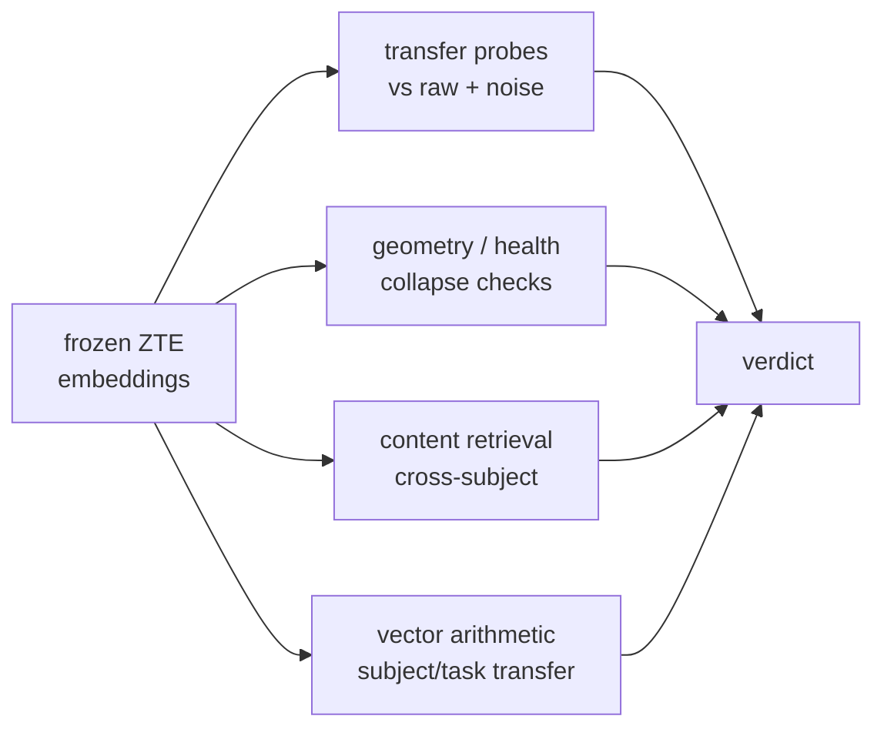

### 1. Transfer probes (does the space *carry* attributes?)

Linear + kNN probes predict known attributes (word length, log frequency, subject, task) from **frozen** embeddings. Each is run on three representations so the result is interpretable:

- **ZTE** — the learned embedding.
- **raw band-power** — the un-learned input features (a strong reference).
- **noise (matched)** — Gaussian noise matched to the data's mean/variance (the floor a *real* encoder must beat).

R² for regression, accuracy for classification; a dashed baseline marks predict-the-mean / majority. ZTE should beat the noise control and rival raw band-power in far fewer dimensions.

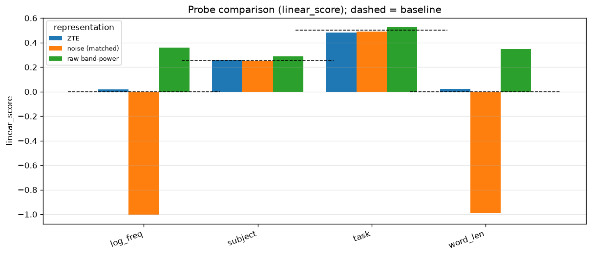
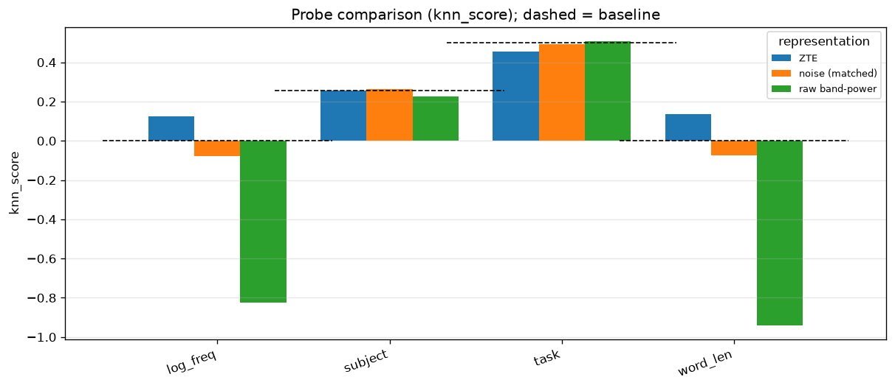
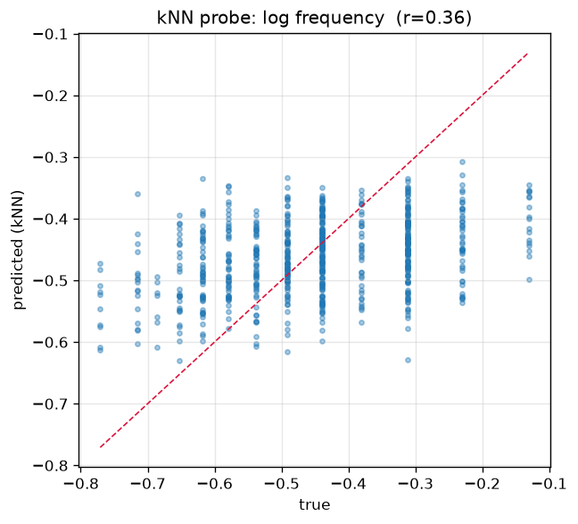

### 2. Geometry / health (is the space healthy, or collapsed?)

Label-free metrics from `zte.evaluation.metrics`:

| Metric                     | Good sign               | Detects                   |
| -------------------------- | ----------------------- | ------------------------- |
| Effective rank / ratio     | high (near `embed_dim`) | dimensional collapse      |
| Uniformity (Wang & Isola)  | low (spread out)        | crowding on the sphere    |
| Alignment (adjacent words) | low                     | neighbours drifting apart |
| Anisotropy                 | low                     | a degenerate "cone"       |
| Dead-dim fraction          | ~0                      | unused dimensions         |

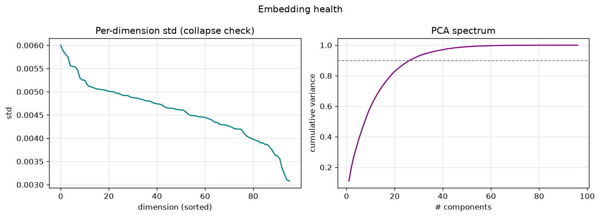

The PCA projections should show smooth structure by word length and separable subjects rather than a featureless blob:

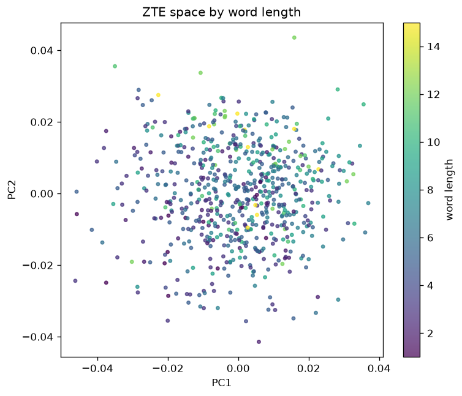
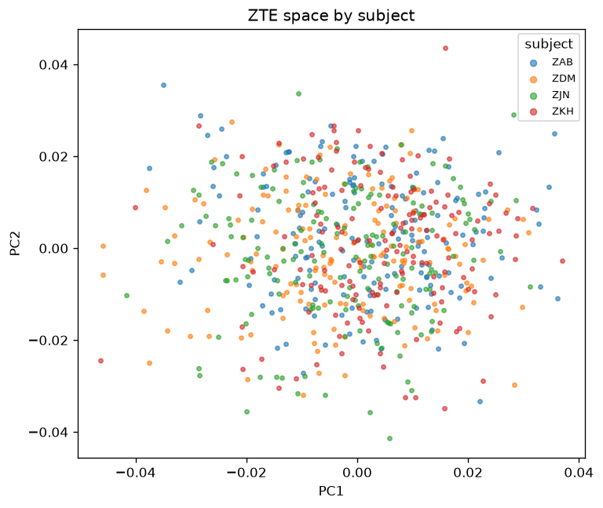

### 3. Content retrieval (do same-thoughts attract?)

Leave-one-out retrieval: does the *same stimulus read by a different subject* retrieve its counterparts better than chance (Top-K, MRR)? This is the honest cross-subject test and the direct analogue of the downstream zero-shot task.

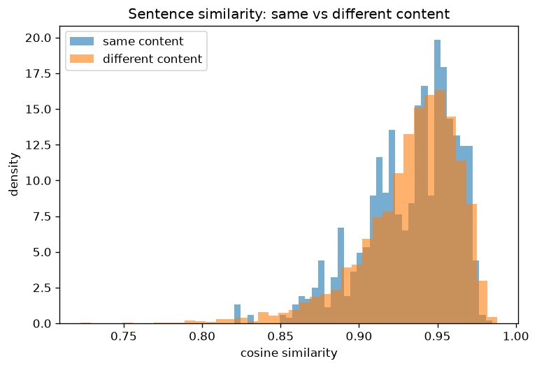
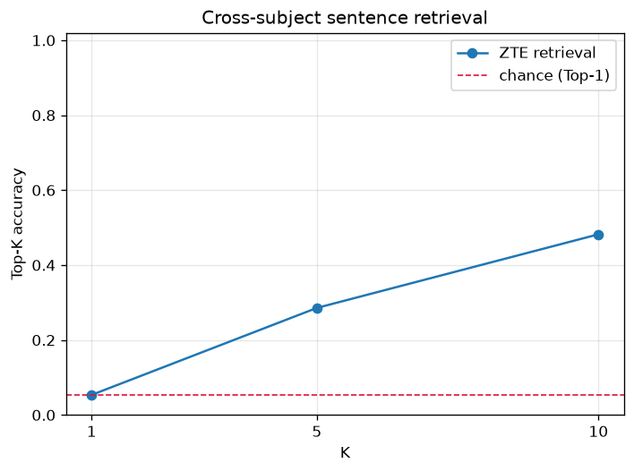

### 4. Vector arithmetic (the `king − man + woman` test for thoughts)

If ZTE is a real thought code, *who* produced a thought should be a translation in
the space. For a stimulus token `t`,
`emb(t, subject A) − centroid(A) + centroid(B)` should retrieve `emb(t, B)`. The
report gives **subject-transfer** (and task-transfer) analogy accuracy vs chance,
with a raw-feature control — a falsifiable test of subject-agnosticism.

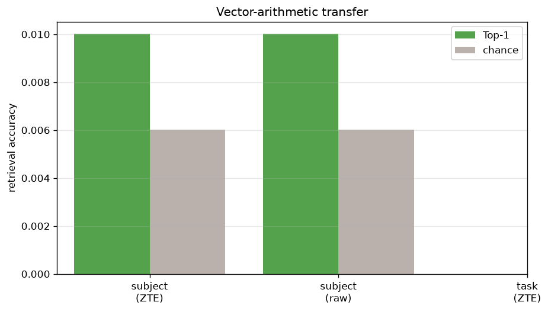

## Stratified breakdowns

The same metrics are re-computed **per subject, per task and per sentence category** (`zte.evaluation.breakdown`), so a strong global number can't hide a subject that fails:

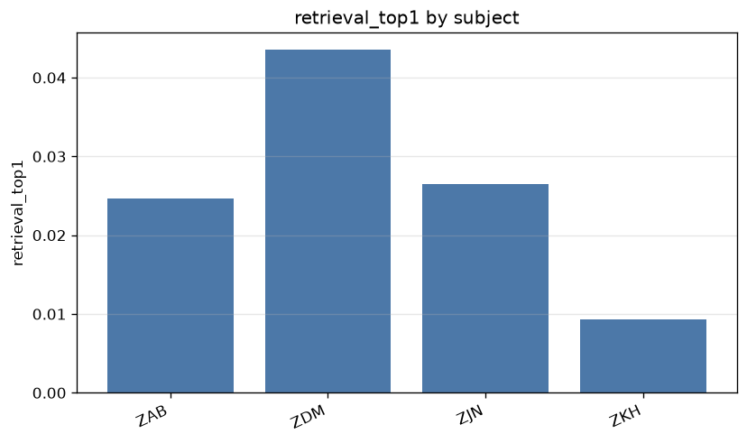
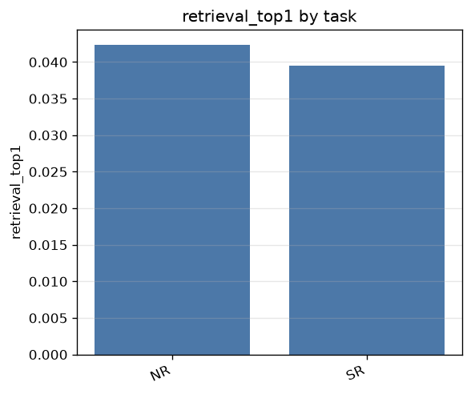

## Scalp-region importance & eye-tracking (`zte-explore`)

Which parts of the cortex encode *thought* vs *reading*, and how much does gaze behaviour actually help? `zte-explore` groups the 105 channels into anterior->posterior scalp regions and scores each region's share of the decodable information for reading targets (word length, frequency) and cognitive targets (task, subject). It also probes EEG-only vs eye-tracking-only vs both, quantifying the intuition behind the `include_eye_tracking` switch.

```sh
uv run zte-explore --root res/data/zuco_extracted --out res/exploration
uv run zte-explore --drive <folder-id-or-url> --out res/exploration
# Supply an exact montage instead of the approximate default map:
uv run zte-explore --bundle res/bundle --montage-csv my_montage.csv --out res/exploration
```

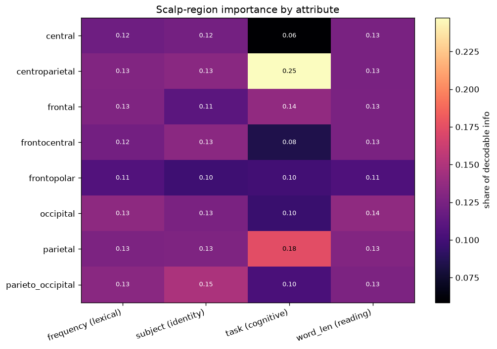

Flags: one of `--bundle` / `--root` / `--drive` / `--synthetic`, `--extract-dir`, `--tasks`, `--out`, `--montage-csv`, `--method mutual_info|f_score`.

## The verdict

`report.md` ends with a small set of boolean checks derived from the metrics:

- **beats the noise control** on each probe target,
- **no representation collapse** (effective-rank ratio > 0.1, dead dims < 50%),
- **cross-subject retrieval above chance**,
- **subject arithmetic above chance**.

Each check is now backed by a **statistic, not a sign**. "Beats noise" requires the paired
per-fold (ZTE − noise) probe-score difference's bootstrap 95% CI lower bound to clear an
**effect-size floor** (0.01), not merely be positive by 1e-3; retrieval- and arithmetic-above-chance
require the bootstrap CI on `(Top-1 − chance)` over the per-query hit vector to exclude zero. The CIs
are stored in the verdict (`beats_noise_ci`, `retrieval_ci`, `subject_arithmetic_ci`,
`effect_size_floor`). Two further honesty fixes: retrieval **chance is query-weighted** (matching how
hits are scored — the old type-weighted value is kept as `chance_top1_typeweighted` and typically
understated chance by ~30×), and probes use **shuffled, scaled** cross-validation so R² magnitudes are
trustworthy (direction was always correct). Evaluation now defaults to a **held-out** split
(`train.test_fraction = 0.1`, or a `by_stimulus` split) rather than in-sample.

These are intentionally strict: on tiny synthetic data some will legitimately fail (there is little real cross-subject signal to find), which is exactly why the same commands must be run on real ZuCo to make claims. See [RESULTS.md].

## Reproducible benchmarks (`zte-benchmark`)

To claim ZTE's *choices* are good (not just asserted), sweep them under fixed seeds. `zte-benchmark` trains + evaluates a small model across **objective × positional-encoding × eye-tracking × seed** and writes a sortable `benchmark.csv` / `benchmark.md`; every cell writes its own `config.yaml` so any row reproduces exactly.

```sh
uv run zte-benchmark --root res/data/zuco_extracted \
    --objectives skipgram,masked,cpc --pos-encodings rope,learned --eye-tracking both \
    --seeds 42,43 --out res/benchmark
uv run zte-benchmark --drive <folder-id-or-url> \
    --objectives skipgram,masked --pos-encodings rope,learned --out res/benchmark
# Quick, no-data version:
uv run zte-benchmark --synthetic --objectives skipgram --pos-encodings rope,none --out res/benchmark
```

Rows are sorted by **subject-transfer lift** (higher = more subject-agnostic), the metric that matters most for the project's north star.

## The reusable building blocks

| Module                                         | What it provides                                     |
| ---------------------------------------------- | ---------------------------------------------------- |
| `zte.evaluation.metrics`                       | probes, retrieval, geometry/health                   |
| `zte.evaluation.breakdown`                     | per-subject / per-task / per-category stratification |
| `zte.evaluation.analogy`                       | subject/task vector-arithmetic transfer              |
| `zte.data.regions.region_importance`           | scalp-region information share                       |
| `zte.evaluation.interactive`                   | self-contained interactive HTML explorer             |
| `zte.evaluation.tensorboard`                   | projector + HParams + scalars + histograms + figures |
| `zte.inference.retrieval.NearestNeighborIndex` | kNN decoder/probe over a labelled bank               |
| `zte.training.metrics.noise_matched`           | the Gaussian control a real encoder must beat        |

[ARCHITECTURE.md]: ./ARCHITECTURE.md
[RESULTS.md]: ./RESULTS.md
[TRAINING.md]: ./TRAINING.md
