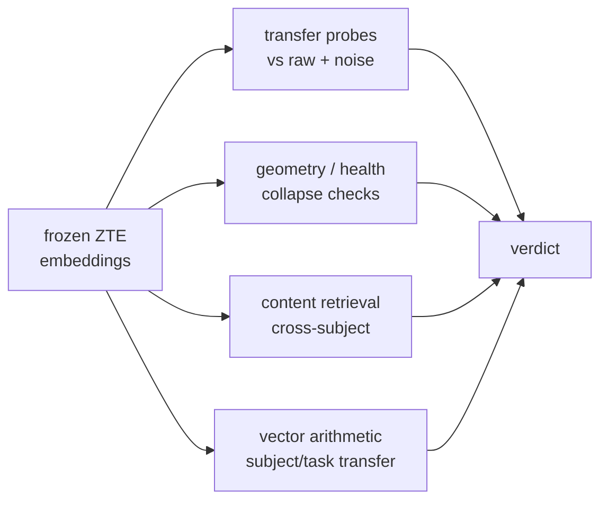

# Evaluation guide

How ZTE proves — without training a decoder — that its encoder turns EEG into a **structured, re-purposable** space rather than memorising noise. This is the project's defence against the "BLEU-trap": every headline number is checked against a raw-feature reference **and** a noise-matched control.

> Related: [ARCHITECTURE.md] · [TRAINING.md] · [RESULTS.md] (validated numbers from a real run).
> Each run writes its plots to `evaluation/figures/` (via `examples/evaluate_zte.py`); the numbers here come from the synthetic smoke run, and real ZuCo produces the same artifacts at scale.

## How to run it

### CLI — `zte-evaluate`

```sh
# Evaluate a checkpoint against a bundle; write report, figures, tables.
uv run zte-evaluate --ckpt res/checkpoints/best.pt --bundle res/bundle --out res/evaluation

# Add the full TensorBoard log (projector, hparams, scalars, histograms, images).
uv run zte-evaluate --ckpt res/checkpoints/best.pt --bundle res/bundle \
    --out res/evaluation --tensorboard
tensorboard --logdir res/evaluation/tb        # then open the PROJECTOR tab

# Evaluate straight from .mat files instead of a bundle; skip the HTML explorer.
uv run zte-evaluate --ckpt res/checkpoints/best.pt --root res/data/zuco_extracted \
    --out res/evaluation --no-interactive
# Or download + evaluate in one step (needs `uv sync --group drive`):
uv run zte-evaluate --ckpt res/checkpoints/best.pt \
    --drive 'https://drive.google.com/drive/folders/13EYW1h6dHD5E4YoEWNsKe6ZBHmMU_kFQ' \
    --out res/evaluation
```

Flags: `--ckpt` (required), one of `--bundle` / `--root` / `--drive`, `--extract-dir` (default `res/data/zuco_extracted`), `--out` (`res/evaluation`), `--device`, `--run-name`, `--tensorboard`, `--no-interactive`.  `zte-run` performs this automatically for each experiment.

### Self-contained demo (no data)

```sh
uv run python examples/evaluate_zte.py --out res/eval_demo/evaluation
```

Trains a small model on synthetic ZuCo, then runs the whole suite end-to-end.

### Python API

```python
from zte.cli.evaluate import collect_embeddings
from zte.evaluation.report import evaluate_representation
from zte.inference.embed import ZTEEmbedder

embedder = ZTEEmbedder.from_checkpoint('res/checkpoints/best.pt', ds)
word_emb, word_meta, raw_feats, sent_emb, sent_ids, sent_meta, word_bp = collect_embeddings(
    embedder, ds
)
metrics = evaluate_representation(
    word_emb,
    word_meta,
    raw_feats,
    sent_emb,
    sent_ids,
    out_dir='res/evaluation',
    sent_meta=sent_meta,
    word_band_power=word_bp,
    config=embedder.config,
    tensorboard=True,
    interactive=True,
)
print(metrics['verdict'])
```

## What gets written

```text
res/evaluation/
├── report.md          # human-readable report with a pass/fail verdict
├── metrics.json       # every number (also returned by evaluate_representation)
├── comparison.csv     # probe table (ZTE vs raw vs noise, per target)
├── breakdown.csv      # per-subject / per-task rows
├── region_importance.csv
├── figures/           # generated plots (per run)
├── interactive/word_explorer.html   # self-contained 3-D explorer
└── tb/<run_name>/     # TensorBoard (if --tensorboard)
```

## The four families of evidence



### 1. Transfer probes (does the space *carry* attributes?)

Linear + kNN probes predict known attributes (word length, log frequency, subject, task) from **frozen** embeddings. Each is run on three representations so the result is interpretable:

- **ZTE** — the learned embedding.
- **raw band-power** — the un-learned input features (a strong reference).
- **noise (matched)** — Gaussian noise matched to the data's mean/variance (the floor a *real* encoder must beat).

R² for regression, accuracy for classification; a dashed baseline marks predict-the-mean / majority. The coefficient of determination compares residual to total variance,

$$
R^{2} = 1 - \frac{\sum_i (y_i - \hat y_i)^{2}}{\sum_i (y_i - \bar y)^{2}}
$$

so the predict-the-mean baseline sits at $R^{2}=0$. ZTE should beat the noise control and rival raw band-power in far fewer dimensions.

### 2. Geometry / health (is the space healthy, or collapsed?)

Label-free metrics from `zte.evaluation.metrics`:

| Metric                     | Good sign               | Detects                   |
| -------------------------- | ----------------------- | ------------------------- |
| Effective rank / ratio     | high (near `embed_dim`) | dimensional collapse      |
| Uniformity (Wang & Isola)  | low (spread out)        | crowding on the sphere    |
| Alignment (adjacent words) | low                     | neighbours drifting apart |
| Anisotropy                 | low                     | a degenerate "cone"       |
| Dead-dim fraction          | ~0                      | unused dimensions         |

Writing $Z \in \mathbb{R}^{n \times d}$ ($d = 768$) for the embedding matrix with rows $z_i$, unit-normalised $\hat z_i = z_i / \lVert z_i \rVert$ and cosine $s_{ij} = \hat z_i^\top \hat z_j$, the label-free metrics are:

- **Effective rank** (Roy & Vetterli) from the singular values $\sigma_k$ of the mean-centred $Z$, with $p_k = \sigma_k / \sum_j \sigma_j$ — a soft count of active dimensions:

$$
\mathrm{erank}(Z) = \exp\!\Big(-\sum_k p_k \log p_k\Big)
$$

- **Uniformity** (Wang & Isola, $t = 2$) — the log mean Gaussian potential over all distinct pairs, lower when embeddings spread over the sphere:

$$
\mathcal{U} = \log\ \mathbb{E}_{i \ne j}\ \exp\!\big(-t\,\lVert \hat z_i - \hat z_j \rVert^{2}\big)
$$

- **Alignment** (over positive pairs $P$, adjacent words, $\alpha = 2$) — low when neighbours stay close:

$$
\mathcal{A} = \mathbb{E}_{(i,j)\in P}\ \lVert \hat z_i - \hat z_j \rVert^{\alpha}
$$

- **Anisotropy** — the mean off-diagonal cosine; high values signal a degenerate "cone". On the unit sphere it is equivalent (up to a constant) to squared distance:

$$
\text{aniso} = \mathbb{E}_{i \ne j}\big[\hat z_i^\top \hat z_j\big], \qquad \lVert \hat z_i - \hat z_j \rVert^{2} = 2 - 2\,\hat z_i^\top \hat z_j
$$

The PCA projections should show smooth structure by word length and separable subjects rather than a featureless blob:

### 3. Content retrieval (do same-thoughts attract?)

Leave-one-out retrieval: does the *same stimulus read by a different subject* retrieve its counterparts better than chance (Top-K, MRR)? Over $Q$ queries, a hit is a $\text{top-}k$ neighbour sharing the query's group, and $\text{rank}_q$ is the rank of the first such neighbour:

$$
\text{Recall@}k = \frac{1}{Q}\sum_{q=1}^{Q} \mathbf{1}\!\big[\text{rank}_q \le k\big], \qquad \text{MRR} = \frac{1}{Q}\sum_{q=1}^{Q} \frac{1}{\text{rank}_q}
$$

This is the honest cross-subject test and the direct analogue of the downstream zero-shot task.

### 4. Vector arithmetic (the `king − man + woman` test for thoughts)

If ZTE is a real thought code, *who* produced a thought should be a translation in
the space. For a stimulus token `t`,
`emb(t, subject A) − centroid(A) + centroid(B)` should retrieve `emb(t, B)`. The
report gives **subject-transfer** (and task-transfer) analogy accuracy vs chance,
with a raw-feature control — a falsifiable test of subject-agnosticism.

## Stratified breakdowns

The same metrics are re-computed **per subject, per task and per sentence category** (`zte.evaluation.breakdown`), so a strong global number can't hide a subject that fails:

## Scalp-region importance & eye-tracking (`zte-explore`)

Which parts of the cortex encode *thought* vs *reading*, and how much does gaze behaviour actually help? `zte-explore` groups the 105 channels into anterior->posterior scalp regions and scores each region's share of the decodable information for reading targets (word length, frequency) and cognitive targets (task, subject). It also probes EEG-only vs eye-tracking-only vs both, quantifying the intuition behind the `include_eye_tracking` switch.

```sh
uv run zte-explore --root res/data/zuco_extracted --out res/exploration
uv run zte-explore --drive <folder-id-or-url> --out res/exploration
# Supply an exact montage instead of the approximate default map:
uv run zte-explore --bundle res/bundle --montage-csv my_montage.csv --out res/exploration
```

Flags: one of `--bundle` / `--root` / `--drive` / `--synthetic`, `--extract-dir`, `--tasks`, `--out`, `--montage-csv`, `--method mutual_info|f_score`.

## The verdict

`report.md` ends with a small set of boolean checks derived from the metrics:

- **beats the noise control** on each probe target,
- **no representation collapse** (effective-rank ratio > 0.1, dead dims < 50%),
- **cross-subject retrieval above chance**,
- **subject arithmetic above chance**.

Each check is now backed by a **statistic, not a sign**. "Beats noise" requires the paired
per-fold (ZTE − noise) probe-score difference's bootstrap 95% CI lower bound to clear an
**effect-size floor** (0.01), not merely be positive by 1e-3; retrieval- and arithmetic-above-chance
require the bootstrap CI on `(Top-1 − chance)` over the per-query hit vector to exclude zero. These are
**percentile bootstrap** intervals: resample the statistic $B$ times to get $\theta^{\ast}_1,\dots,\theta^{\ast}_B$, then take the central $(1-\alpha)$ quantile pair,

$$\text{CI}_{1-\alpha} = \big[\theta^{\ast}_{(\alpha/2)},\ \theta^{\ast}_{(1-\alpha/2)}\big].$$

The CIs are stored in the verdict (`beats_noise_ci`, `retrieval_ci`, `subject_arithmetic_ci`,
`effect_size_floor`). Two further honesty fixes: retrieval **chance is query-weighted** (matching how
hits are scored) — for group sizes $g$ this is

$$
\text{chance} = \frac{\sum_g g(g-1)}{\big(\sum_g g\big)(n-1)}
$$

(the old type-weighted value is kept as `chance_top1_typeweighted` and typically
understated chance by ~30×), and probes use **shuffled, scaled** cross-validation so R² magnitudes are
trustworthy (direction was always correct). Evaluation now defaults to a **held-out** split
(`train.test_fraction = 0.1`, or a `by_stimulus` split) rather than in-sample.

These are intentionally strict: on tiny synthetic data some will legitimately fail (there is little real cross-subject signal to find), which is exactly why the same commands must be run on real ZuCo to make claims. See [RESULTS.md].

## Reading a LOSO sweep honestly (`zte-loso-summary`)

In a leave-one-subject-out sweep, a single fold's `sentence_retrieval.top1` is **pooled** over all subjects — every reading queries against every other, and most positives are the same sentence read by one of the 11 subjects the model *trained on*. That number is dominated by in-sample subjects and reads far higher than the model's generalisation. The honest metric is `scoreboard.held_out_retrieval`: retrieval among the never-seen subject's own readings alone.

`zte-loso-summary --experiments res/experiments/loso` reads every fold and reports the honest trend — held-out retrieval lift over chance (mean ± std), how many folds beat chance, the anchor-calibration lift, and a **converged/collapsed** split (folds whose pooled retrieval never rose above 0.01 never learned a subject-invariant code). `scripts/run_loso.sh` writes this `LOSO_SUMMARY.md` automatically, and its `SEEDS="42 43 44"` option repeats each fold at several seeds so the summary can separate a genuinely hard subject from an unlucky run. Quote the held-out number for LOSO, never the pooled `sentence Top-1` in `INDEX.md`.

The full 12-subject sweep of the band-power champion (2026-07-24) makes the gap concrete: pooled Top-1 swings 0.0015 → 0.131 across folds (mostly training instability — 3/12 folds collapsed), while held-out retrieval is essentially chance (+0.0017 ± 0.0030 lift, 6/12 folds at or below chance). What *does* generalise: held-out category decode (10/12 folds) and anchor calibration (12/12) — a new brain snaps into the shared frame from ~12 anchor words, the most promising lever for a decoder.

## The content-probe positive control

The scoreboard gates every "content 0%" claim on a **positive control**: can *raw* EEG expose lexical content at all? If it cannot, a 0% content budget in the embedding is meaningless — the probe is blind, not the space empty. This control must probe **genuinely-raw band power** (`raw_content_positive_control`), not the model's normalised input: whitening normalisers (`riemannian`, `zscore_subject`) remove the per-subject amplitude that word length and frequency ride on, so a control run on normalised features reads ≈0 even when the signal is present — a false failure that invalidated the content story on every run before 2026-07-24. It now probes the untouched `(bands × channels)` band power, so a passing control (`raw_content_r2_best ≥ 0.02`) means a subsequent 0% content budget is a real absence. Raw-signal frontends carry no band power, so the control is reported as not applicable there.

## What makes a brain easy to encode? (`zte-encodability`)

`zte-encodability --experiments res/experiments/loso` joins each held-out subject's **outcome** (held-out retrieval rank-percentile, category decode, calibration lift) with **properties** of that subject's data (word count, omission rate) and of the run that produced it (identity variance left in the space, the anisotropy the held-out embeddings collapsed to), then rank-correlates them. Multiple seeds of one subject are averaged, so the question becomes "is this brain hard" rather than "was this run unlucky".

On the 2026-07-24 sweep the dominant signal is geometric, not about raw data volume: a held-out brain is hard when the run left it in a collapsed, anisotropic region of the space (identity not removed), which is exactly when category generalisation fails. Anchor calibration helps *most* on those collapsed brains (ρ ≈ +0.84 vs held-out anisotropy) — the rescue path. Counter-intuitively, the brains hardest to make subject-invariant tend to be the ones with the *most* and *cleanest* data (highest word count, lowest omission): a stronger individual signature the adversary must work harder to remove. With ~12 subjects at one seed this is underpowered and confounded with training instability — multi-seed sweeps are the way to firm it up.

## Reproducible benchmarks (`zte-benchmark`)

To claim ZTE's *choices* are good (not just asserted), sweep them under fixed seeds. `zte-benchmark` trains + evaluates one cell per grid point and writes a sortable `benchmark.csv` / `benchmark.md`; every cell writes its own `config.yaml` so any row reproduces exactly, and `--resume` skips finished cells.

Pass `--base-config` so every cell inherits the flagship recipe (encoder, spatial encoding, invariance stack) and only the swept axis differs — a benchmark of the *current* champion, not of a bare default model. Add `--loso-holdout` so rows are held-out comparable:

```sh
uv run zte-benchmark --root res/data/zuco_extracted \
    --base-config experiments/flagship/zte_raw_aligned.yaml --loso-holdout ZAB \
    --objectives clip,skipgram,masked,cpc --pos-encodings rope --eye-tracking off \
    --seeds 42 --out res/benchmark --resume
# Quick, no-data version:
uv run zte-benchmark --synthetic --base-config experiments/flagship/zte_raw_aligned.yaml \
    --objectives clip,skipgram --pos-encodings rope --eye-tracking off --seeds 42 --out res/benchmark
```

The self-supervised objective sweep (`skipgram,cbow,masked,cpc`) is now a **control**: CLIP against a frozen text encoder is the flagship, and this confirms it beats the alternatives on one recipe. For the live questions — which text encoder, which frontend, meaning on/off — run the candidate configs through `scripts/run_loso.sh` on a fixed held-out panel and compare their `LOSO_SUMMARY.md` (the honest held-out metric), since `benchmark.csv` reports the pooled retrieval. Rows are sorted by **subject-transfer lift** (higher = more subject-agnostic).

## The reusable building blocks

| Module                                         | What it provides                                     |
| ---------------------------------------------- | ---------------------------------------------------- |
| `zte.evaluation.metrics`                       | probes, retrieval, geometry/health                   |
| `zte.evaluation.breakdown`                     | per-subject / per-task / per-category stratification |
| `zte.evaluation.analogy`                       | subject/task vector-arithmetic transfer              |
| `zte.data.montage.regions.region_importance`           | scalp-region information share                       |
| `zte.evaluation.interactive`                   | self-contained interactive HTML explorer             |
| `zte.evaluation.tensorboard`                   | projector + HParams + scalars + histograms + figures |
| `zte.inference.retrieval.NearestNeighborIndex` | kNN decoder/probe over a labelled bank               |
| `zte.training.metrics.noise_matched`           | the Gaussian control a real encoder must beat        |

[ARCHITECTURE.md]: ./ARCHITECTURE.md
[RESULTS.md]: ./RESULTS.md
[TRAINING.md]: ./TRAINING.md
