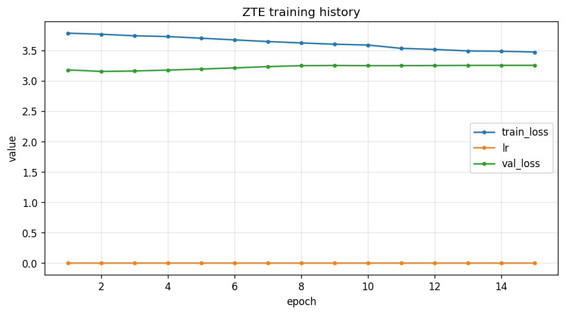
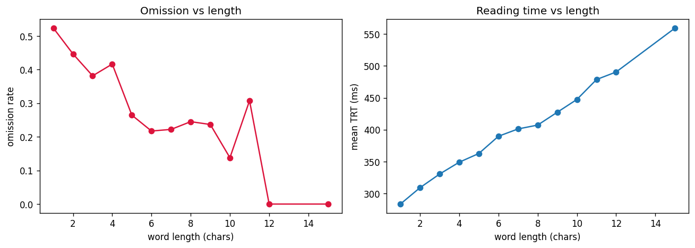
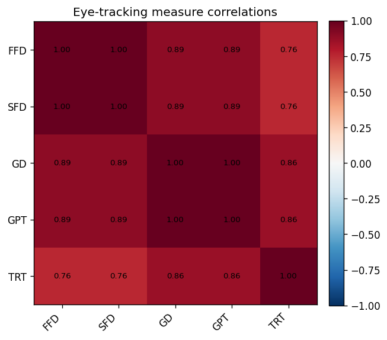
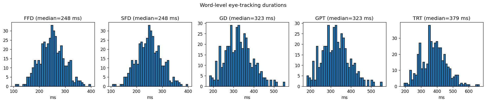
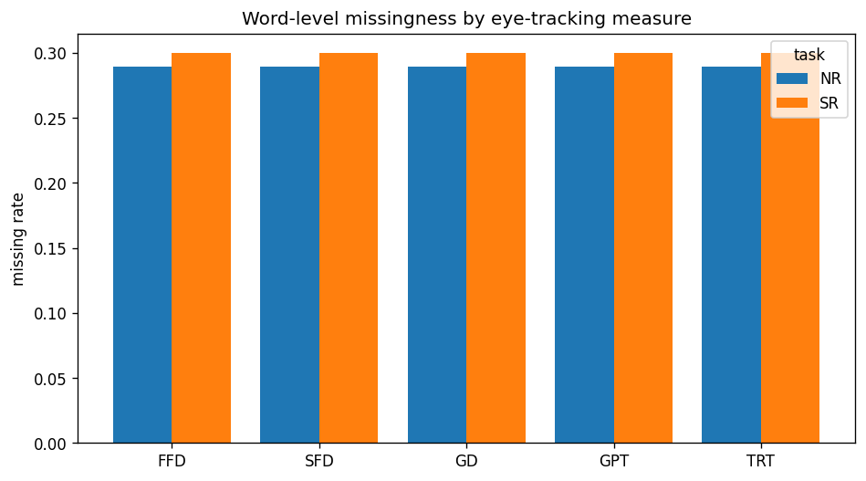
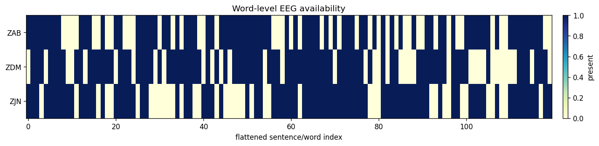

# Validated results (synthetic smoke-runs)

The real ZuCo archives are 17–23 GB each and cannot be pulled into this environment, so the numbers below come from **schema-faithful synthetic ZuCo** — the generator reproduces ZuCo's exact struct schema (105 channels × 8 bands × 5 eye-tracking measures, empty arrays for omitted words). The point is to show the whole pipeline runs end-to-end and behaves sensibly; on real ZuCo the same commands produce the same artifacts at scale.

> How to regenerate everything on this page is at the [bottom](#reproduce).
> For methodology see [EVALUATION.md]; for the knobs see [TRAINING.md] and [DATASET.md].

## 1. Headline pretraining run

A skip-gram (InfoNCE) model trained end-to-end via `examples/run_demo.py` on a 3-subject × 2-task synthetic tree:

| Metric                       | Value                             |
| ---------------------------- | --------------------------------- |
| Words / sentences / subjects | 614 / 72 / 3                      |
| Overall omission rate        | 0.295                             |
| Objective                    | skip-gram (InfoNCE)               |
| Epochs / device              | 15 / CPU                          |
| Final train loss             | 3.472 (monotonically decreasing)  |
| Word embeddings extracted    | 433 (present words only)          |
| Embedding dim                | 128 (768 by default in real runs) |



Train loss decreases steadily; on this tiny synthetic split the validation curve is essentially flat — expected, since the smoke-run exercises the machinery rather than benchmarking generalisation.

## 2. All four objectives train

Each objective was trained for 3 quick epochs on the same synthetic tree (10 sentences × 3 subjects -> 504 words); all converge without error on both frontends.  Loss scales are not comparable *across* objectives (different losses), only the fact that each optimises cleanly:

| Objective         | Frontend       | Final train loss (3 epochs) |
| ----------------- | -------------- | --------------------------- |
| skip-gram         | band_power_mlp | 3.758                       |
| cbow              | band_power_mlp | 4.592                       |
| masked (data2vec) | band_power_mlp | 0.282                       |
| cpc               | band_power_mlp | 4.598                       |

The raw-Conformer frontend (`--frontend raw_conformer --representation raw`) trains the masked/CPC objectives the same way; see `examples/run_demo.py` and [TRAINING.md].

## 3. Dataset analysis (auto-generated by `zte.data.viz.save_overview`)

The synthetic generator injects the structure the real corpus exhibits, and the analysis tooling recovers it:



Short words are skipped far more often (omission ≈ 0.5 at length 1–2, falling with length) and total reading time rises with word length — exactly the lexical effects ZuCo is known for.






## 4. Evaluation of the learned space

Running the full evaluation suite (`examples/evaluate_zte.py`, a 4-subject skip-gram model, `embed_dim=96`) on **664 word / 112 sentence** embeddings gives the verdict:

| Check                                | Result                          | Detail                                                  |
| ------------------------------------ | ------------------------------- | ------------------------------------------------------- |
| Beats the noise control              | ✓ (word_len, log_freq, subject) | linear probe                                            |
| No representation collapse           | ✓                               | effective-rank ratio **0.57** (54.6 / 96), 0% dead dims |
| Cross-subject retrieval above chance | ✗                               | Top-1 0.054 vs chance 0.054                             |
| Subject arithmetic above chance      | ✓                               | Top-1 0.010 vs chance 0.006                             |

Effective rank quantifies how many dimensions the space meaningfully spans: from the singular values $\sigma_k$ of the centred $Z\in\mathbb{R}^{n\times d}$ with $p_k=\sigma_k/\sum_j\sigma_j$,

$$
\operatorname{erank}=\exp\!\Big(-\sum_k p_k\log p_k\Big),
$$

and the reported **0.57** is $\operatorname{erank}/d = 54.6/96$. Retrieval is scored by $\text{Recall@}k$ — the fraction of $Q$ queries whose correct match ranks in the top $k$ (Top-1 is $k=1$):

$$
\text{Recall@}k=\frac{1}{Q}\sum_q \mathbb{1}[\text{rank}_q\le k].
$$

The embedding is healthy (well-spread, no collapse) and carries lexical attributes above the noise floor. Cross-subject retrieval sits **at** chance here — expected, because synthetic subjects share no real neural structure to retrieve across. That is precisely the gap real ZuCo is meant to close, and why the suite reports it honestly rather than hiding it.


See [EVALUATION.md] for what every figure and metric means, plus the per-subject/per-task breakdowns, analogy transfer and scalp-region importance.

## Reproduce

```sh
# 1) Headline pretraining run + dataset figures + training curve.
uv run python examples/run_demo.py --objective skipgram --epochs 15 --sentences 12

# 2) Each objective (swap --objective for cbow | masked | cpc).
uv run python examples/run_demo.py --objective masked --epochs 3 --sentences 10

# 3) Full evaluation suite (figures, report.md, verdict, interactive HTML, TensorBoard).
uv run python examples/evaluate_zte.py --out res/eval_demo/evaluation

# 4) The test suite exercises the same code paths on every objective.
uv run pytest
```

Point the `--ckpt` / `--root` / `--drive` flags of `zte-evaluate` and `zte-extract` at real artifacts to reproduce these tables on genuine ZuCo recordings.

[DATASET.md]: ./DATASET.md
[EVALUATION.md]: ./EVALUATION.md
[TRAINING.md]: ./TRAINING.md
