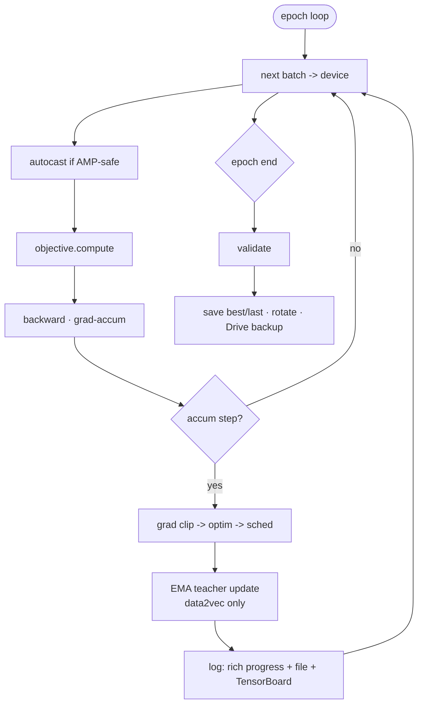

# Training & inference guide

Pretrain a self-supervised EEG **thought embedding**, then use the checkpoint to embed words, sentences, or brand-new signals. This guide covers the one-command path, the individual steps, every config knob, and inference.

> Related: [ARCHITECTURE.md] (model & objectives), [DATASET.md] (building a bundle), [EVALUATION.md] (proving the embedding is good), [RESULTS.md] (validated numbers).

## One command: `zte-run`

The recommended entry point. It resolves the data source, prepares + caches the dataset, trains, evaluates and explores, cataloguing everything under `res/experiments/<run_name>/`:

```sh
# No data needed — full pipeline on a synthetic ZuCo tree (great smoke test).
uv run zte-run --config experiments/flagship/zte_raw_aligned.yaml --synthetic --epochs 5

# Real data from a local folder (extracted .mat files, or a folder of task .zip archives).
uv run zte-run --config experiments/flagship/zte_raw_aligned.yaml --root res/data/zuco_extracted

# Real data straight from Google Drive (folder id or shareable URL; needs the `drive` group).
uv run zte-run --config experiments/flagship/clip_e5_raw.yaml --drive <folder-id-or-url>
# Same flag on any individual step: zte-prepare, zte-train, zte-evaluate, zte-explore, …
```

Handy overrides (all optional): `--name`, `--subjects ZAB,ZDM`, `--tasks SR,NR`, `--epochs N`, `--device auto|cpu|cuda|mps`, `--out-root`, `--extract-dir` (default `res/data/zuco_extracted`), `--no-tensorboard`, `--no-interactive`, `--skip-eval`, `--skip-explore`.

Each run writes `config.yaml`, `bundle/`, `checkpoints/`, `figures/`, `evaluation/`, `exploration/`, `tb/`, `manifest.json`, `README.md`, plus a row in `res/experiments/INDEX.md`. The `<run_name>` comes from inside the config, not from its file path, so a tiered config still writes to its historical directory (`experiments/flagship/zte_raw_aligned.yaml` -> `res/experiments/exp8_clip_e5/`). See [`experiments/README.md`](../experiments/README.md) for the config tiers (`flagship/`, `decoder/`, `benchmark/`, `ablation/`, `archive/`) and their rationale.

## Prefer the individual steps? `zte-train`

```sh
# Skip-gram on a prepared bundle, 20 epochs, auto device.
uv run zte-train --bundle res/bundle --objective skipgram --epochs 20 --run-name sg

# Masked (data2vec) on raw EEG with a Conformer frontend, CUDA, bf16.
uv run zte-train --bundle res/bundle --objective masked \
    --frontend raw_conformer --representation raw --device cuda --precision bf16

# CPC with TensorBoard + Drive checkpoint backup.
uv run zte-train --bundle res/bundle --objective cpc --tensorboard \
    --drive-backup-dir /content/drive/MyDrive/ZTE/ckpts

# No bundle yet? Train straight from .mat files, Google Drive, or synthetic data.
uv run zte-train --root res/data/zuco_extracted --objective skipgram
uv run zte-train --drive 13EYW1h6dHD5E4YoEWNsKe6ZBHmMU_kFQ --objective skipgram
uv run zte-train --synthetic --objective masked --epochs 5
```

`zte-train` flags (a data source — `--bundle` / `--root` / `--drive` / `--synthetic` — is required; everything else overrides the YAML/defaults):

| Flag                                               | Choices / type                                                                             | Overrides                                          |
| -------------------------------------------------- | ------------------------------------------------------------------------------------------ | -------------------------------------------------- |
| `--config`                                         | path                                                                                       | base YAML (`ZTEConfig`)                            |
| `--root` / `--drive`                               | path / Drive id or URL                                                                     | local `.mat` dir, zip(s), or Drive folder          |
| `--extract-dir`                                    | path (`res/data/zuco_extracted`)                                                           | where Drive/zips are unzipped                      |
| `--objective`                                      | `skipgram`,`cbow`,`masked`,`cpc`,`clip`,`decode`                                           | `objective.name`                                   |
| `--frontend`                                       | `band_power_mlp`,`raw_conformer`                                                           | `model.frontend`                                   |
| `--representation`                                 | `band_power`,`raw`,`both`                                                                  | `dataset.representation` (ignored with `--bundle`) |
| `--embed-dim`                                      | int                                                                                        | `model.embed_dim`                                  |
| `--epochs` / `--batch-size` / `--lr`               | int/int/float                                                                              | `train.*`                                          |
| `--split`                                          | `random`,`by_sentence`,`by_stimulus`,`by_task`,`by_subject_loso`,`by_subject_and_stimulus` | `train.split`                                      |
| `--mode` / `--encoder-ckpt`                        | `encoder`,`decoder`,`joint` / path                                                         | `train.mode` / `train.encoder_ckpt`                |
| `--device`                                         | `auto`,`cpu`,`cuda`,`mps`                                                                  | `train.device`                                     |
| `--precision`                                      | `auto`,`fp32`,`fp16`,`bf16`                                                                | `train.precision`                                  |
| `--tensorboard`                                    | flag                                                                                       | `train.tensorboard`                                |
| `--drive-backup-dir` / `--ckpt-dir` / `--run-name` | path/path/str                                                                              | `train.*` / `run_name`                             |
| `--resume`                                         | flag                                                                                       | continue from `last.pt`                            |

## Config-driven runs

Every knob is a field on a typed, YAML-serialisable `ZTEConfig` (`src/zte/config/`). A YAML file only needs to set what differs from the defaults:

```yaml
# config.yaml
run_name: zte-skipgram-loso
dataset:
  representation: band_power
  normalize: zscore_channel
  include_eye_tracking: true
  missing: { method: knn }
model:
  frontend: band_power_mlp
  embed_dim: 768
  hidden_dim: 256
  n_layers: 4
  pos_encoding: rope          # rope | sinusoidal | learned | alibi | none
  pool: attention
objective:
  name: skipgram              # skipgram | cbow | masked | cpc
  temperature: 0.07
  context_window: 2
train:
  epochs: 50
  batch_size: 128
  lr: 0.0003
  split: by_subject_loso
  loso_holdout_subject: ZPH
  device: auto
  precision: auto
  tensorboard: true
```

```sh
uv run zte-train --bundle res/bundle --config config.yaml
```

CLI flags override YAML, so you can pin a base config and sweep one knob: `uv run zte-train --config config.yaml --bundle b --objective cpc --lr 1e-4`.

### Objective hyper-parameters (`ObjectiveConfig`)

| Field                   | Default    | Applies to    | Meaning                              |
| ----------------------- | ---------- | ------------- | ------------------------------------ |
| `name`                  | `skipgram` | —             | `skipgram`,`cbow`,`masked`,`cpc`     |
| `temperature`           | `0.07`     | contrastive   | InfoNCE softmax temperature          |
| `context_window`        | `2`        | skipgram/cbow | neighbouring words per side          |
| `n_negatives`           | `20`       | contrastive   | negatives per positive               |
| `mask_ratio`            | `0.5`      | masked        | fraction of tokens masked            |
| `masked_target`         | `latent`   | masked        | `latent` (data2vec) or `reconstruct` |
| `ema_decay`             | `0.999`    | masked/latent | teacher EMA decay                    |
| `cpc_steps`             | `4`        | cpc           | future steps predicted               |
| `reduce_omitted_weight` | `0.0`      | all           | down-weight omitted-word tokens      |

The contrastive objectives score pairs by cosine similarity of the unit-normalised embeddings, $s_{ij} = \hat z_i^\top \hat z_j$ with $\hat z_i = z_i / \lVert z_i \rVert$, and divide the logits by the `temperature` $\tau$. Skip-gram treats every context word of an anchor as a positive, so it minimises a multi-positive InfoNCE over anchors $A$, positives $P(i)$ and candidate keys $\mathcal{C}(i)$ (the positives plus `n_negatives` sampled negatives); that is,

$$\mathcal{L}_{\text{SG}} = -\frac{1}{\lvert A \rvert}\sum_{i \in A} \log \frac{\sum_{p \in P(i)} \exp(s_{ip}/\tau)}{\sum_{k \in \mathcal{C}(i)} \exp(s_{ik}/\tau)}$$

CBOW and CPC instead have a single positive $i^{+}$ per anchor (the pooled context, or the true future step), giving the standard single-positive form

$$\mathcal{L} = -\frac{1}{N}\sum_{i} \log \frac{\exp(s_{i,i^{+}}/\tau)}{\sum_{k} \exp(s_{ik}/\tau)}$$

Lowering $\tau$ sharpens the softmax and increasingly penalises hard negatives.

The masked objective (`masked_target: latent`, i.e. data2vec) regresses a student prediction onto an EMA **teacher**. Before the loss, the teacher targets are normalised across tokens per feature $j$, $\tilde t_{:,j} = (t_{:,j} - \mu_j) / \max(\sigma_j,\ \sigma_{\min})$, and the loss is a smooth-L1 (Huber) between the student prediction and $\tilde t$ over the masked positions (`mask_ratio` sets the masked fraction).

### Model knobs (`ModelConfig`)

`frontend`, `embed_dim` (768 by default -> LLM-compatible), `hidden_dim`, `n_layers`, `n_heads`, `dropout`, `pos_encoding`, `max_positions`, `pool` (`mean`/`attention`/`cls`), `subject_conditioning`, `n_subjects`. Raw-Conformer adds `conformer_filters` and `conformer_temporal_kernel`.

## Device & precision

Auto-detected by `zte.device.resolve_device`:

| Backend | Selected when            | Mixed precision                    | Notes                                     |
| ------- | ------------------------ | ---------------------------------- | ----------------------------------------- |
| `cuda`  | Nvidia GPU present       | bf16 (Ampere+) / fp16 + GradScaler | `--device cuda`; `compile_model` optional |
| `mps`   | Apple-silicon (M-series) | fp32 (autocast still maturing)     | `--device mps`                            |
| `cpu`   | otherwise                | fp32                               | fine for smoke-tests & synthetic data     |

```python
cfg.train.device = 'auto'  # or 'cuda' | 'mps' | 'cpu'
cfg.train.precision = 'auto'  # or 'bf16' | 'fp16' | 'fp32'
```

## The training loop



For the data2vec / masked objective, the `EMA teacher update` step above is an exponential moving average of the student parameters $\phi$ into the teacher parameters $\theta$, that is, $\theta \leftarrow \rho\,\theta + (1-\rho)\,\phi$, where the decay $\rho$ is the `ema_decay` field (typically ramped $\rho_0 \to \rho_1$ over training).

## Three modes: `encoder`, `decoder`, `joint`

`train.mode` selects what a run trains. The language model is frozen in all three — `joint` refers to the encoder and
the bridge, never to the LM.

| Mode                | Trains                                                                         | Encoder                                                  | Needs `train.encoder_ckpt` |
| ------------------- | ------------------------------------------------------------------------------ | -------------------------------------------------------- | -------------------------- |
| `encoder` (default) | encoder + objective, one group at `train.lr`                                   | from scratch                                             | no                         |
| `decoder`           | the prefix bridge at `train.bridge_lr`                                         | loaded, frozen, kept in `.eval()`                        | yes                        |
| `joint`             | stage A the bridge; stage B also the encoder at `bridge_lr × encoder_lr_scale` | loaded, frozen for `train.stage_a_epochs`, then unfrozen | yes                        |

`train.freeze_encoder` means the encoder never trains, so `joint` requires `freeze_encoder: false` and raises if it is
`true`; there, `train.stage_a_epochs` alone decides when the encoder joins in.

`encoder` is the pre-decoder pipeline unchanged: `run_training` branches away before the objective is built and
`stages.parameter_groups` returns the single AdamW group it always returned. In the other two modes the source
checkpoint's fitted **normaliser and aligner are restored, not refitted** — refitting does not fail a frozen encoder,
it silently feeds it a scale it never trained on. Parameter groups are structural rather than conditional on
`requires_grad`, so a resume whose freeze state differs cannot break the optimiser state, and `LambdaLR` decays each
group against its own `initial_lr`.

`train.early_stop_patience` (0 disables) stops after that many epochs without an improvement in the monitored metric,
and the counter survives a resume. Every real run on record bottoms out its validation loss at epoch 5–6 of 40.

Full method: [DECODER.md](DECODER.md).

## What a run produces

```text
res/checkpoints/
├── best.pt            # lowest monitored (val) loss
├── last.pt            # most recent
├── ckpt_epoch####.pt  # rotating (train.ckpt_keep_last)
├── config.yaml        # resolved config
└── training_curves.png
```

Each checkpoint embeds the model, optimiser, scheduler, AMP scaler, the full config, the fitted feature-normaliser state and the subject vocabulary, so inference reconstructs the exact pipeline — and can even run with no dataset.

## Reproducibility

Every config fixes `train.seed`; set `train.deterministic: true` for deterministic cuDNN kernels on CUDA. Checkpoints embed the config, fitted normaliser and subject vocabulary, so inference is exact. `zte-benchmark` runs a fixed-seed grid over objective × positional-encoding × eye-tracking and writes each cell's `config.yaml` (see [EVALUATION.md]).

## Inference

```python
from zte.inference.embed import ZTEEmbedder

embedder = ZTEEmbedder.from_checkpoint('res/checkpoints/best.pt', ds)

# Word-level "thought embeddings" (present words only) with aligned metadata.
emb, meta = embedder.embed(ds, level='word')
embedder.export(emb, meta, 'res/embeddings/word_embeddings.npz')

# Sentence-level (pooled) embeddings.
semb, smeta = embedder.embed(ds, level='sentence')

# Qualitative probe: nearest neighbours of a token in embedding space.
embedder.nearest_neighbors(emb, query_idx=0, k=5)
```

Or from the CLI, with an optional linear-probe sanity check + Drive upload:

```sh
uv run zte-extract --ckpt res/checkpoints/best.pt --bundle res/bundle \
    --level word --probe-target log_freq --out res/embeddings/embeddings.npz
# Or embed straight from Drive / local .mat files:
uv run zte-extract --ckpt res/checkpoints/best.pt --drive <folder-id-or-url> \
    --level word --out res/embeddings/embeddings.npz
```

### Embedding brand-new EEG signals

`from_checkpoint` reads the input shapes and the fitted normaliser from the checkpoint itself, so **no dataset is required** to embed new signals. Use `embed` for new recordings packaged as `.mat` files, or `embed_signals` for EEG already in memory (any `(N, F·C)` band-power array, or `(N, C, T)` raw windows for a raw-Conformer model). Band-power inputs are normalised exactly as in training.

```python
from zte.inference.embed import ZTEEmbedder

embedder = ZTEEmbedder.from_checkpoint('res/checkpoints/best.pt')  # no dataset needed

# (a) New recordings as .mat files -> build a dataset, then embed.
from zte.config import DatasetConfig
from zte.data.dataset import ZuCoDataset

new_ds = ZuCoDataset(
    DatasetConfig(
        root='res/data/new_subject', representation=embedder.config.dataset.representation
    )
).build()
word_emb, word_meta = embedder.embed(new_ds, level='word')

# (b) New signals already in memory (e.g. from a custom pipeline).
import numpy as np

signals = np.load('my_band_power.npy')  # shape (N, F*C), un-normalised
emb = embedder.embed_signals(band_power=signals)  # -> (N, embed_dim); normaliser applied
```

A complete runnable version of both flows is in `examples/embed_new_signals.py`:

```sh
uv run python examples/embed_new_signals.py            # trains a tiny model first
uv run python examples/embed_new_signals.py --ckpt res/checkpoints/best.pt
```

## Performance tips

- **GPU**: `--device cuda --precision bf16` on Ampere+; raise `--batch-size`; set `compile_model: true` in YAML.
- **Apple silicon**: `--device mps` (fp32). Great for development-scale runs.
- **Throughput**: increase `train.num_workers`; `pin_memory` is auto-enabled on CUDA.
- **Large data**: cache once (`zte-prepare`/`build()` writes a bundle), then train from the bundle repeatedly.
- **Contrastive objectives** benefit from larger batches (more in-batch negatives)
  — `skipgram`/`cbow`/`cpc` drop the last short batch automatically.

[ARCHITECTURE.md]: ./ARCHITECTURE.md
[DATASET.md]: ./DATASET.md
[EVALUATION.md]: ./EVALUATION.md
[RESULTS.md]: ./RESULTS.md
