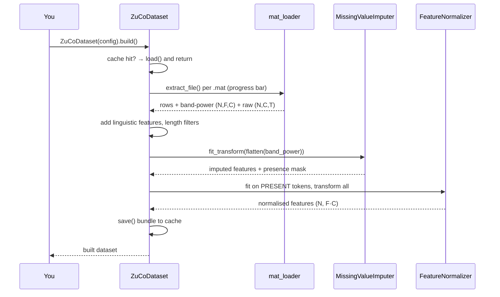

# The ZuCoDataset guide

`ZuCoDataset` is the tunable front door to ZuCo. This guide covers its lifecycle, every knob, and the analysis/visualisation helpers.

## Lifecycle



## Configuration reference (`DatasetConfig`)

| Field                        | Default                   | Meaning                                                   |
| ---------------------------- | ------------------------- | --------------------------------------------------------- |
| `root`                       | `res/data/zuco_extracted` | Directory of `.mat` files (searched recursively)          |
| `tasks`                      | `('SR','NR')`             | Reading tasks to include (`SR`,`NR`,`TSR`)                |
| `subjects`                   | `None`                    | Subject filter (`None` = all discovered)                  |
| `granularity`                | `word`                    | Token granularity (`word` or `sentence`)                  |
| `representation`             | `band_power`              | `band_power` \| `raw` \| `both`                           |
| `band_power_measures`        | `('TRT',)`                | Eye-tracking-locked measures for band power               |
| `bands`                      | all 8                     | Frequency bands for band power                            |
| `raw_field`                  | `rawEEG`                  | Word raw-EEG field                                        |
| `raw_window`                 | `128`                     | Samples raw EEG is padded/truncated to                    |
| `normalize`                  | `zscore_channel`          | `zscore_channel` \| `zscore_global` \| `minmax` \| `none` |
| `bandpass`                   | `None`                    | Optional `(low, high)` Hz Butterworth filter for raw      |
| `missing`                    | `MissingConfig()`         | Missing-value strategy (see README table)                 |
| `include_omitted`            | `True`                    | Keep omitted words as masked tokens                       |
| `min_words` / `max_words`    | `1` / `None`              | Sentence-length filter                                    |
| `cache_dir` / `cache_format` | `res/cache` / `npz`       | Processed cache location/format                           |

## Analysis & visualisation

```python
from zte.data.viz import save_overview
summary = ds.analyze()                 # counts, omission, missingness (JSON-safe)
save_overview(ds, 'res/figures')       # missingness, ET dists, correlations, omission, availability
```

| Figure                      | Function                  | Mirrors notebook section |
| --------------------------- | ------------------------- | ------------------------ |
| Missingness by measure/task | `plot_missingness`        | missing-rate analysis    |
| ET duration histograms      | `plot_et_distributions`   | word-level durations     |
| ET correlation matrix       | `plot_correlations`       | measure correlations     |
| Omission & TRT vs length    | `plot_omission_by_length` | length effects           |
| EEG availability heatmap    | `plot_eeg_availability`   | availability heatmap     |

## Feature selection

```python
res = ds.select_features(target='log_freq', method='mutual_info', k=64)
res.indices   # selected flattened (channel×band) indices
res.scores    # importance per input feature
res.names     # e.g. 'TRT_t1::ch042'
```

Methods: `variance`, `f_score`, `mutual_info`, `rf_importance`. Scoring is restricted to present tokens (`present_only=True`) so omitted words never drive the ranking — the packaged version of the notebook's channel-importance study.

## Splits

| Strategy          | Holds out       | Use                                          |
| ----------------- | --------------- | -------------------------------------------- |
| `random`          | random words    | quick sanity checks                          |
| `by_sentence`     | whole sentences | default; no within-sentence leakage          |
| `by_subject_loso` | one subject     | cross-subject generalisation (the real test) |
| `by_task`         | one task        | cross-task transfer                          |

## Persistence & remote

```python
ds.save('res/bundle')                       # arrays.npz + words.pkl + sentences.pkl + meta.json
ds2 = ZuCoDataset.load('res/bundle')        # exact round-trip incl. normaliser state
ds.save_to_drive('/content/drive/MyDrive/ZTE/bundle')
ZuCoDataset.from_drive('<file id | url | mounted path>')
```
